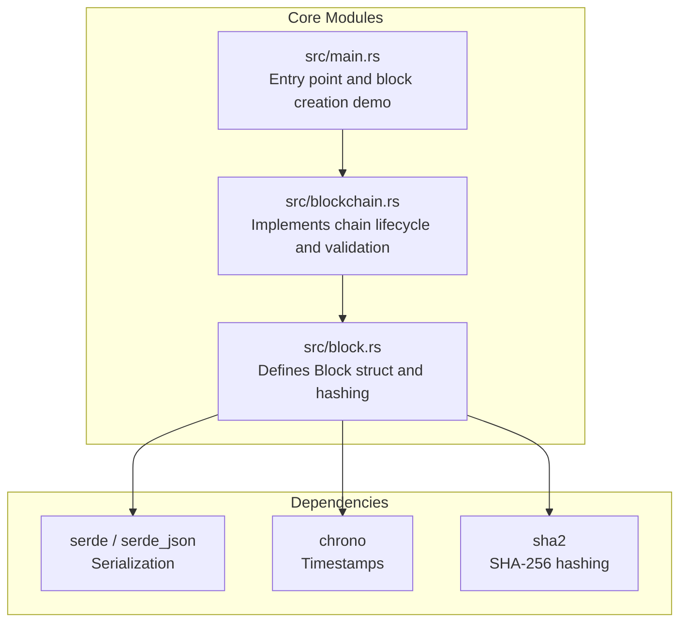
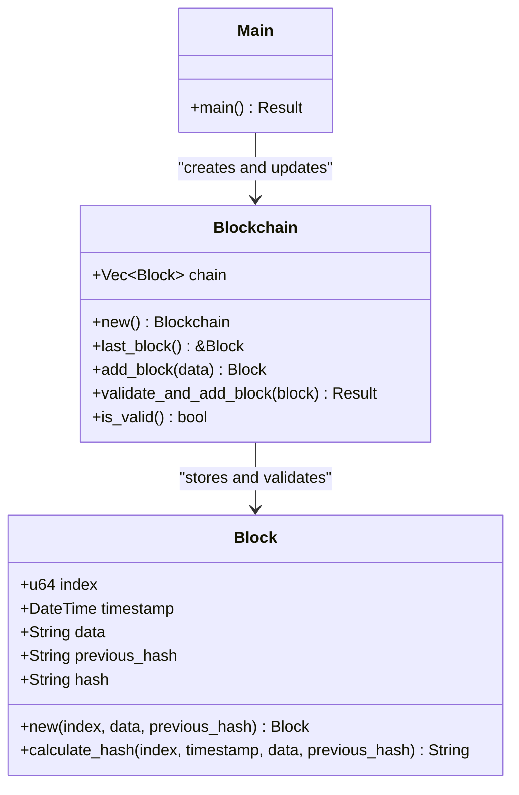
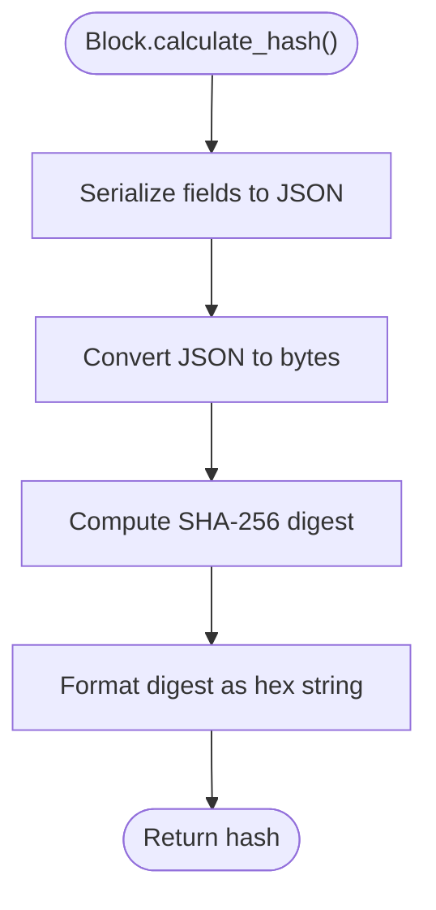
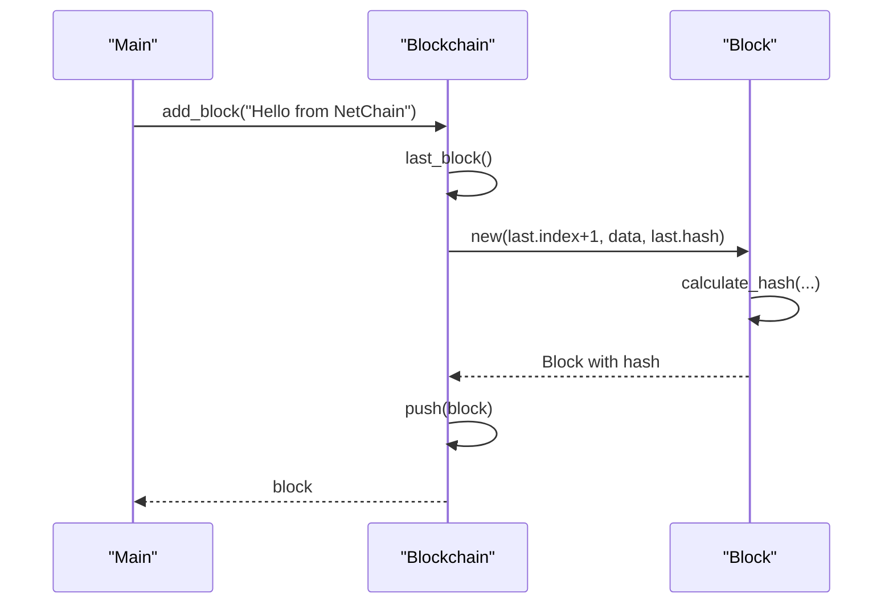
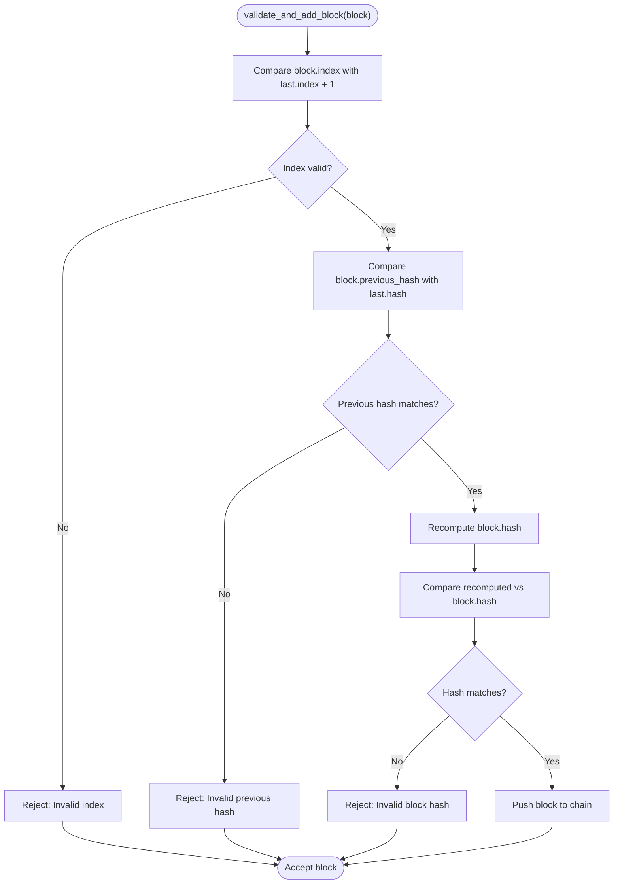
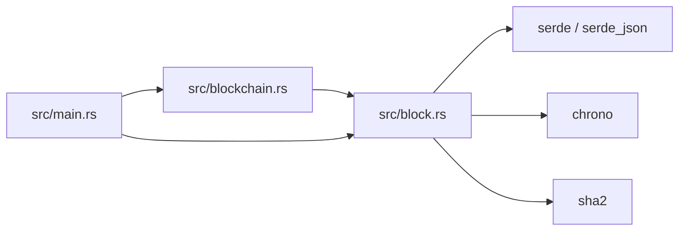

# Block Management

<cite>
**Referenced Files in This Document**
- [block.rs](file://src/block.rs)
- [blockchain.rs](file://src/blockchain.rs)
- [main.rs](file://src/main.rs)
- [Cargo.toml](file://Cargo.toml)
- [README.md](file://README.md)
</cite>

## Table of Contents
1. [Introduction](#introduction)
2. [Project Structure](#project-structure)
3. [Core Components](#core-components)
4. [Architecture Overview](#architecture-overview)
5. [Detailed Component Analysis](#detailed-component-analysis)
6. [Dependency Analysis](#dependency-analysis)
7. [Performance Considerations](#performance-considerations)
8. [Troubleshooting Guide](#troubleshooting-guide)
9. [Conclusion](#conclusion)

## Introduction
This document explains NetChain’s block management system with a focus on the fundamental block structure and cryptographic hashing implementation. It covers the Block struct definition, the SHA-256 hashing algorithm using serde_json serialization for consistent hash calculation, block creation via the new() constructor and calculate_hash() method, and practical examples of block instantiation, hash verification, and blockchain immutability. It also documents the relationship between blocks and chain integrity, explaining how previous_hash links blocks together, and discusses the cryptographic security implications of SHA-256 usage.

## Project Structure
NetChain is organized into modular Rust modules. The block management system centers around two primary modules:
- src/block.rs: Defines the Block struct and its hashing logic.
- src/blockchain.rs: Implements chain lifecycle, genesis block creation, block addition, and validation routines.

Supporting elements:
- src/main.rs: Demonstrates block creation and P2P broadcasting, and integrates with the blockchain module.
- Cargo.toml: Declares dependencies including serde, serde_json, chrono, and sha2 for serialization, time, and cryptographic hashing.
- README.md: Provides project context and highlights the modular development stages.

**Diagram sources**
- [block.rs](file://src/block.rs#L1-L47)
- [blockchain.rs](file://src/blockchain.rs#L1-L89)
- [main.rs](file://src/main.rs#L1-L106)
- [Cargo.toml](file://Cargo.toml#L6-L32)

**Section sources**
- [README.md](file://README.md#L47-L68)
- [Cargo.toml](file://Cargo.toml#L6-L32)

## Core Components
This section documents the Block struct and its cryptographic hashing implementation, and how blocks are created and validated within the chain.

- Block struct fields:
  - index: Monotonically increasing block number.
  - timestamp: UTC timestamp of block creation.
  - data: Arbitrary block data payload.
  - previous_hash: Hash of the previous block in the chain.
  - hash: Cryptographic hash of the current block computed from its fields.

- Block creation:
  - Constructor new(index, data, previous_hash) sets timestamp and computes hash via calculate_hash().
  - calculate_hash() produces a SHA-256 digest over a JSON-serialized representation of the block’s fields.

- Chain lifecycle:
  - Genesis block initialization in Blockchain::new().
  - Adding blocks locally via add_block() and validating incoming blocks via validate_and_add_block().
  - Full chain validation via is_valid() that checks linkage and hashes across all blocks.

**Section sources**
- [block.rs](file://src/block.rs#L5-L12)
- [block.rs](file://src/block.rs#L14-L46)
- [blockchain.rs](file://src/blockchain.rs#L10-L37)
- [blockchain.rs](file://src/blockchain.rs#L40-L64)
- [blockchain.rs](file://src/blockchain.rs#L66-L87)

## Architecture Overview
The block management architecture ties together the Block struct, the Blockchain container, and the main entry point that demonstrates block creation and P2P broadcasting.

**Diagram sources**
- [block.rs](file://src/block.rs#L5-L12)
- [block.rs](file://src/block.rs#L14-L46)
- [blockchain.rs](file://src/blockchain.rs#L5-L8)
- [blockchain.rs](file://src/blockchain.rs#L10-L37)
- [main.rs](file://src/main.rs#L16-L25)

## Detailed Component Analysis

### Block Struct Definition and Hashing
The Block struct encapsulates the immutable record of a block. Its fields are serialized deterministically and hashed to produce a unique cryptographic fingerprint.

- Field serialization and hashing:
  - The calculate_hash() method constructs a JSON object containing index, timestamp, data, and previous_hash, then computes SHA-256 over the serialized string.
  - The timestamp is serialized in RFC 3339 format to ensure consistent representation across systems.

- Immutability and tamper evidence:
  - Changing any field (including timestamp) alters the hash, making tampering evident during validation.
  - The previous_hash field ensures chronological linkage, preventing forks without detection.

**Diagram sources**
- [block.rs](file://src/block.rs#L27-L45)

**Section sources**
- [block.rs](file://src/block.rs#L5-L12)
- [block.rs](file://src/block.rs#L27-L45)

### Block Creation and Instantiation
Blocks are created using the new() constructor, which sets the timestamp and computes the hash immediately.

- Constructor behavior:
  - new(index, data, previous_hash) captures the current UTC time and invokes calculate_hash() to set the hash field.
  - This ensures every block is cryptographically anchored at creation time.

- Practical example paths:
  - Local block creation and broadcasting in main.rs demonstrates constructing a block and sending it over P2P.
  - The add_block() method in Blockchain shows how a new block is appended to the chain with the correct index and previous_hash.

**Diagram sources**
- [main.rs](file://src/main.rs#L48-L53)
- [blockchain.rs](file://src/blockchain.rs#L28-L37)
- [block.rs](file://src/block.rs#L14-L25)

**Section sources**
- [block.rs](file://src/block.rs#L14-L25)
- [blockchain.rs](file://src/blockchain.rs#L28-L37)
- [main.rs](file://src/main.rs#L48-L53)

### Chain Integrity and Validation
Chain integrity relies on two invariants checked during validation:
- Index continuity: Each new block must increment the chain index by one.
- Previous hash linkage: The previous_hash must match the hash of the immediately preceding block.
- Hash correctness: The block’s hash must equal the recomputed hash of its fields.

- Validation process:
  - validate_and_add_block() enforces the above checks and appends the block if valid.
  - is_valid() iterates the chain to verify both linkage and hash correctness across all blocks.

**Diagram sources**
- [blockchain.rs](file://src/blockchain.rs#L40-L64)

**Section sources**
- [blockchain.rs](file://src/blockchain.rs#L40-L64)
- [blockchain.rs](file://src/blockchain.rs#L66-L87)

### Practical Examples and Use Cases
Below are concrete example paths demonstrating block construction, hash verification, and chain validation:

- Constructing a block:
  - See [block.rs](file://src/block.rs#L14-L25) for the constructor and [block.rs](file://src/block.rs#L27-L45) for hash calculation.
  - See [blockchain.rs](file://src/blockchain.rs#L28-L37) for adding a block to the chain.

- Verifying a block’s hash:
  - See [blockchain.rs](file://src/blockchain.rs#L51-L56) for recomputing the hash and [blockchain.rs](file://src/blockchain.rs#L58) for comparison.

- Validating chain integrity:
  - See [blockchain.rs](file://src/blockchain.rs#L66-L87) for iterating and validating the entire chain.

- Demonstrating block creation and broadcasting:
  - See [main.rs](file://src/main.rs#L48-L61) for creating a block and [main.rs](file://src/main.rs#L66-L87) for receiving and validating blocks over P2P.

**Section sources**
- [block.rs](file://src/block.rs#L14-L45)
- [blockchain.rs](file://src/blockchain.rs#L28-L37)
- [blockchain.rs](file://src/blockchain.rs#L51-L56)
- [blockchain.rs](file://src/blockchain.rs#L66-L87)
- [main.rs](file://src/main.rs#L48-L61)
- [main.rs](file://src/main.rs#L66-L87)

### Cryptographic Security Implications of SHA-256
SHA-256 is used to ensure:
- Uniqueness: Each block hash is highly likely to be unique for distinct inputs.
- Tamper evidence: Any change to a block’s fields will alter its hash, making tampering detectable.
- Determinism: Consistent serialization guarantees identical hashes across systems.

- Why SHA-256 is appropriate:
  - It is a well-established cryptographic hash function suitable for blockchain use.
  - Combined with deterministic serialization, it provides a robust foundation for immutability.

- Limitations to consider:
  - SHA-256 alone does not authenticate block origin; digital signatures are used elsewhere in the system (see transaction.rs).
  - The current block hashing does not incorporate Merkle roots or additional anti-collision measures; future enhancements could strengthen collision resistance.

**Section sources**
- [block.rs](file://src/block.rs#L27-L45)
- [Cargo.toml](file://Cargo.toml#L25-L27)

## Dependency Analysis
The block management system depends on external crates for serialization, time handling, and cryptographic hashing.

**Diagram sources**
- [block.rs](file://src/block.rs#L1-L3)
- [Cargo.toml](file://Cargo.toml#L18-L26)

**Section sources**
- [Cargo.toml](file://Cargo.toml#L6-L32)

## Performance Considerations
- Hash computation cost:
  - SHA-256 hashing is efficient and suitable for frequent block creation.
  - For high-throughput scenarios, consider batching or optimizing serialization if needed.

- Serialization overhead:
  - Using serde_json for hashing ensures deterministic output but may be slightly heavier than binary formats.
  - If performance becomes critical, evaluate compact binary serialization while preserving determinism.

- Chain validation:
  - validate_and_add_block() performs O(1) checks per block addition.
  - is_valid() iterates the entire chain, resulting in O(n) complexity for full validation.

[No sources needed since this section provides general guidance]

## Troubleshooting Guide
Common issues and remedies when working with blocks and chain validation:

- Invalid index:
  - Cause: Block index does not follow the expected sequence.
  - Remedy: Ensure the new block’s index equals last.index + 1.

- Invalid previous hash:
  - Cause: Block’s previous_hash does not match the last block’s hash.
  - Remedy: Reconstruct the block with the correct previous_hash from the latest block.

- Invalid block hash:
  - Cause: Block hash differs from the recomputed hash of its fields.
  - Remedy: Verify serialization and ensure no field was altered post-creation.

- Deserialization errors:
  - Cause: Malformed block JSON received over P2P.
  - Remedy: Validate JSON structure and ensure consistent serialization across nodes.

**Section sources**
- [blockchain.rs](file://src/blockchain.rs#L43-L49)
- [blockchain.rs](file://src/blockchain.rs#L58)
- [main.rs](file://src/main.rs#L69-L87)

## Conclusion
NetChain’s block management system establishes a solid foundation for immutable, verifiable records using a clear Block struct and SHA-256 hashing over deterministic JSON serialization. The new() constructor and calculate_hash() method ensure each block is cryptographically anchored at creation, while validate_and_add_block() and is_valid() enforce chain integrity through index continuity, previous hash linkage, and hash correctness. Together, these mechanisms provide tamper-evident block records and a reliable basis for extending the system with transactions, signatures, and advanced consensus features.