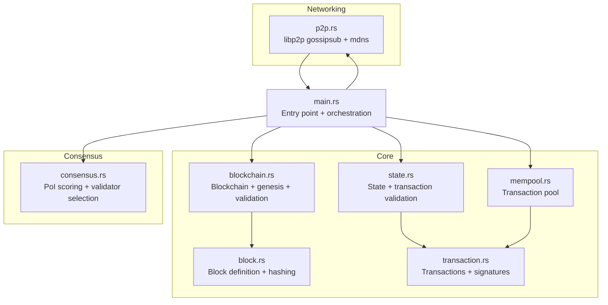
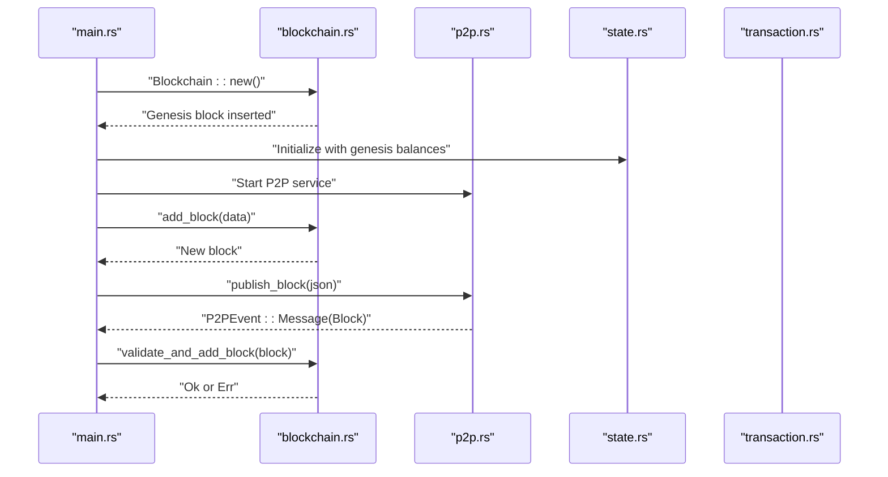
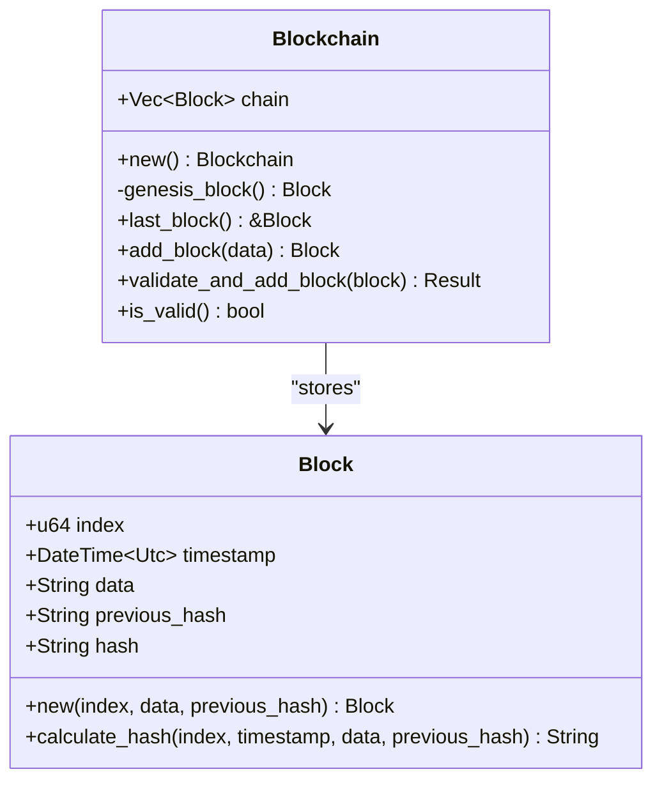
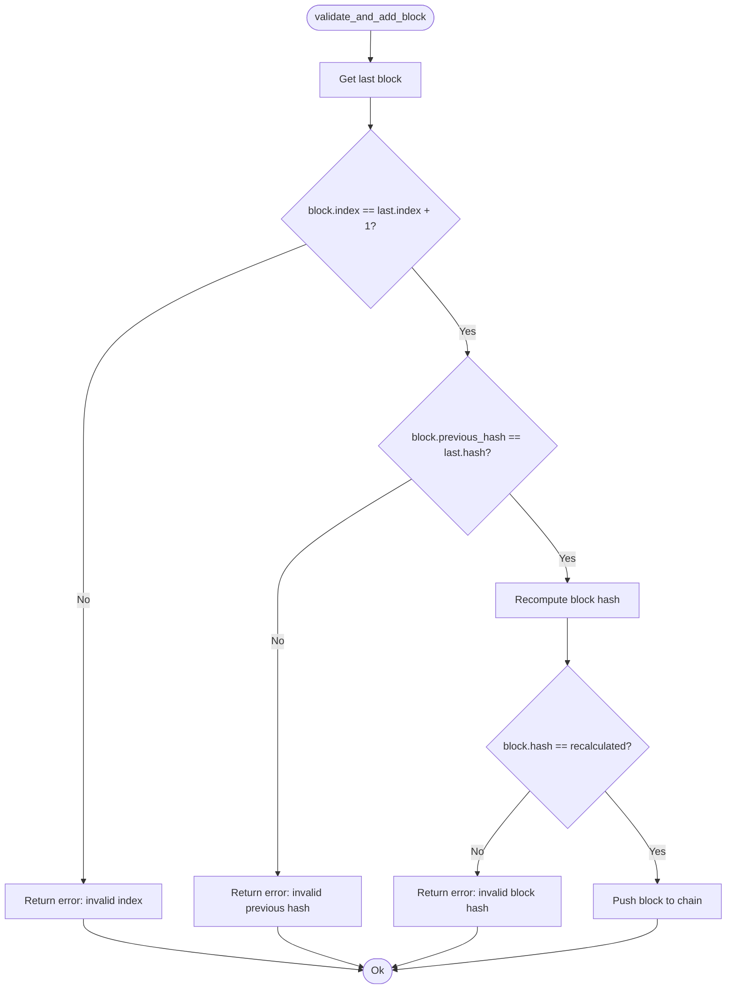
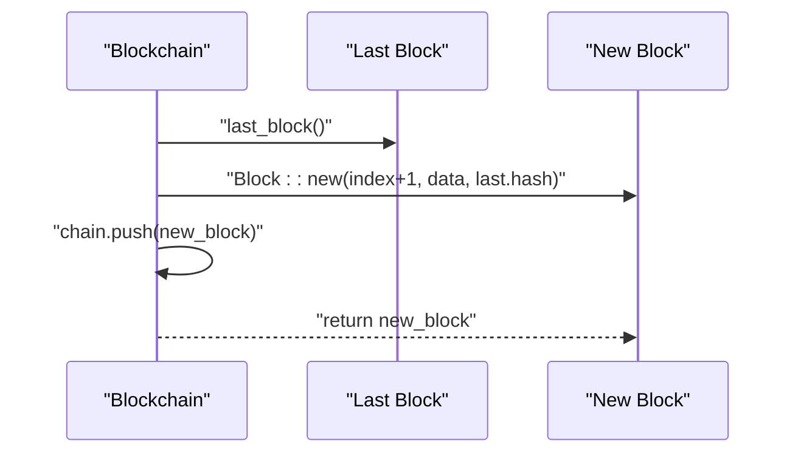
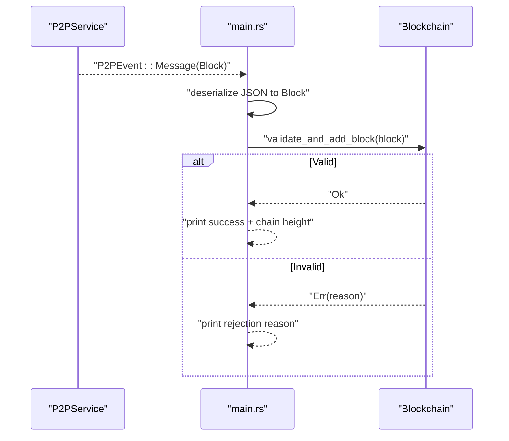
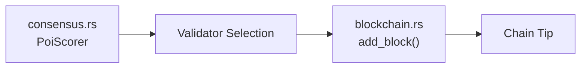
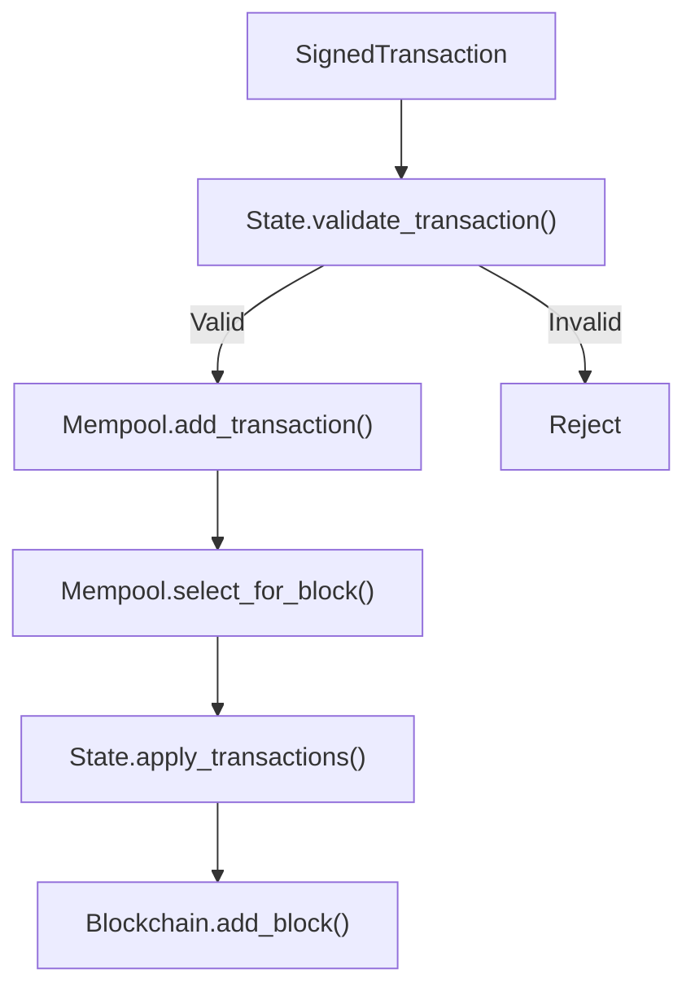
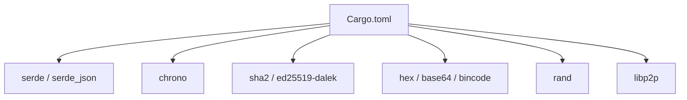

# Blockchain Operations

<cite>
**Referenced Files in This Document**
- [main.rs](file://src/main.rs)
- [blockchain.rs](file://src/blockchain.rs)
- [block.rs](file://src/block.rs)
- [state.rs](file://src/state.rs)
- [transaction.rs](file://src/transaction.rs)
- [mempool.rs](file://src/mempool.rs)
- [p2p.rs](file://src/p2p.rs)
- [consensus.rs](file://src/consensus.rs)
- [Cargo.toml](file://Cargo.toml)
</cite>

## Table of Contents
1. [Introduction](#introduction)
2. [Project Structure](#project-structure)
3. [Core Components](#core-components)
4. [Architecture Overview](#architecture-overview)
5. [Detailed Component Analysis](#detailed-component-analysis)
6. [Dependency Analysis](#dependency-analysis)
7. [Performance Considerations](#performance-considerations)
8. [Troubleshooting Guide](#troubleshooting-guide)
9. [Conclusion](#conclusion)
10. [Appendices](#appendices)

## Introduction
This document explains NetChain’s blockchain operations system with a focus on chain management, genesis block creation, and blockchain validation. It covers the blockchain data structure, integrity checks, block addition logic, and the validation pipeline used when accepting blocks from peers. It also documents how the system relates to consensus mechanisms, particularly the Proof of Internet (PoI) scoring engine, and provides practical examples of initializing a blockchain, inserting blocks, and verifying chain integrity. Finally, it outlines performance considerations and optimization strategies for large blockchains.

## Project Structure
NetChain is organized around modular components:
- Block and blockchain core logic
- State and transaction validation
- Mempool for transaction staging
- P2P networking for block propagation
- Consensus engine for validator selection

**Diagram sources**
- [main.rs](file://src/main.rs#L1-L123)
- [blockchain.rs](file://src/blockchain.rs#L1-L89)
- [block.rs](file://src/block.rs#L1-L47)
- [state.rs](file://src/state.rs#L1-L183)
- [transaction.rs](file://src/transaction.rs#L1-L211)
- [mempool.rs](file://src/mempool.rs#L1-L159)
- [p2p.rs](file://src/p2p.rs#L1-L150)
- [consensus.rs](file://src/consensus.rs#L1-L334)

**Section sources**
- [Cargo.toml](file://Cargo.toml#L1-L47)
- [main.rs](file://src/main.rs#L1-L123)

## Core Components
- Block: Immutable unit containing index, timestamp, data, previous hash, and computed hash.
- Blockchain: Ordered list of blocks with genesis initialization, last-block access, local block creation, and validation for incoming blocks.
- State: Global ledger with accounts and transaction validation/apply logic.
- Transaction: Signed transaction model with Ed25519 signatures and canonical serialization.
- Mempool: In-memory transaction pool enforcing uniqueness, nonce ordering, and fee-based selection.
- P2P: libp2p-based gossipsub messaging for blocks and transactions.
- Consensus (PoI): Scoring engine for validator selection based on network metrics.

**Section sources**
- [block.rs](file://src/block.rs#L1-L47)
- [blockchain.rs](file://src/blockchain.rs#L1-L89)
- [state.rs](file://src/state.rs#L1-L183)
- [transaction.rs](file://src/transaction.rs#L1-L211)
- [mempool.rs](file://src/mempool.rs#L1-L159)
- [p2p.rs](file://src/p2p.rs#L1-L150)
- [consensus.rs](file://src/consensus.rs#L1-L334)

## Architecture Overview
The system initializes a blockchain with a genesis block, maintains state, and integrates with P2P to receive and propagate blocks. Local miners can create blocks and broadcast them; remote peers’ blocks are validated before acceptance.

**Diagram sources**
- [main.rs](file://src/main.rs#L24-L123)
- [blockchain.rs](file://src/blockchain.rs#L10-L64)
- [p2p.rs](file://src/p2p.rs#L113-L149)
- [state.rs](file://src/state.rs#L44-L51)
- [transaction.rs](file://src/transaction.rs#L83-L144)

## Detailed Component Analysis

### Blockchain Data Structure and Genesis Creation
- Blockchain stores a vector of Blocks and ensures integrity via validation.
- Genesis block is created automatically upon construction with a predefined initial data and previous hash.
- The last block accessor provides the tip for new block creation.

**Diagram sources**
- [block.rs](file://src/block.rs#L5-L47)
- [blockchain.rs](file://src/blockchain.rs#L5-L89)

**Section sources**
- [blockchain.rs](file://src/blockchain.rs#L10-L25)
- [block.rs](file://src/block.rs#L14-L25)

### Chain Integrity Checking Mechanisms
- Index continuity: Each new block must have index equal to last block index + 1.
- Previous hash linkage: Each block’s previous_hash must match the last block’s hash.
- Hash correctness: Recompute block hash from fields and compare with stored hash.
- Full chain validation iterates all blocks to verify the above conditions.

**Diagram sources**
- [blockchain.rs](file://src/blockchain.rs#L40-L64)

**Section sources**
- [blockchain.rs](file://src/blockchain.rs#L40-L64)
- [block.rs](file://src/block.rs#L27-L45)

### Block Addition Logic
- Local creation: Miner or validator creates a new block by incrementing index and linking to the last block’s hash.
- Remote acceptance: Incoming blocks are validated before insertion.

**Diagram sources**
- [blockchain.rs](file://src/blockchain.rs#L28-L37)
- [block.rs](file://src/block.rs#L14-L25)

**Section sources**
- [blockchain.rs](file://src/blockchain.rs#L28-L37)

### Blockchain Validation Pipeline
- Deserialization of JSON block payload.
- Validation and insertion into the chain.
- Logging of acceptance or rejection reasons.

**Diagram sources**
- [p2p.rs](file://src/p2p.rs#L113-L149)
- [main.rs](file://src/main.rs#L80-L119)
- [blockchain.rs](file://src/blockchain.rs#L40-L64)

**Section sources**
- [main.rs](file://src/main.rs#L80-L119)
- [p2p.rs](file://src/p2p.rs#L113-L149)

### Relationship Between Blockchain Operations and Consensus
- The PoI scoring engine computes validator importance based on network metrics and supports deterministic validator selection for block production.
- While the current blockchain logic does not enforce PoI-driven validator selection in block validation, the PoI engine is available for future integration (e.g., selecting who can propose the next block).

**Diagram sources**
- [consensus.rs](file://src/consensus.rs#L57-L182)
- [blockchain.rs](file://src/blockchain.rs#L28-L37)

**Section sources**
- [consensus.rs](file://src/consensus.rs#L57-L182)
- [blockchain.rs](file://src/blockchain.rs#L28-L37)

### Practical Examples

- Initializing a blockchain and printing the genesis block:
  - See [main.rs](file://src/main.rs#L28-L32)

- Locally creating and broadcasting a block:
  - See [main.rs](file://src/main.rs#L62-L78)

- Receiving and validating a block from P2P:
  - See [main.rs](file://src/main.rs#L80-L119)
  - See [p2p.rs](file://src/p2p.rs#L113-L149)
  - See [blockchain.rs](file://src/blockchain.rs#L40-L64)

- Verifying chain integrity:
  - See [blockchain.rs](file://src/blockchain.rs#L66-L87)

- Transaction validation and state updates:
  - See [state.rs](file://src/state.rs#L69-L95)
  - See [state.rs](file://src/state.rs#L98-L127)
  - See [transaction.rs](file://src/transaction.rs#L83-L144)

**Section sources**
- [main.rs](file://src/main.rs#L28-L78)
- [p2p.rs](file://src/p2p.rs#L113-L149)
- [blockchain.rs](file://src/blockchain.rs#L40-L87)
- [state.rs](file://src/state.rs#L69-L127)
- [transaction.rs](file://src/transaction.rs#L83-L144)

### Chain Reorganization, Fork Resolution, and Longest-Chain Rule
- Current implementation validates incoming blocks against the current tip and appends them if valid. There is no explicit fork resolution or longest-chain rule implemented.
- To support reorganization, the system would need:
  - Fork detection by comparing previous hashes
  - Maintaining multiple candidate chains
  - Applying longest-chain rule to select the canonical chain
  - Rolling back or switching to the winning chain and re-applying transactions as needed

[No sources needed since this section provides conceptual guidance]

### Transaction Lifecycle and Mempool Integration
- Transactions are validated against current state before entering the mempool.
- Mempool enforces uniqueness, monotonic nonce ordering per sender, and simple fee-based selection for block inclusion.
- State applies transactions atomically when building blocks.

**Diagram sources**
- [state.rs](file://src/state.rs#L69-L127)
- [mempool.rs](file://src/mempool.rs#L42-L112)
- [blockchain.rs](file://src/blockchain.rs#L28-L37)

**Section sources**
- [state.rs](file://src/state.rs#L69-L127)
- [mempool.rs](file://src/mempool.rs#L42-L112)

## Dependency Analysis
External dependencies include serialization, time, cryptography, encoding, randomness, and libp2p for networking.

**Diagram sources**
- [Cargo.toml](file://Cargo.toml#L6-L47)

**Section sources**
- [Cargo.toml](file://Cargo.toml#L6-L47)

## Performance Considerations
- Hash computation: SHA-256 over JSON-encoded block fields; consider precomputing canonical payloads to reduce overhead.
- Chain traversal: Full validation scans all blocks; for large chains, consider incremental validation or caching recomputed hashes.
- P2P throughput: libp2p gossipsub is efficient for broadcast; tune topic subscriptions and message sizes.
- State operations: Canonical serialization and signature verification are deterministic and lightweight; batch operations where possible.
- Mempool: Hash maps and deques provide O(1) average insert/remove; ensure capacity tuning for high-throughput environments.

[No sources needed since this section provides general guidance]

## Troubleshooting Guide
Common issues and diagnostics:
- Invalid index: Occurs when a block’s index does not follow the chain sequence.
- Invalid previous hash: Indicates a mismatch with the last block’s hash.
- Invalid block hash: Indicates tampering or incorrect field values.
- Deserialization errors: Malformed block JSON payloads.
- P2P connectivity: Peer discovery and message delivery depend on libp2p; verify topics and ports.

**Section sources**
- [blockchain.rs](file://src/blockchain.rs#L40-L64)
- [main.rs](file://src/main.rs#L86-L104)
- [p2p.rs](file://src/p2p.rs#L113-L149)

## Conclusion
NetChain’s blockchain operations provide a solid foundation for block creation, validation, and P2P propagation. The current implementation focuses on integrity checks and a simple longest-chain append behavior. Integrating PoI-based validator selection and adding fork resolution and longest-chain rule will strengthen consensus alignment. With careful attention to performance and robust error handling, the system can scale to larger datasets and more complex operational scenarios.

## Appendices

### API and Operation References
- Blockchain initialization and genesis: [blockchain.rs](file://src/blockchain.rs#L10-L19)
- Add block locally: [blockchain.rs](file://src/blockchain.rs#L28-L37)
- Validate and add block: [blockchain.rs](file://src/blockchain.rs#L40-L64)
- Full chain validation: [blockchain.rs](file://src/blockchain.rs#L66-L87)
- Block hashing: [block.rs](file://src/block.rs#L27-L45)
- State validation and application: [state.rs](file://src/state.rs#L69-L127)
- Transaction signing and verification: [transaction.rs](file://src/transaction.rs#L83-L144)
- Mempool operations: [mempool.rs](file://src/mempool.rs#L42-L112)
- P2P block publishing and reception: [p2p.rs](file://src/p2p.rs#L113-L149), [main.rs](file://src/main.rs#L80-L119)
- PoI scoring and validator selection: [consensus.rs](file://src/consensus.rs#L57-L182)