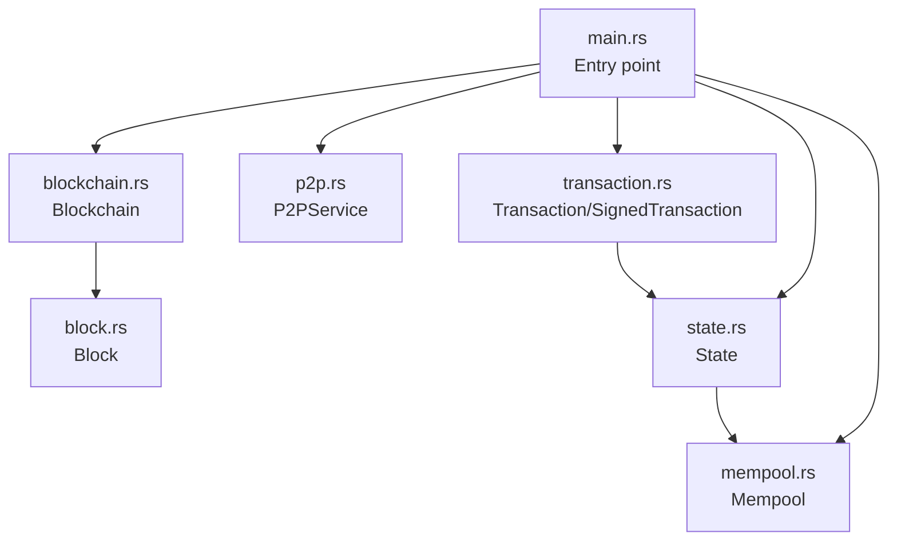
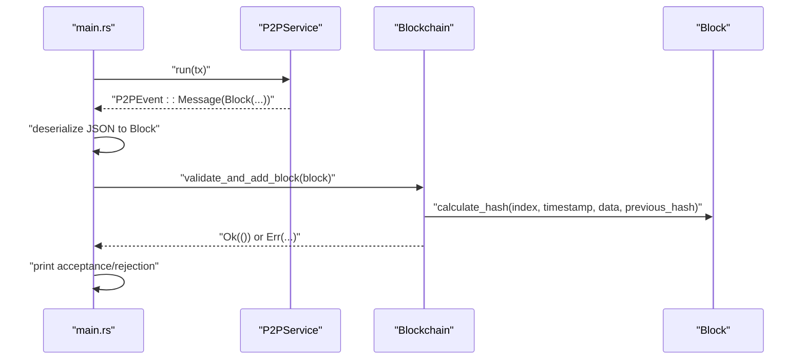
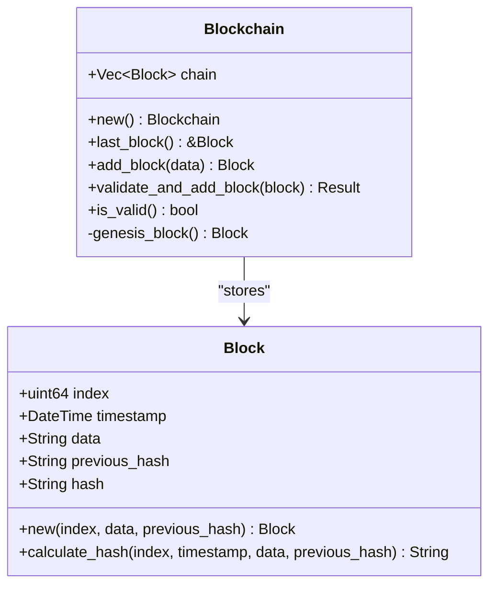
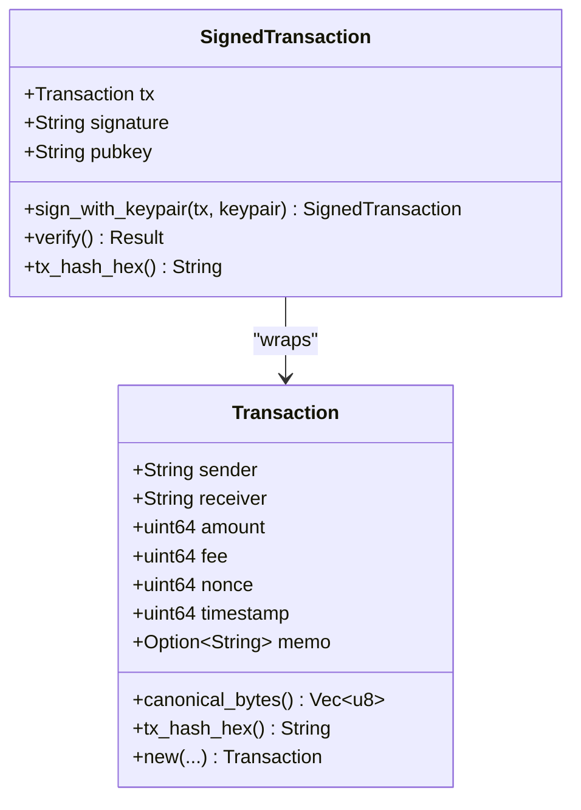
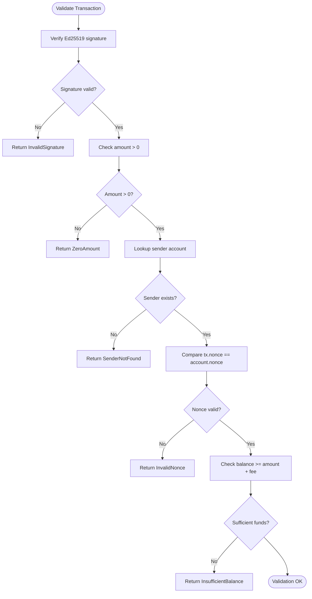
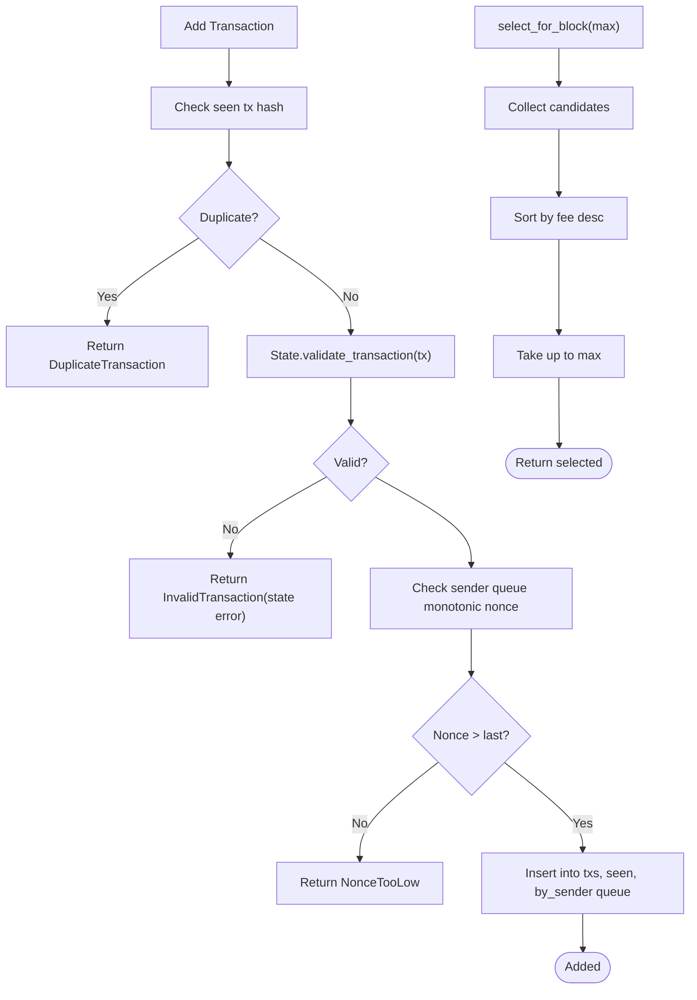
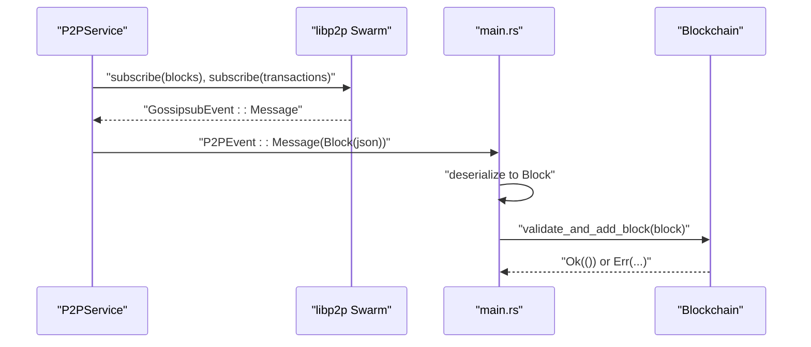
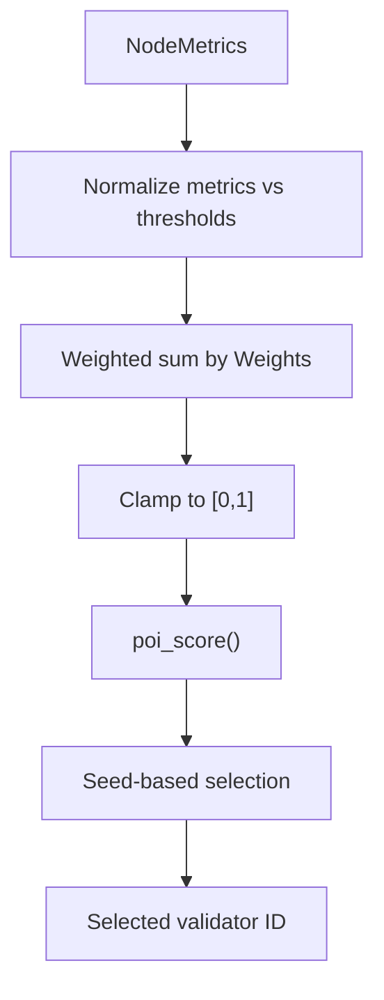
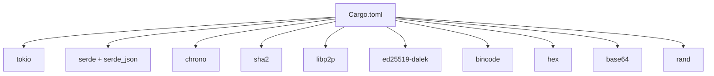

# Core Blockchain Components

<cite>
**Referenced Files in This Document**
- [main.rs](file://src/main.rs)
- [block.rs](file://src/block.rs)
- [blockchain.rs](file://src/blockchain.rs)
- [transaction.rs](file://src/transaction.rs)
- [state.rs](file://src/state.rs)
- [mempool.rs](file://src/mempool.rs)
- [p2p.rs](file://src/p2p.rs)
- [consensus.rs](file://src/consensus.rs)
- [Cargo.toml](file://Cargo.toml)
- [README.md](file://README.md)
</cite>

## Table of Contents
1. [Introduction](#introduction)
2. [Project Structure](#project-structure)
3. [Core Components](#core-components)
4. [Architecture Overview](#architecture-overview)
5. [Detailed Component Analysis](#detailed-component-analysis)
6. [Dependency Analysis](#dependency-analysis)
7. [Performance Considerations](#performance-considerations)
8. [Troubleshooting Guide](#troubleshooting-guide)
9. [Conclusion](#conclusion)
10. [Appendices](#appendices)

## Introduction
This document explains NetChain’s core blockchain components with a focus on the fundamental building blocks: block structure and SHA-256 hashing, blockchain chain operations with genesis block support, transaction processing with Ed25519 digital signatures, account state management, and memory pool functionality. It provides both conceptual overviews for beginners and technical details for advanced developers extending the system. Terminology follows the codebase: block, transaction, account, mempool, and state.

## Project Structure
NetChain is organized around modular Rust modules that implement the core blockchain logic. The main entry point coordinates a shared blockchain state, a P2P service for networking, and a temporary mining/broadcast loop. The core modules are:
- Block and blockchain: define block structure, hashing, and chain operations
- Transaction: define transaction structure, Ed25519 signing/verification, and canonical serialization
- State: manage account balances and nonces, validate and apply transactions
- Mempool: collect, deduplicate, and prioritize transactions for block inclusion
- P2P: handle gossipsub messaging and peer discovery
- Consensus: PoI scoring and validator selection (future integration point)

**Diagram sources**
- [main.rs](file://src/main.rs#L16-L106)
- [blockchain.rs](file://src/blockchain.rs#L1-L89)
- [block.rs](file://src/block.rs#L1-L47)
- [transaction.rs](file://src/transaction.rs#L1-L209)
- [state.rs](file://src/state.rs#L1-L183)
- [mempool.rs](file://src/mempool.rs#L1-L159)
- [p2p.rs](file://src/p2p.rs#L1-L150)

**Section sources**
- [main.rs](file://src/main.rs#L16-L106)
- [Cargo.toml](file://Cargo.toml#L1-L38)
- [README.md](file://README.md#L47-L159)

## Core Components
This section introduces the primary building blocks and their roles:
- Block: Immutable record containing index, timestamp, data payload, previous hash, and computed hash
- Blockchain: Chain of blocks with genesis initialization and validation logic
- Transaction: Unsigned transaction with canonical serialization and Ed25519 signatures
- State: In-memory ledger with accounts and transaction validation/apply logic
- Mempool: In-memory transaction pool with deduplication, nonce ordering, and fee-based selection
- P2P: Gossipsub-based broadcast and receive of blocks and transactions

**Section sources**
- [block.rs](file://src/block.rs#L5-L47)
- [blockchain.rs](file://src/blockchain.rs#L5-L89)
- [transaction.rs](file://src/transaction.rs#L23-L138)
- [state.rs](file://src/state.rs#L16-L128)
- [mempool.rs](file://src/mempool.rs#L13-L113)
- [p2p.rs](file://src/p2p.rs#L25-L149)

## Architecture Overview
The system integrates asynchronous networking with a shared blockchain state. The main loop listens for P2P events, deserializes incoming blocks, validates them against the chain, and appends valid blocks. Locally produced blocks are temporarily created and broadcast via P2P.

**Diagram sources**
- [main.rs](file://src/main.rs#L64-L88)
- [blockchain.rs](file://src/blockchain.rs#L40-L64)
- [block.rs](file://src/block.rs#L27-L45)
- [p2p.rs](file://src/p2p.rs#L113-L141)

## Detailed Component Analysis

### Block and Blockchain
- Block structure includes index, timestamp, data, previous_hash, and hash. Hashing uses SHA-256 over a JSON-serialized payload of the block fields.
- Genesis block is automatically created on blockchain initialization with index 0 and a fixed previous hash.
- Chain operations:
  - Local block creation increments index and sets previous_hash to the last block’s hash
  - Validation checks sequential index, correct previous hash, and recomputed hash equality
  - Full chain validity iterates all blocks to verify continuity and hashes

**Diagram sources**
- [block.rs](file://src/block.rs#L5-L47)
- [blockchain.rs](file://src/blockchain.rs#L5-L89)

**Section sources**
- [block.rs](file://src/block.rs#L14-L47)
- [blockchain.rs](file://src/blockchain.rs#L10-L89)

### Transaction Processing with Ed25519 Digital Signatures
- Transaction structure includes sender, receiver, amount, fee, nonce, timestamp, and optional memo. Canonical serialization uses bincode with fixed-width integers and little-endian encoding for deterministic hashing/signing.
- SignedTransaction wraps a Transaction with base64-encoded signature and public key.
- Signing uses Ed25519 keypairs; verification decodes base64 signature/public key and validates the signature against canonical bytes.
- Address derivation helper produces a hex-encoded address from the public key bytes.

**Diagram sources**
- [transaction.rs](file://src/transaction.rs#L23-L138)

**Section sources**
- [transaction.rs](file://src/transaction.rs#L23-L138)

### Account State Management
- Account holds balance and nonce. State manages a map from address to Account.
- Validation ensures cryptographic signature verification, non-zero amount, sender existence, nonce monotonicity, and sufficient balance (amount + fee).
- Applying a transaction debits sender (amount + fee), increments nonce, credits receiver (amount), and optionally handles fee distribution at block level.

**Diagram sources**
- [state.rs](file://src/state.rs#L69-L95)

**Section sources**
- [state.rs](file://src/state.rs#L16-L128)

### Memory Pool Functionality
- Mempool stores transactions keyed by hash, tracks seen hashes for deduplication, and maintains per-sender queues ordered by nonce.
- Validation enforces uniqueness and state-based checks against the current ledger.
- Selection sorts by fee descending and returns up to a configured limit; removal cleans seen set and sender queues.

**Diagram sources**
- [mempool.rs](file://src/mempool.rs#L41-L113)

**Section sources**
- [mempool.rs](file://src/mempool.rs#L13-L113)

### P2P Networking and Integration
- P2PService initializes libp2p with TCP transport, Noise encryption, Yamux multiplexing, and Gossipsub for pub/sub messaging.
- Topics include “blocks” and “transactions”. Messages are forwarded to the main event loop via an mpsc channel.
- The main loop deserializes received blocks, validates them, and prints acceptance/rejection status.

**Diagram sources**
- [p2p.rs](file://src/p2p.rs#L70-L149)
- [main.rs](file://src/main.rs#L64-L88)

**Section sources**
- [p2p.rs](file://src/p2p.rs#L25-L149)
- [main.rs](file://src/main.rs#L27-L102)

### Consensus Engine (PoI) Integration Point
- PoI scoring computes a node importance score from upload/download speed, latency, uptime, and stability, normalized against configurable thresholds.
- Validator selection is deterministic given a seed and weighted by scores, with a fallback to lexicographic ordering when all scores are zero.
- This module is intended to integrate with block production and leader scheduling in future iterations.

**Diagram sources**
- [consensus.rs](file://src/consensus.rs#L57-L182)

**Section sources**
- [consensus.rs](file://src/consensus.rs#L6-L182)

## Dependency Analysis
External dependencies include Tokio for async runtime, Serde for serialization, SHA-256 for hashing, Ed25519 for signatures, and libp2p for networking. These dependencies underpin the core cryptographic and networking primitives used across components.

**Diagram sources**
- [Cargo.toml](file://Cargo.toml#L6-L38)

**Section sources**
- [Cargo.toml](file://Cargo.toml#L6-L38)

## Performance Considerations
- Block hashing uses SHA-256 over JSON-serialized fields; keep block payloads minimal to reduce hashing overhead.
- Transaction canonical serialization with bincode ensures deterministic signatures and hashes; avoid unnecessary fields to minimize serialization cost.
- Mempool uses hash maps and deques for O(1) insertions and near O(1) lookups; fee-based selection is linear in candidate count.
- P2P gossipsub is efficient for broadcast; ensure topic subscriptions are scoped to reduce bandwidth.

[No sources needed since this section provides general guidance]

## Troubleshooting Guide
Common issues and resolutions:
- Block rejected due to invalid index or previous hash: ensure sequential indexing and correct previous hash linkage
- Invalid block hash: verify hashing logic and payload serialization
- Transaction signature verification failure: confirm canonical serialization and base64 encoding/decoding
- Mempool duplicate transaction: deduplication prevents repeated submissions
- Mempool nonce too low: enforce monotonic nonce ordering per sender
- State errors (insufficient balance, invalid nonce, sender not found): validate against current state before acceptance

**Section sources**
- [blockchain.rs](file://src/blockchain.rs#L40-L64)
- [transaction.rs](file://src/transaction.rs#L105-L132)
- [mempool.rs](file://src/mempool.rs#L41-L77)
- [state.rs](file://src/state.rs#L69-L95)

## Conclusion
NetChain’s core components provide a solid foundation for a lightweight, modular blockchain system. Blocks and chains are validated with SHA-256 hashing; transactions are securely signed with Ed25519 and canonical serialization; state and mempool ensure correctness and throughput; and P2P networking enables distributed propagation. The PoI consensus engine offers a novel validator selection mechanism ready for integration.

[No sources needed since this section summarizes without analyzing specific files]

## Appendices

### Practical Examples and Usage Patterns
- Block creation and broadcasting:
  - Create a block locally and broadcast via P2P
  - See [main.rs](file://src/main.rs#L42-L61) for the temporary mining/broadcast loop
- Transaction signing and verification:
  - Build an unsigned transaction, compute canonical bytes, sign with Ed25519 keypair, and verify
  - See [transaction.rs](file://src/transaction.rs#L94-L138) for signing and verification helpers
- State updates:
  - Initialize state with genesis balances, validate and apply a transaction
  - See [state.rs](file://src/state.rs#L44-L119) for state construction and transaction application
- Mempool operations:
  - Add transactions, deduplicate, enforce nonce ordering, and select by fee
  - See [mempool.rs](file://src/mempool.rs#L41-L113) for add/remove/select logic

**Section sources**
- [main.rs](file://src/main.rs#L42-L61)
- [transaction.rs](file://src/transaction.rs#L94-L138)
- [state.rs](file://src/state.rs#L44-L119)
- [mempool.rs](file://src/mempool.rs#L41-L113)