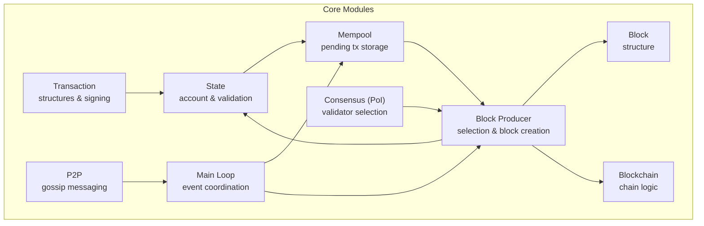
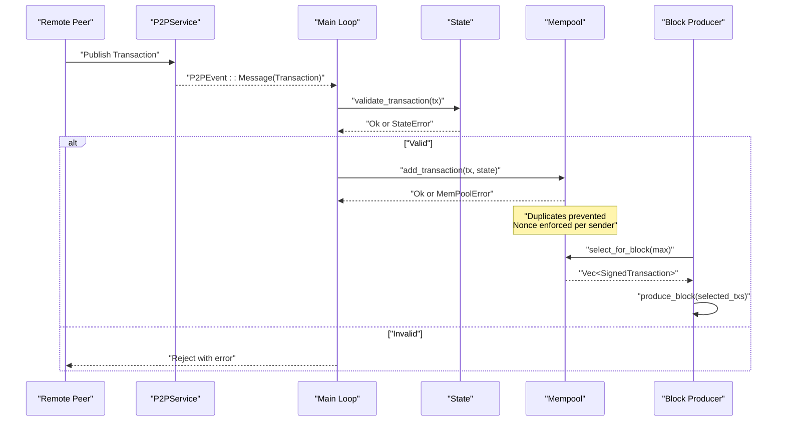
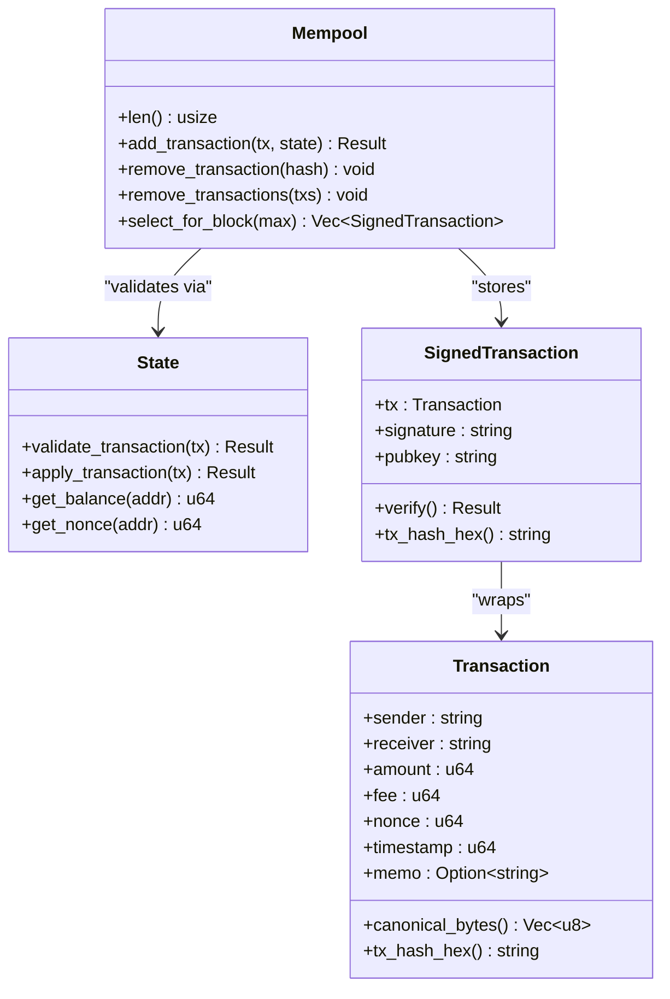
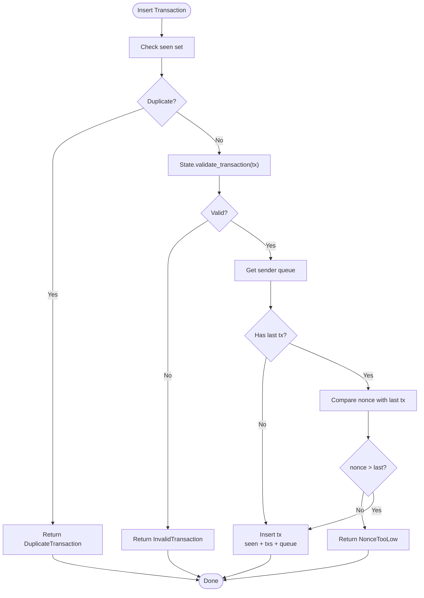
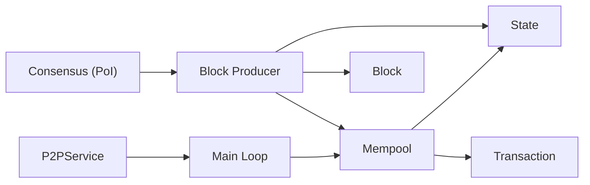

# Memory Pool System

<cite>
**Referenced Files in This Document**
- [mempool.rs](file://src/mempool.rs)
- [transaction.rs](file://src/transaction.rs)
- [state.rs](file://src/state.rs)
- [main.rs](file://src/main.rs)
- [p2p.rs](file://src/p2p.rs)
- [producer.rs](file://src/producer.rs)
- [consensus.rs](file://src/consensus.rs)
- [block.rs](file://src/block.rs)
- [blockchain.rs](file://src/blockchain.rs)
- [Cargo.toml](file://Cargo.toml)
</cite>

## Table of Contents
1. [Introduction](#introduction)
2. [Project Structure](#project-structure)
3. [Core Components](#core-components)
4. [Architecture Overview](#architecture-overview)
5. [Detailed Component Analysis](#detailed-component-analysis)
6. [Dependency Analysis](#dependency-analysis)
7. [Performance Considerations](#performance-considerations)
8. [Troubleshooting Guide](#troubleshooting-guide)
9. [Conclusion](#conclusion)
10. [Appendices](#appendices)

## Introduction
This document explains NetChain’s memory pool (mempool) system for managing pending transactions before block inclusion. It covers:
- Mempool data structures for storing transactions
- Validation during insertion (signature verification, balance checks, nonce ordering)
- Duplicate prevention mechanisms
- Fee-based prioritization for block selection
- Relationship between mempool and state management
- Practical examples of transaction submission, validation, and selection
- Size limits, expiration, and cleanup strategies
- Role of mempool in network coordination and propagation timing

## Project Structure
NetChain organizes core blockchain logic into modular Rust modules. The mempool resides alongside transaction, state, and P2P modules, integrating with the main event loop and block producer.

**Diagram sources**
- [mempool.rs](file://src/mempool.rs#L1-L159)
- [transaction.rs](file://src/transaction.rs#L1-L211)
- [state.rs](file://src/state.rs#L1-L183)
- [producer.rs](file://src/producer.rs#L1-L239)
- [consensus.rs](file://src/consensus.rs#L1-L334)
- [block.rs](file://src/block.rs#L1-L47)
- [blockchain.rs](file://src/blockchain.rs#L1-L117)
- [p2p.rs](file://src/p2p.rs#L1-L214)
- [main.rs](file://src/main.rs#L1-L147)

**Section sources**
- [Cargo.toml](file://Cargo.toml#L1-L47)
- [main.rs](file://src/main.rs#L1-L147)

## Core Components
- Mempool: Stores pending transactions, prevents duplicates, enforces nonce ordering per sender, and selects transactions for block production by fee.
- Transaction: Defines the unsigned transaction structure, canonical serialization, hashing, and Ed25519 signing/verification.
- State: Manages ledger accounts and validates transactions without mutating state.
- P2P: Receives transactions from peers and forwards them to the mempool.
- Producer: Selects validator and produces blocks from mempool transactions.

**Section sources**
- [mempool.rs](file://src/mempool.rs#L1-L159)
- [transaction.rs](file://src/transaction.rs#L1-L211)
- [state.rs](file://src/state.rs#L1-L183)
- [p2p.rs](file://src/p2p.rs#L1-L214)
- [producer.rs](file://src/producer.rs#L1-L239)

## Architecture Overview
The mempool sits between incoming transactions from the P2P layer and block production. It validates each transaction against the current state, enforces nonce ordering per sender, and exposes a fee-based selection interface for block producers.

**Diagram sources**
- [p2p.rs](file://src/p2p.rs#L123-L167)
- [main.rs](file://src/main.rs#L109-L133)
- [state.rs](file://src/state.rs#L69-L95)
- [mempool.rs](file://src/mempool.rs#L42-L77)
- [producer.rs](file://src/producer.rs#L136-L176)

## Detailed Component Analysis

### Mempool Data Structures and Behavior
- Storage:
  - Hash map of transaction hash to signed transaction for O(1) lookup and deduplication.
  - HashSet of seen hashes for fast duplicate detection.
  - Per-sender queues (VecDeque) to maintain monotonic nonce ordering.
- Validation pipeline:
  - Duplicate check using seen set.
  - State validation via State::validate_transaction.
  - Per-sender nonce monotonicity enforcement.
  - Insertion into maps and queues.
- Selection:
  - Fee-based prioritization by sorting descending by fee.
  - Limit selection to a configurable maximum.

**Diagram sources**
- [mempool.rs](file://src/mempool.rs#L14-L113)
- [state.rs](file://src/state.rs#L69-L119)
- [transaction.rs](file://src/transaction.rs#L23-L144)

**Section sources**
- [mempool.rs](file://src/mempool.rs#L14-L113)
- [state.rs](file://src/state.rs#L69-L119)
- [transaction.rs](file://src/transaction.rs#L23-L144)

### Transaction Validation During Mempool Insertion
Validation performed by the mempool before insertion:
- Duplicate prevention: Check seen set and reject if present.
- State validation: Call State::validate_transaction to verify:
  - Signature correctness.
  - Non-zero amount.
  - Sender exists.
  - Nonce equals current state nonce.
  - Sufficient balance for amount + fee.
- Per-sender nonce ordering: Compare against the last transaction in the sender’s queue and reject if nonce is not strictly greater.

**Diagram sources**
- [mempool.rs](file://src/mempool.rs#L42-L77)
- [state.rs](file://src/state.rs#L69-L95)

**Section sources**
- [mempool.rs](file://src/mempool.rs#L42-L77)
- [state.rs](file://src/state.rs#L69-L95)

### Duplicate Transaction Detection and Prevention
- The seen HashSet stores transaction hashes to enable O(1) duplicate detection.
- On insertion, if the hash is already present, the operation fails immediately with DuplicateTransaction.

**Section sources**
- [mempool.rs](file://src/mempool.rs#L45-L48)

### Nonce Ordering and Monotonicity
- Per-sender queues maintain transaction hashes in increasing nonce order.
- Before insertion, the mempool compares the incoming nonce with the last nonce in the queue and rejects if not strictly greater.

**Section sources**
- [mempool.rs](file://src/mempool.rs#L58-L66)

### Fee-Based Transaction Prioritization
- The mempool’s selection routine sorts transactions by fee in descending order and caps the result by a maximum count.
- This ensures higher-paying transactions are included first when building blocks.

**Section sources**
- [mempool.rs](file://src/mempool.rs#L99-L112)

### Relationship Between Mempool and State Management
- Mempool relies on State for validation to ensure cryptographic validity, correct nonce, sufficient balance, and non-zero amount.
- State does not mutate during validation; mutations occur during block application in the producer.

**Section sources**
- [mempool.rs](file://src/mempool.rs#L50-L53)
- [state.rs](file://src/state.rs#L69-L119)
- [producer.rs](file://src/producer.rs#L168-L173)

### Practical Examples

#### Submitting a Transaction
- A peer publishes a transaction over the P2P gossip topic.
- The main loop deserializes the transaction and calls Mempool::add_transaction with the current State.
- On success, the transaction is stored; on failure, the error is logged.

**Section sources**
- [p2p.rs](file://src/p2p.rs#L168-L183)
- [main.rs](file://src/main.rs#L109-L133)
- [mempool.rs](file://src/mempool.rs#L42-L77)

#### Mempool Validation Criteria
- Signature verified.
- Non-zero amount.
- Sender exists in state.
- Nonce equals current state nonce.
- Balance >= amount + fee.

**Section sources**
- [state.rs](file://src/state.rs#L69-L95)

#### Transaction Prioritization Based on Fees
- Block producer requests up to a configured maximum number of transactions from the mempool.
- Transactions are sorted by fee descending before inclusion.

**Section sources**
- [producer.rs](file://src/producer.rs#L136-L176)
- [mempool.rs](file://src/mempool.rs#L99-L112)

### Mempool Size Limits, Expiration, and Cleanup
- Current implementation does not define explicit size limits or transaction expiration.
- Cleanup occurs when transactions are removed after block inclusion via remove_transaction/remove_transactions.
- Future enhancements could include:
  - Size-based eviction policies.
  - TTL-based removal of stale transactions.
  - Garbage collection of empty sender queues.

**Section sources**
- [mempool.rs](file://src/mempool.rs#L79-L97)

### Network Coordination and Propagation Timing
- P2PService subscribes to a “transactions” topic and forwards received messages to the main loop.
- The main loop validates and inserts transactions into the mempool, enabling immediate propagation to peers.
- Validator selection for block production is handled by the PoI consensus module; the mempool remains agnostic to validator roles.

**Section sources**
- [p2p.rs](file://src/p2p.rs#L88-L99)
- [main.rs](file://src/main.rs#L109-L133)
- [consensus.rs](file://src/consensus.rs#L101-L143)

## Dependency Analysis
The mempool depends on transaction and state modules for validation and on the producer for selection. The main loop coordinates P2P reception and mempool updates.

**Diagram sources**
- [p2p.rs](file://src/p2p.rs#L1-L214)
- [main.rs](file://src/main.rs#L1-L147)
- [mempool.rs](file://src/mempool.rs#L1-L159)
- [state.rs](file://src/state.rs#L1-L183)
- [transaction.rs](file://src/transaction.rs#L1-L211)
- [producer.rs](file://src/producer.rs#L1-L239)
- [consensus.rs](file://src/consensus.rs#L1-L334)

**Section sources**
- [Cargo.toml](file://Cargo.toml#L6-L47)
- [mempool.rs](file://src/mempool.rs#L1-L159)
- [state.rs](file://src/state.rs#L1-L183)
- [transaction.rs](file://src/transaction.rs#L1-L211)
- [producer.rs](file://src/producer.rs#L1-L239)
- [consensus.rs](file://src/consensus.rs#L1-L334)
- [p2p.rs](file://src/p2p.rs#L1-L214)
- [main.rs](file://src/main.rs#L1-L147)

## Performance Considerations
- Hash-based storage and sets provide O(1) average-time operations for insertions, lookups, and duplicate checks.
- Sorting by fee is O(n log n) for selection; consider maintaining a heap or per-sender priority queues if throughput demands.
- Maintaining per-sender queues ensures monotonic nonces without scanning the entire pool.
- Network propagation via gossip reduces latency for transaction delivery.

[No sources needed since this section provides general guidance]

## Troubleshooting Guide
Common errors and causes:
- DuplicateTransaction: Transaction hash already present in the pool.
- InvalidTransaction: State validation failed (signature invalid, sender not found, nonce mismatch, insufficient balance, zero amount).
- NonceTooLow: Incoming nonce not greater than the last nonce in the sender’s queue.

Mitigation steps:
- Verify transaction signature and canonical serialization.
- Ensure sender account exists and nonce matches state.
- Confirm sufficient balance for amount + fee.
- Check that transactions are submitted in strictly increasing nonce order per sender.

**Section sources**
- [mempool.rs](file://src/mempool.rs#L7-L11)
- [state.rs](file://src/state.rs#L69-L95)

## Conclusion
NetChain’s mempool provides a compact, efficient mechanism for accepting validated transactions, preventing duplicates, enforcing nonce ordering, and selecting transactions by fee for block inclusion. Its integration with P2P and the block producer enables timely propagation and deterministic block construction. Future enhancements can introduce size limits, expiration, and advanced prioritization strategies to improve resilience under load.

[No sources needed since this section summarizes without analyzing specific files]

## Appendices

### Code Example Paths
- Mempool insertion and validation: [mempool.rs](file://src/mempool.rs#L42-L77)
- State validation: [state.rs](file://src/state.rs#L69-L95)
- Transaction signing and verification: [transaction.rs](file://src/transaction.rs#L93-L144)
- P2P transaction reception and forwarding: [p2p.rs](file://src/p2p.rs#L123-L167), [main.rs](file://src/main.rs#L109-L133)
- Block producer selection and application: [producer.rs](file://src/producer.rs#L136-L176)
- Consensus-driven validator selection: [consensus.rs](file://src/consensus.rs#L101-L143)

[No sources needed since this section lists paths without analyzing specific files]