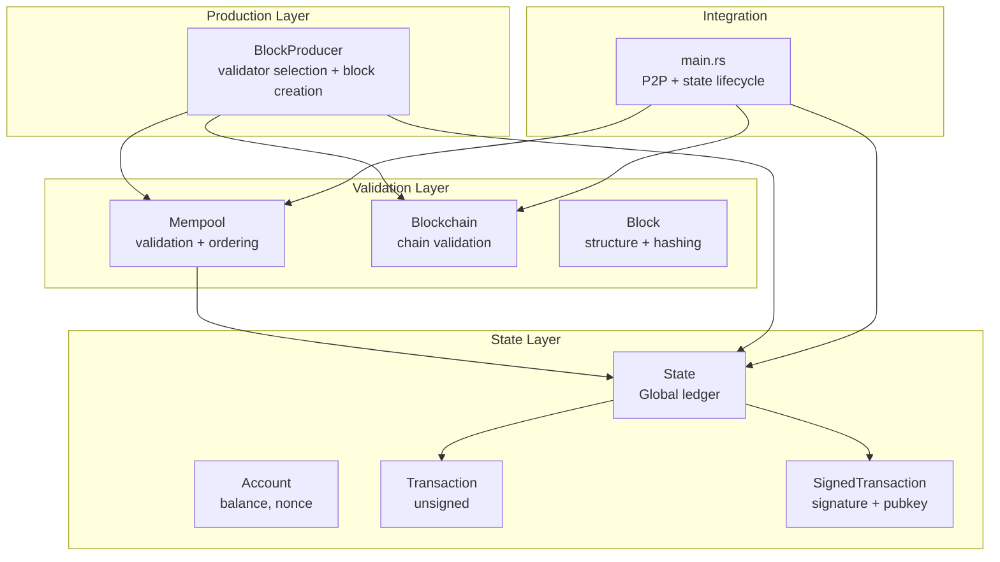
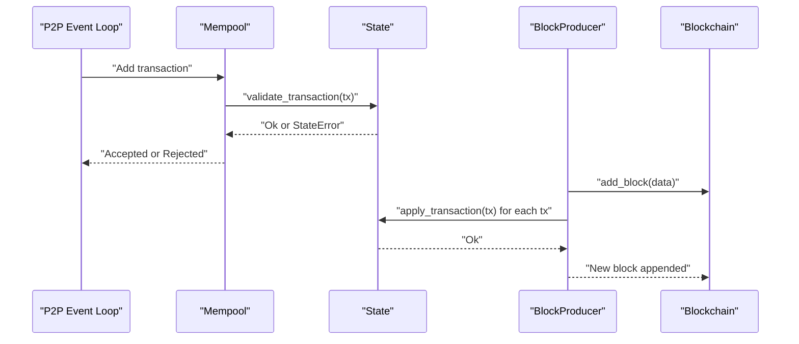
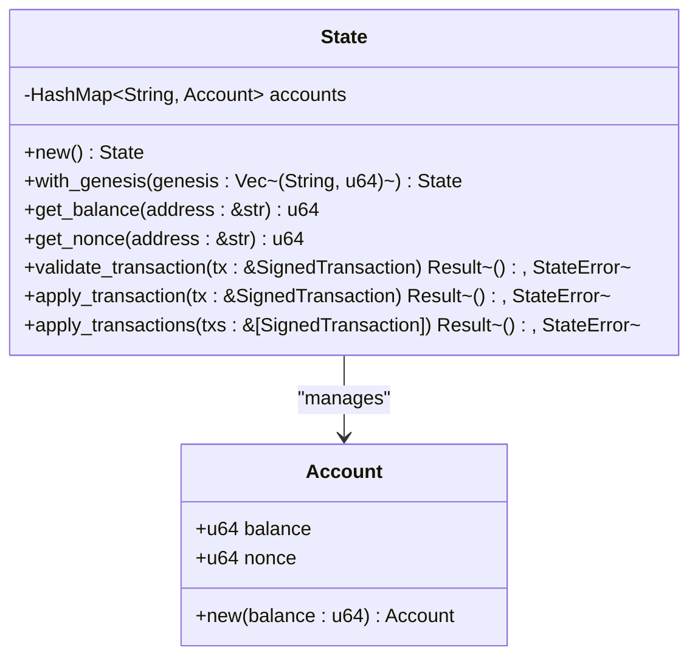
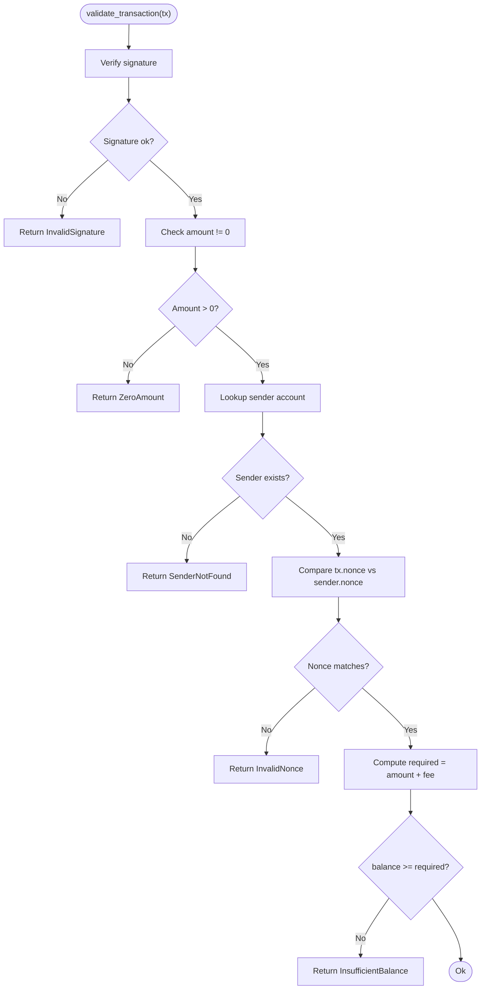
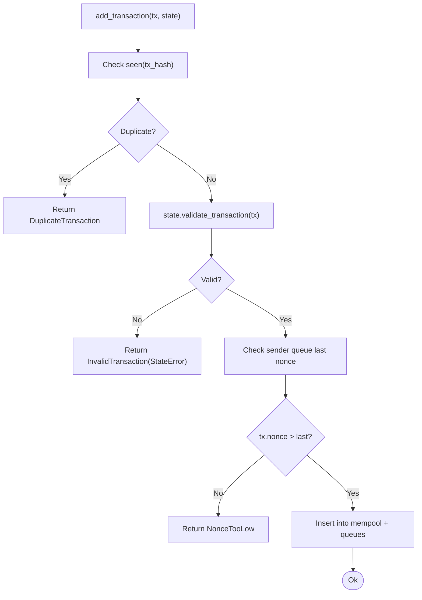
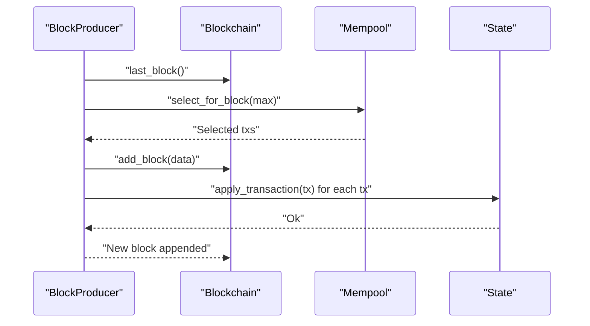
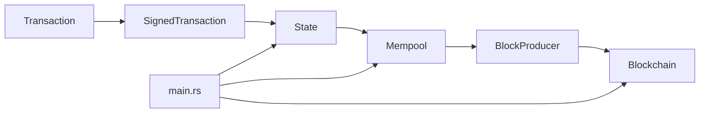

# State Management

<cite>
**Referenced Files in This Document**
- [state.rs](file://src/state.rs)
- [transaction.rs](file://src/transaction.rs)
- [mempool.rs](file://src/mempool.rs)
- [blockchain.rs](file://src/blockchain.rs)
- [block.rs](file://src/block.rs)
- [producer.rs](file://src/producer.rs)
- [main.rs](file://src/main.rs)
</cite>

## Table of Contents
1. [Introduction](#introduction)
2. [Project Structure](#project-structure)
3. [Core Components](#core-components)
4. [Architecture Overview](#architecture-overview)
5. [Detailed Component Analysis](#detailed-component-analysis)
6. [Dependency Analysis](#dependency-analysis)
7. [Performance Considerations](#performance-considerations)
8. [Troubleshooting Guide](#troubleshooting-guide)
9. [Conclusion](#conclusion)

## Introduction
This document explains NetChain’s state management system with a focus on account state representation, balance tracking, and state transition validation. It covers how the Account struct stores balance and nonce, how transactions mutate state, and how state validation enforces correctness (including sufficient balance checks and nonce ordering). Practical examples illustrate account creation, balance transfers, and maintaining state consistency. The document also describes the relationship between state management and transaction validation, how state prevents double-spending and maintains account integrity, and provides guidance on performance optimizations and caching strategies for frequently accessed accounts.

## Project Structure
NetChain organizes state management around a small set of cohesive modules:
- State: Defines the global ledger and account model, and validates/applies transactions.
- Transaction: Provides the transaction model, canonical serialization, signing, and verification.
- Mempool: Validates incoming transactions against the current state and enforces nonce ordering.
- Blockchain and Block: Provide block structure and chain validation (independent of state).
- Producer: Coordinates block production and applies transactions to state.
- Main: Integrates state, mempool, and P2P networking.

**Diagram sources**
- [state.rs](file://src/state.rs#L16-L34)
- [transaction.rs](file://src/transaction.rs#L23-L91)
- [mempool.rs](file://src/mempool.rs#L13-L24)
- [blockchain.rs](file://src/blockchain.rs#L5-L8)
- [block.rs](file://src/block.rs#L5-L12)
- [producer.rs](file://src/producer.rs#L36-L42)
- [main.rs](file://src/main.rs#L23-L21)

**Section sources**
- [state.rs](file://src/state.rs#L1-L183)
- [transaction.rs](file://src/transaction.rs#L1-L211)
- [mempool.rs](file://src/mempool.rs#L1-L159)
- [blockchain.rs](file://src/blockchain.rs#L1-L89)
- [block.rs](file://src/block.rs#L1-L47)
- [producer.rs](file://src/producer.rs#L1-L239)
- [main.rs](file://src/main.rs#L1-L145)

## Core Components
- Account: Holds balance and nonce for each address.
- State: Manages the global ledger, exposes getters, validates transactions without mutation, and applies transactions with mutation.
- SignedTransaction: Encapsulates a transaction with signature and public key for verification.
- Mempool: Validates transactions against the current state and enforces nonce ordering per sender.
- BlockProducer: Produces blocks and applies transactions to state atomically.
- Blockchain: Provides block structure and chain validation independent of state.

**Section sources**
- [state.rs](file://src/state.rs#L16-L34)
- [transaction.rs](file://src/transaction.rs#L23-L91)
- [mempool.rs](file://src/mempool.rs#L13-L24)
- [producer.rs](file://src/producer.rs#L36-L42)
- [blockchain.rs](file://src/blockchain.rs#L5-L8)

## Architecture Overview
State management is integrated into the transaction lifecycle:
- Transactions arrive via P2P and are validated by the mempool against the current state.
- When a node is selected as validator, it builds a block from mempool transactions and applies them to state.
- Chain validation ensures block integrity independently of state.

**Diagram sources**
- [main.rs](file://src/main.rs#L107-L131)
- [mempool.rs](file://src/mempool.rs#L41-L77)
- [state.rs](file://src/state.rs#L69-L119)
- [producer.rs](file://src/producer.rs#L136-L176)
- [blockchain.rs](file://src/blockchain.rs#L27-L37)

## Detailed Component Analysis

### Account and State Model
- Account encapsulates two fields: balance and nonce. New accounts are created with zero nonce and a specified initial balance.
- State maintains a map from address to Account and provides:
  - Genesis initialization with pre-funded accounts.
  - Queries for balance and nonce.
  - Validation of transactions without mutating state.
  - Application of transactions with mutation.

**Diagram sources**
- [state.rs](file://src/state.rs#L16-L34)
- [state.rs](file://src/state.rs#L36-L128)

**Section sources**
- [state.rs](file://src/state.rs#L16-L34)
- [state.rs](file://src/state.rs#L36-L128)

### Transaction Validation and State Transition
Validation rules enforced by State:
- Cryptographic verification of the signature.
- Non-zero amount.
- Sender exists in state.
- Nonce equals the sender’s current nonce.
- Sufficient balance for amount plus fee.

Application steps:
- Subtract amount and fee from sender.
- Increment sender nonce.
- Credit amount to receiver (creating account if needed).

**Diagram sources**
- [state.rs](file://src/state.rs#L69-L95)

**Section sources**
- [state.rs](file://src/state.rs#L69-L95)
- [state.rs](file://src/state.rs#L98-L119)

### Mempool Integration and Nonce Ordering
Mempool enforces:
- Duplicate prevention using a set of seen transaction hashes.
- State-based validation against the current ledger.
- Monotonic nonce ordering per sender by tracking a queue of pending transactions.

**Diagram sources**
- [mempool.rs](file://src/mempool.rs#L41-L77)

**Section sources**
- [mempool.rs](file://src/mempool.rs#L41-L77)

### Block Production and State Updates
BlockProducer coordinates:
- Validator selection using PoI with a deterministic seed.
- Selecting transactions from mempool.
- Applying transactions to state and appending a new block.

**Diagram sources**
- [producer.rs](file://src/producer.rs#L136-L176)
- [blockchain.rs](file://src/blockchain.rs#L27-L37)
- [state.rs](file://src/state.rs#L98-L119)

**Section sources**
- [producer.rs](file://src/producer.rs#L136-L176)
- [blockchain.rs](file://src/blockchain.rs#L27-L37)
- [state.rs](file://src/state.rs#L98-L119)

### Relationship Between State and Transaction Validation
- State validation occurs before transactions enter the mempool, preventing invalid transactions from propagating.
- State validation occurs again when applying transactions to the block, ensuring atomicity and correctness.
- Nonce ordering prevents double-spending by ensuring transactions are processed in strict order per sender.
- Sufficient balance checks prevent overspending and maintain account integrity.

**Section sources**
- [mempool.rs](file://src/mempool.rs#L41-L77)
- [state.rs](file://src/state.rs#L69-L95)
- [state.rs](file://src/state.rs#L98-L119)

### Practical Examples

- Account creation and genesis funding:
  - Initialize state with genesis accounts.
  - Example path: [state.rs](file://src/state.rs#L44-L51)

- Balance transfer:
  - Create a transaction with sender, receiver, amount, fee, and nonce.
  - Sign the transaction.
  - Validate and apply to state.
  - Example path: [state.rs](file://src/state.rs#L98-L119)

- State consistency maintenance:
  - After applying a transaction, sender balance decreases by amount+fee and nonce increments.
  - Receiver balance increases by amount; account is created if absent.
  - Example path: [state.rs](file://src/state.rs#L102-L116)

- Double-spending prevention:
  - Mempool enforces monotonic nonce ordering per sender.
  - Example path: [mempool.rs](file://src/mempool.rs#L58-L66)

**Section sources**
- [state.rs](file://src/state.rs#L44-L51)
- [state.rs](file://src/state.rs#L98-L119)
- [mempool.rs](file://src/mempool.rs#L58-L66)

## Dependency Analysis
- State depends on Transaction and SignedTransaction for validation and application.
- Mempool depends on State for validation and on SignedTransaction for deduplication and ordering.
- BlockProducer depends on State for applying transactions and on Blockchain for block creation.
- Main ties everything together, passing transactions to mempool and coordinating state updates.

**Diagram sources**
- [state.rs](file://src/state.rs#L3-L4)
- [transaction.rs](file://src/transaction.rs#L23-L91)
- [mempool.rs](file://src/mempool.rs#L1-L3)
- [producer.rs](file://src/producer.rs#L9-L14)
- [main.rs](file://src/main.rs#L16-L21)

**Section sources**
- [state.rs](file://src/state.rs#L3-L4)
- [transaction.rs](file://src/transaction.rs#L23-L91)
- [mempool.rs](file://src/mempool.rs#L1-L3)
- [producer.rs](file://src/producer.rs#L9-L14)
- [main.rs](file://src/main.rs#L16-L21)

## Performance Considerations
- State access patterns:
  - Frequent reads for balance and nonce queries are O(1) via HashMap lookups.
  - Writes are O(1) per transaction application.
- Caching strategies:
  - Cache hot accounts in memory keyed by address to reduce repeated lookups.
  - Maintain a small LRU cache for recent addresses to optimize frequent transfers.
- Validation cost:
  - Signature verification is constant-time per transaction.
  - Canonical serialization and hashing are lightweight compared to cryptographic operations.
- Concurrency:
  - Use fine-grained locks or concurrent data structures to minimize contention between P2P ingestion and block production.
- Batch application:
  - Apply transactions in batches during block production to reduce overhead and improve throughput.

[No sources needed since this section provides general guidance]

## Troubleshooting Guide
Common validation errors and causes:
- InvalidSignature: Signature verification failed; check canonical serialization and signature encoding.
- ZeroAmount: Transaction amount is zero; ensure amount > 0.
- SenderNotFound: Sender account does not exist; initialize with genesis balances.
- InvalidNonce: Transaction nonce does not match current sender nonce; enforce monotonic ordering in mempool.
- InsufficientBalance: Balance less than amount plus fee; ensure sufficient funds before sending.

Operational tips:
- Verify canonical serialization and hashing for transactions to ensure consistent signatures.
- Monitor mempool for duplicate transactions and nonce conflicts.
- Ensure state is updated atomically during block production to maintain consistency.

**Section sources**
- [state.rs](file://src/state.rs#L6-L14)
- [state.rs](file://src/state.rs#L69-L95)
- [mempool.rs](file://src/mempool.rs#L41-L77)

## Conclusion
NetChain’s state management provides a compact, efficient model for account state and transaction validation. The Account struct captures essential state fields, State enforces correctness through cryptographic verification, nonce ordering, and balance checks, and Mempool and BlockProducer coordinate validation and application. Together, these components prevent double-spending, maintain account integrity, and support scalable transaction processing with clear extension points for performance optimizations and advanced caching strategies.