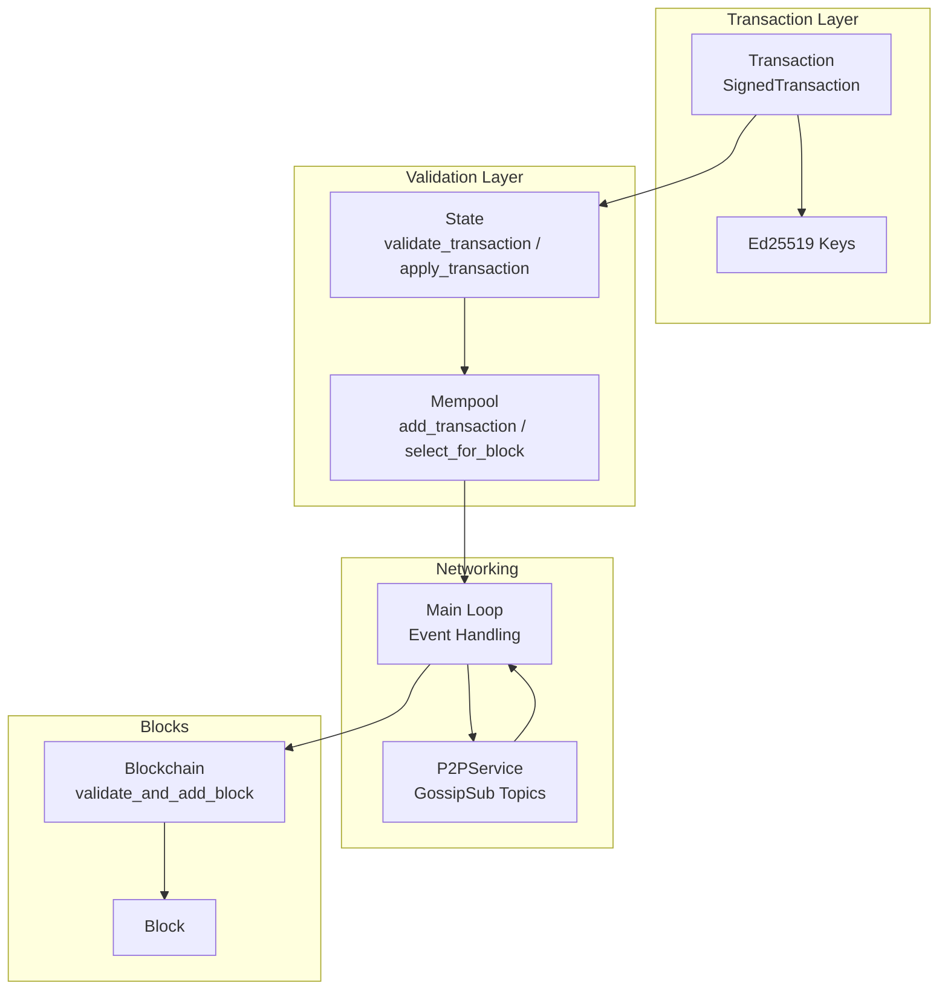
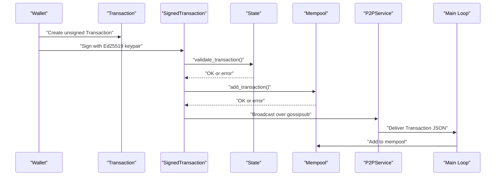
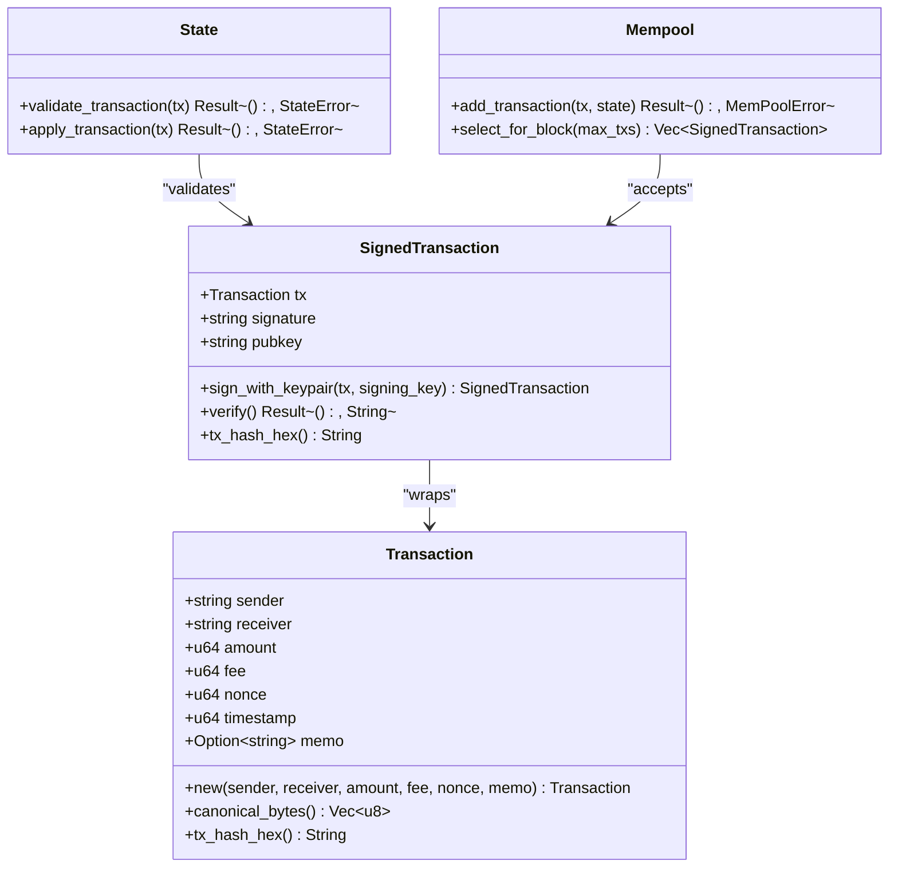
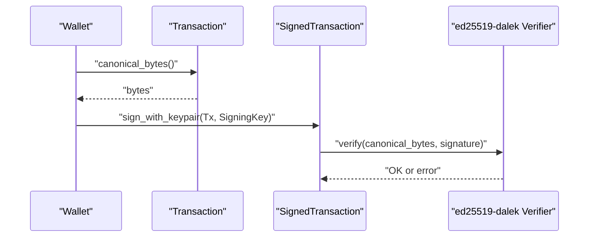
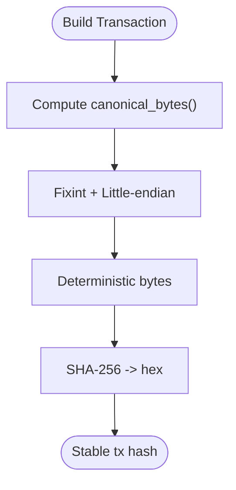
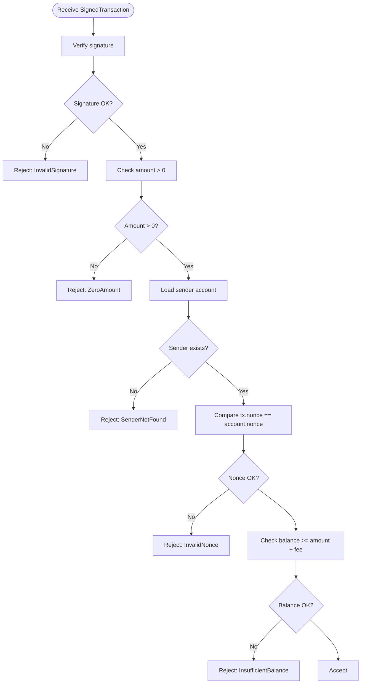
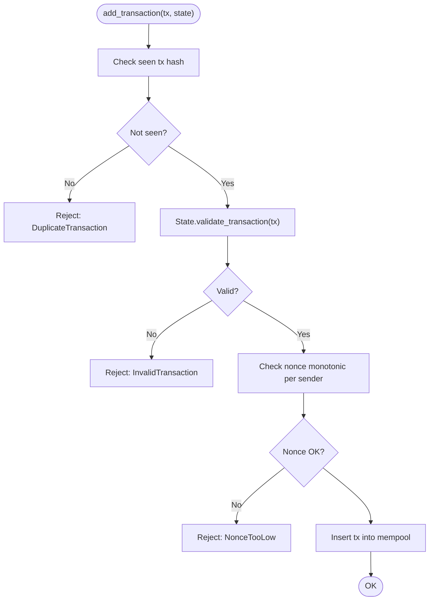
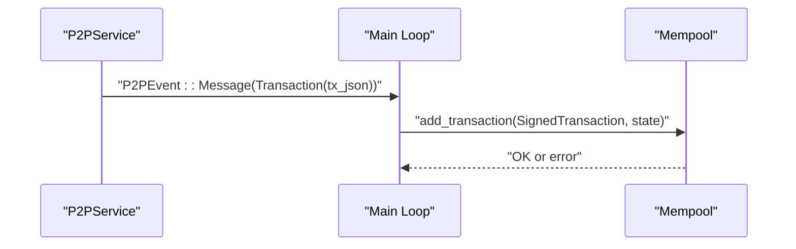
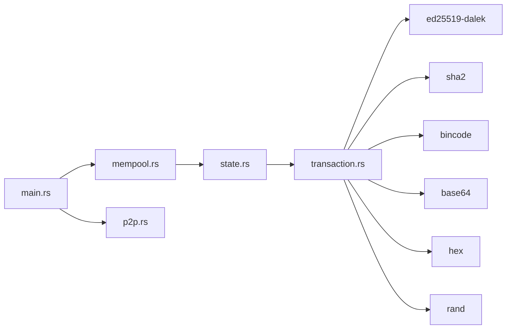

# Transaction System

<cite>
**Referenced Files in This Document**
- [transaction.rs](file://src/transaction.rs)
- [state.rs](file://src/state.rs)
- [mempool.rs](file://src/mempool.rs)
- [main.rs](file://src/main.rs)
- [p2p.rs](file://src/p2p.rs)
- [block.rs](file://src/block.rs)
- [blockchain.rs](file://src/blockchain.rs)
- [Cargo.toml](file://Cargo.toml)
- [README.md](file://README.md)
</cite>

## Table of Contents
1. [Introduction](#introduction)
2. [Project Structure](#project-structure)
3. [Core Components](#core-components)
4. [Architecture Overview](#architecture-overview)
5. [Detailed Component Analysis](#detailed-component-analysis)
6. [Dependency Analysis](#dependency-analysis)
7. [Performance Considerations](#performance-considerations)
8. [Troubleshooting Guide](#troubleshooting-guide)
9. [Conclusion](#conclusion)
10. [Appendices](#appendices)

## Introduction
This document explains NetChain’s transaction system with a focus on:
- Transaction data model and fields
- Ed25519 digital signature implementation using the ed25519-dalek crate
- Canonical serialization for deterministic signature creation and verification
- Transaction validation rules (nonce, balance, signature)
- Practical workflows for wallet creation, transaction signing, and broadcasting
- Security considerations for key management and cryptographic guarantees

The transaction system is implemented in a modular way across several modules, integrating with the mempool, state, and P2P networking layers.

## Project Structure
The transaction system spans the following modules:
- Transaction model and signing: [transaction.rs](file://src/transaction.rs)
- State and validation: [state.rs](file://src/state.rs)
- Mempool: [mempool.rs](file://src/mempool.rs)
- P2P networking and broadcast: [p2p.rs](file://src/p2p.rs)
- Entry point and integration: [main.rs](file://src/main.rs)
- Blocks and blockchain validation: [block.rs](file://src/block.rs), [blockchain.rs](file://src/blockchain.rs)
- Dependencies: [Cargo.toml](file://Cargo.toml)

**Diagram sources**
- [transaction.rs](file://src/transaction.rs#L23-L144)
- [state.rs](file://src/state.rs#L69-L119)
- [mempool.rs](file://src/mempool.rs#L42-L112)
- [main.rs](file://src/main.rs#L107-L131)
- [p2p.rs](file://src/p2p.rs#L25-L149)
- [block.rs](file://src/block.rs#L5-L46)
- [blockchain.rs](file://src/blockchain.rs#L40-L64)

**Section sources**
- [Cargo.toml](file://Cargo.toml#L6-L47)
- [README.md](file://README.md#L47-L156)

## Core Components
- Transaction: Unsigned transaction with sender, receiver, amount, fee, nonce, timestamp, and optional memo.
- SignedTransaction: Wraps a Transaction with a base64-encoded signature and base64-encoded public key.
- Ed25519 keypair generation and address derivation helpers.
- Canonical serialization using bincode with fixed-size integers and little-endian encoding.
- Transaction hashing via SHA-256 of canonical bytes.
- State validation: signature verification, nonce check, and balance verification.
- Mempool enforcement: duplicate prevention, nonce ordering, and fee-based selection.
- P2P integration: receiving and forwarding transactions over gossipsub topics.

**Section sources**
- [transaction.rs](file://src/transaction.rs#L23-L159)
- [state.rs](file://src/state.rs#L69-L119)
- [mempool.rs](file://src/mempool.rs#L42-L112)
- [main.rs](file://src/main.rs#L107-L131)

## Architecture Overview
The transaction lifecycle integrates signing, validation, mempool acceptance, and P2P propagation.

**Diagram sources**
- [transaction.rs](file://src/transaction.rs#L94-L144)
- [state.rs](file://src/state.rs#L69-L95)
- [mempool.rs](file://src/mempool.rs#L42-L77)
- [p2p.rs](file://src/p2p.rs#L113-L149)
- [main.rs](file://src/main.rs#L107-L131)

## Detailed Component Analysis

### Transaction Data Model
- Fields:
  - sender: String (address derived from public key)
  - receiver: String (recipient address)
  - amount: u64 (smallest unit)
  - fee: u64 (paid to validators)
  - nonce: u64 (monotonic counter for replay protection)
  - timestamp: u64 (Unix seconds)
  - memo: Option<String> (optional data)
- Construction: Automatic timestamp capture on creation.
- Canonical bytes: Deterministic serialization using bincode with fixint encoding and little-endian ordering.
- Hashing: SHA-256 over canonical bytes, returned as hex string.

**Diagram sources**
- [transaction.rs](file://src/transaction.rs#L23-L144)
- [state.rs](file://src/state.rs#L69-L119)
- [mempool.rs](file://src/mempool.rs#L42-L112)

**Section sources**
- [transaction.rs](file://src/transaction.rs#L23-L81)

### Ed25519 Digital Signature Implementation
- Key generation: Uses ed25519-dalek SigningKey with OS random number generator.
- Signing: Computes canonical bytes of the unsigned transaction and signs with the signing key; stores signature and public key as base64 strings.
- Verification: Decodes base64 signature and public key, reconstructs ed25519 types, verifies the signature against canonical bytes.
- Address derivation: Optional helper converts public key bytes to a 40-character hex address using SHA-256 of public key and taking the first 20 bytes.

**Diagram sources**
- [transaction.rs](file://src/transaction.rs#L94-L144)

**Section sources**
- [transaction.rs](file://src/transaction.rs#L94-L159)

### Canonical Serialization for Deterministic Signatures
- Serialization: bincode with fixint encoding and little-endian ordering ensures consistent byte representation for all primitive fields.
- Hashing: SHA-256 over canonical bytes produces a stable transaction hash used for identification and verification.
- Stability: Changing any field (including memo) changes the canonical bytes and thus the hash/signature.

**Diagram sources**
- [transaction.rs](file://src/transaction.rs#L63-L81)

**Section sources**
- [transaction.rs](file://src/transaction.rs#L63-L81)

### Transaction Validation Rules
- Cryptographic verification: Ensures signature matches the claimed public key and canonical bytes.
- Nonce check: Enforces monotonic, per-sender nonce equality with ledger state.
- Balance verification: Requires sufficient balance for amount plus fee.
- Additional checks: Rejects zero-amount transactions and handles missing senders.

**Diagram sources**
- [state.rs](file://src/state.rs#L69-L95)

**Section sources**
- [state.rs](file://src/state.rs#L69-L95)

### Mempool Enforcement and Selection
- Duplicate prevention: Tracks seen transaction hashes to reject duplicates.
- Per-sender nonce ordering: Enforces strictly increasing nonce per sender.
- Selection: Sorts by fee (descending) and limits by max count for block production.

**Diagram sources**
- [mempool.rs](file://src/mempool.rs#L42-L77)

**Section sources**
- [mempool.rs](file://src/mempool.rs#L42-L112)

### P2P Integration and Broadcast
- Topics: GossipSub topics for blocks and transactions.
- Reception: Main loop deserializes incoming transaction JSON and adds to mempool.
- Broadcasting: Node publishes blocks and can be extended to broadcast transactions.

**Diagram sources**
- [p2p.rs](file://src/p2p.rs#L113-L149)
- [main.rs](file://src/main.rs#L107-L131)

**Section sources**
- [p2p.rs](file://src/p2p.rs#L25-L149)
- [main.rs](file://src/main.rs#L107-L131)

### Practical Workflows

#### Wallet Creation and Key Management
- Generate Ed25519 keypair using the provided helper.
- Derive a human-readable address from the verifying key (SHA-256 of public key, first 20 bytes, hex-encoded).
- Store private keys securely; never expose them.

**Section sources**
- [transaction.rs](file://src/transaction.rs#L147-L159)

#### Transaction Creation and Signing
- Build an unsigned Transaction with sender, receiver, amount, fee, nonce, and optional memo.
- Compute canonical bytes and sign with the SigningKey to produce a SignedTransaction containing signature and public key.

**Section sources**
- [transaction.rs](file://src/transaction.rs#L43-L103)

#### Transaction Verification
- Decode base64 signature and public key.
- Reconstruct ed25519 types and verify the signature against canonical bytes of the inner transaction.

**Section sources**
- [transaction.rs](file://src/transaction.rs#L105-L138)

#### Transaction Validation and Application
- Validate signature, nonce, and balance.
- Apply transaction to state by debiting sender and crediting receiver; increment nonce.

**Section sources**
- [state.rs](file://src/state.rs#L69-L119)

#### Mempool Acceptance and Selection
- Add validated transactions to mempool, enforcing duplicates and nonce ordering.
- Select transactions for block production by fee priority.

**Section sources**
- [mempool.rs](file://src/mempool.rs#L42-L112)

#### Transaction Broadcast
- Deserialize incoming transaction JSON in the main loop.
- Add to mempool for propagation via P2P gossipsub.

**Section sources**
- [main.rs](file://src/main.rs#L107-L131)
- [p2p.rs](file://src/p2p.rs#L113-L149)

## Dependency Analysis
External crates used by the transaction system:
- ed25519-dalek: Ed25519 signing and verification
- sha2: SHA-256 hashing
- bincode: Deterministic serialization
- base64: Encoding signature and public key
- hex: Address derivation
- rand: OS randomness for key generation

**Diagram sources**
- [Cargo.toml](file://Cargo.toml#L25-L35)
- [transaction.rs](file://src/transaction.rs#L15-L21)

**Section sources**
- [Cargo.toml](file://Cargo.toml#L25-L35)

## Performance Considerations
- Serialization cost: bincode with fixint and little-endian is efficient and deterministic.
- Hashing cost: SHA-256 over canonical bytes is lightweight and constant-time per transaction.
- Mempool operations: Hash maps and deques provide O(1) average insertions and lookups; selection sorts by fee.
- Networking: GossipSub throughput depends on network conditions; batching transactions can reduce overhead.

[No sources needed since this section provides general guidance]

## Troubleshooting Guide
Common issues and resolutions:
- Invalid signature: Ensure canonical bytes match the original transaction and public key matches the signing key.
- Invalid nonce: Increment nonce per sender strictly; mempool rejects non-monotonic values.
- Insufficient balance: Ensure sender balance covers amount plus fee.
- Duplicate transaction: Mempool tracks seen hashes; avoid resubmission.
- Zero amount: Transactions must have amount > 0.
- Address mismatch: Optional strict address verification can be enabled depending on address schema.

**Section sources**
- [state.rs](file://src/state.rs#L69-L95)
- [mempool.rs](file://src/mempool.rs#L42-L77)
- [transaction.rs](file://src/transaction.rs#L105-L138)

## Conclusion
NetChain’s transaction system provides a secure, deterministic foundation for transfers:
- Ed25519 signatures ensure authenticity and non-repudiation.
- Canonical serialization guarantees consistent signing and verification across nodes.
- State and mempool enforce economic and replay protections.
- P2P integration enables decentralized propagation and validation.

[No sources needed since this section summarizes without analyzing specific files]

## Appendices

### Security Considerations
- Key management: Protect private keys; consider hardware security modules or secure enclaves for production deployments.
- Address schema: Align sender field with derived address to prevent spoofing.
- Replay protection: Enforce nonce per sender and track seen transaction hashes.
- Transaction integrity: Canonical serialization prevents malleability; any change invalidates the signature.
- Network security: Use encrypted transports and authenticated gossipsub messages.

[No sources needed since this section provides general guidance]