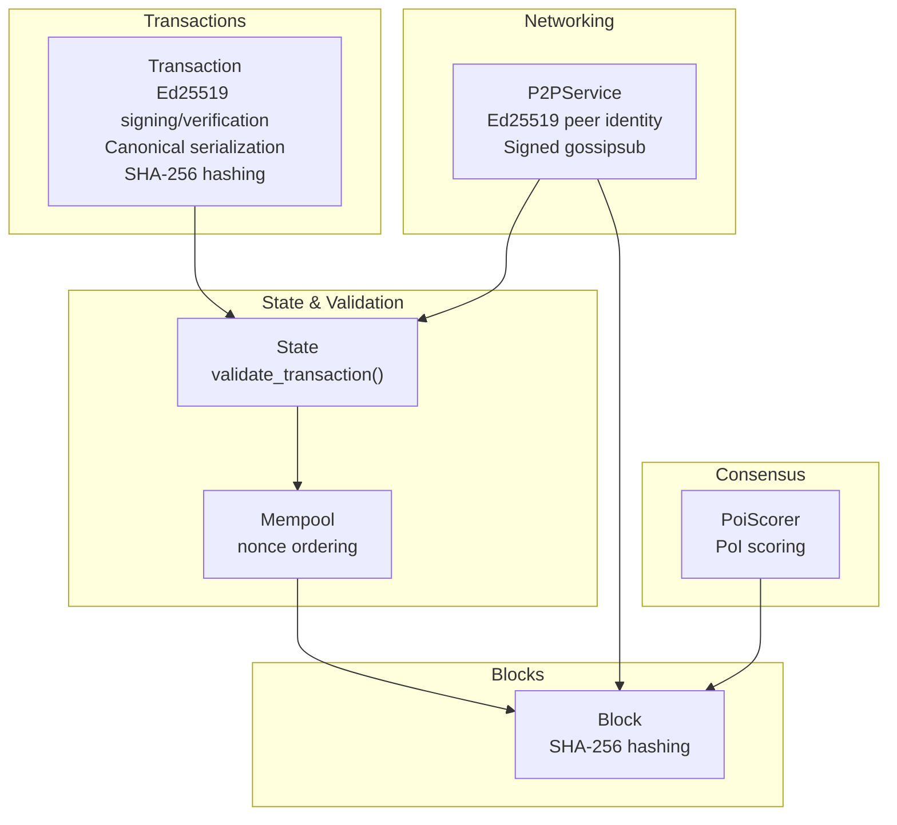
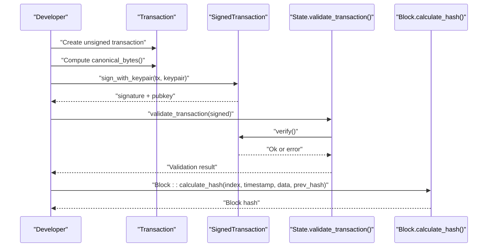
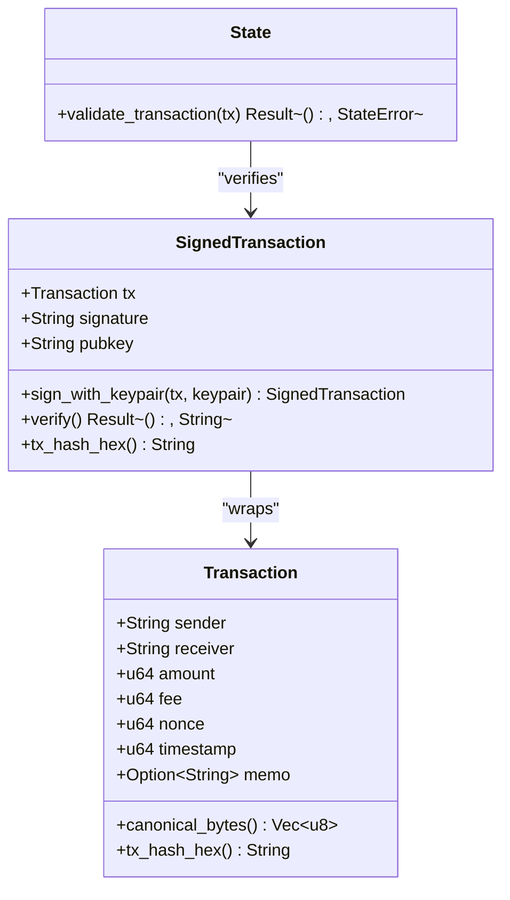
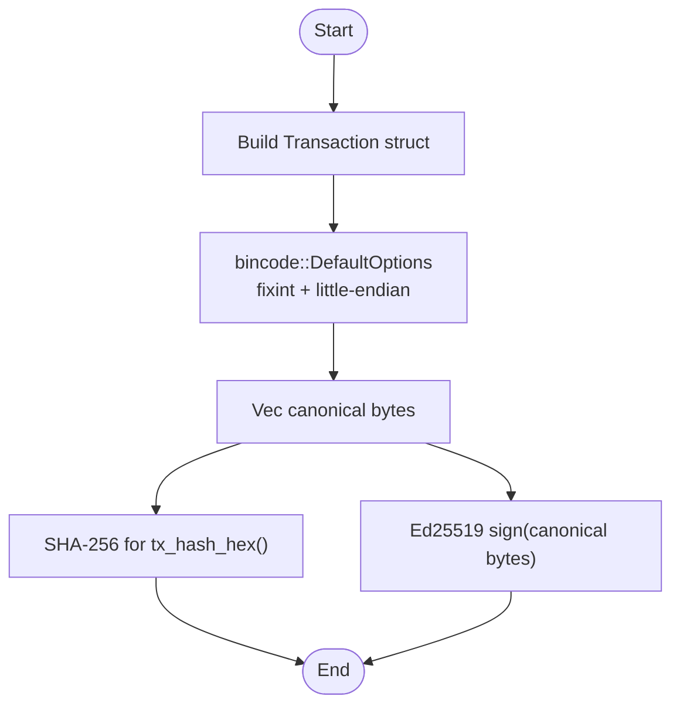
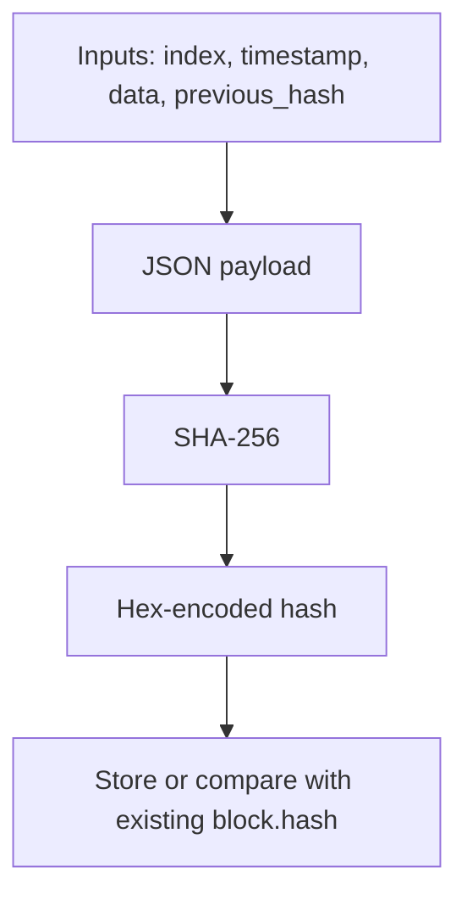
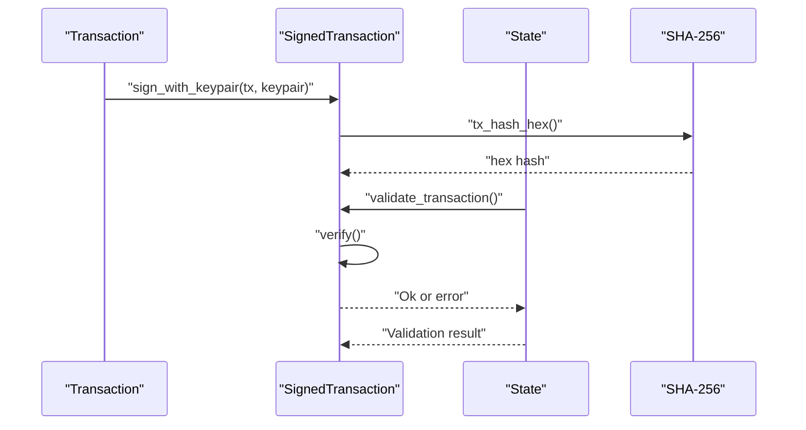
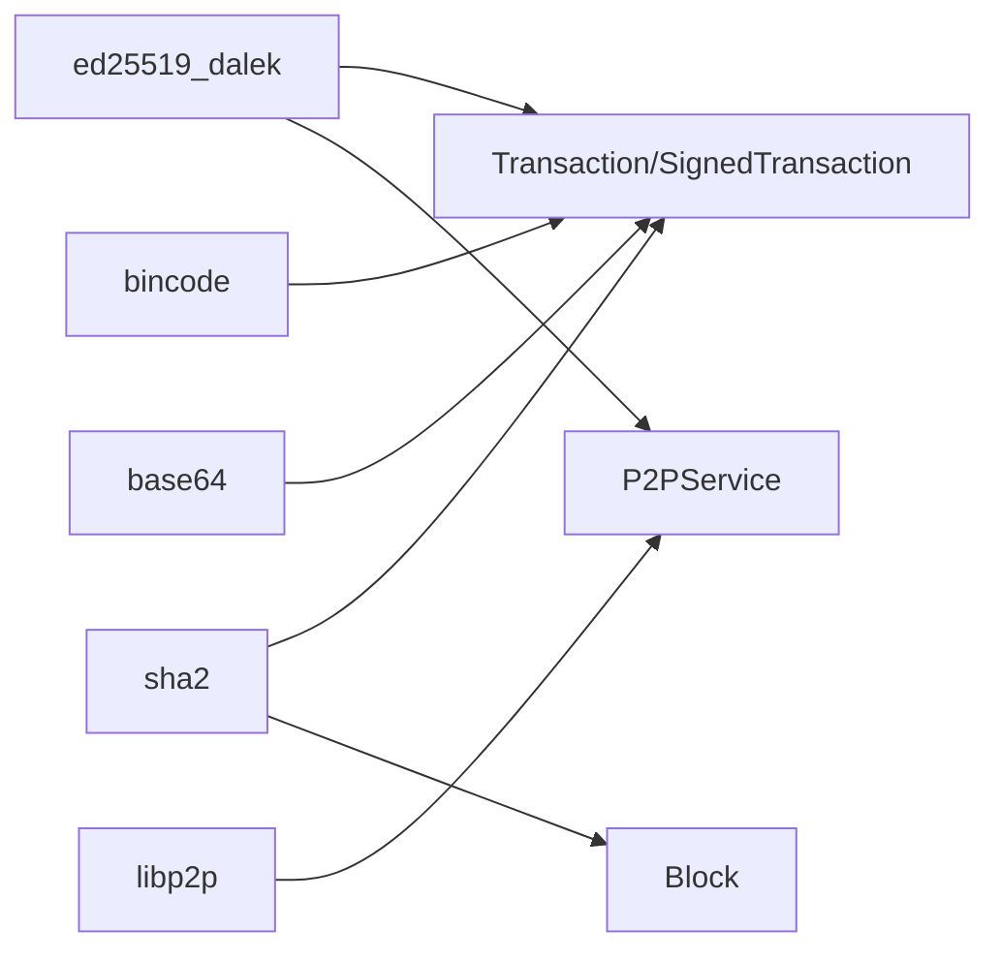

# Cryptographic Implementation

<cite>
**Referenced Files in This Document**
- [src/main.rs](file://src/main.rs)
- [src/transaction.rs](file://src/transaction.rs)
- [src/block.rs](file://src/block.rs)
- [src/blockchain.rs](file://src/blockchain.rs)
- [src/state.rs](file://src/state.rs)
- [src/mempool.rs](file://src/mempool.rs)
- [src/p2p.rs](file://src/p2p.rs)
- [src/consensus.rs](file://src/consensus.rs)
- [Cargo.toml](file://Cargo.toml)
- [README.md](file://README.md)
</cite>

## Table of Contents
1. [Introduction](#introduction)
2. [Project Structure](#project-structure)
3. [Core Components](#core-components)
4. [Architecture Overview](#architecture-overview)
5. [Detailed Component Analysis](#detailed-component-analysis)
6. [Dependency Analysis](#dependency-analysis)
7. [Performance Considerations](#performance-considerations)
8. [Troubleshooting Guide](#troubleshooting-guide)
9. [Conclusion](#conclusion)
10. [Appendices](#appendices)

## Introduction
This document explains NetChain’s cryptographic foundations for blockchain security. It focuses on:
- Ed25519 digital signatures for transaction authentication
- SHA-256 hashing for block integrity and transaction hashing
- Canonical serialization for deterministic signing and hashing

It provides conceptual overviews for newcomers and precise technical details for implementers, including key generation, signing, verification, and security considerations. Practical examples are provided via code snippet paths to guide implementation.

## Project Structure
The cryptographic logic spans several modules:
- Transaction module: Ed25519 signing and verification, canonical serialization, and SHA-256 hashing for transactions
- Block module: SHA-256 hashing for block integrity
- State module: cryptographic verification and state transitions
- Mempool module: transaction validation and nonce ordering
- P2P module: Ed25519-based peer identity and signed gossip messages
- Consensus module: PoI scoring (non-cryptographic) but integrates with cryptographic identities

**Diagram sources**
- [src/transaction.rs](file://src/transaction.rs#L1-L209)
- [src/block.rs](file://src/block.rs#L1-L47)
- [src/state.rs](file://src/state.rs#L1-L183)
- [src/mempool.rs](file://src/mempool.rs#L1-L159)
- [src/p2p.rs](file://src/p2p.rs#L1-L150)
- [src/consensus.rs](file://src/consensus.rs#L1-L334)

**Section sources**
- [src/transaction.rs](file://src/transaction.rs#L1-L209)
- [src/block.rs](file://src/block.rs#L1-L47)
- [src/state.rs](file://src/state.rs#L1-L183)
- [src/mempool.rs](file://src/mempool.rs#L1-L159)
- [src/p2p.rs](file://src/p2p.rs#L1-L150)
- [src/consensus.rs](file://src/consensus.rs#L1-L334)

## Core Components
- Ed25519 digital signatures for transactions:
  - Keypair generation, signing, and verification
  - Base64 encoding for signature and public key storage
  - Address derivation from public key bytes
- Canonical serialization:
  - Deterministic bincode serialization for transaction signing
  - Little-endian fixint encoding for consistent byte layout
- SHA-256 cryptographic hashing:
  - Transaction hashing for stable identifiers
  - Block hashing for integrity and chain linking

**Section sources**
- [src/transaction.rs](file://src/transaction.rs#L1-L209)
- [src/block.rs](file://src/block.rs#L1-L47)
- [src/state.rs](file://src/state.rs#L1-L183)

## Architecture Overview
The cryptographic pipeline connects transaction creation, signing, verification, and block hashing:

**Diagram sources**
- [src/transaction.rs](file://src/transaction.rs#L43-L144)
- [src/state.rs](file://src/state.rs#L69-L95)
- [src/block.rs](file://src/block.rs#L27-L45)

## Detailed Component Analysis

### Ed25519 Digital Signatures for Transactions
- Keypair generation:
  - Cryptographically secure random generation using OS entropy
  - Keypair contains both secret and public parts
- Signing process:
  - Canonical serialization of the unsigned transaction
  - Ed25519 signature computed over canonical bytes
  - Signature and public key stored in base64-encoded form
- Verification process:
  - Decode base64 signature and public key
  - Recompute canonical bytes from the inner transaction
  - Verify Ed25519 signature against the canonical bytes
- Address derivation:
  - Optional helper derives an address from public key bytes using SHA-256

**Diagram sources**
- [src/transaction.rs](file://src/transaction.rs#L23-L144)
- [src/state.rs](file://src/state.rs#L69-L95)

**Section sources**
- [src/transaction.rs](file://src/transaction.rs#L140-L154)
- [src/transaction.rs](file://src/transaction.rs#L93-L138)
- [src/state.rs](file://src/state.rs#L69-L95)

### Canonical Serialization for Deterministic Signing
- Serialization strategy:
  - Deterministic bincode serialization with compact integers and little-endian encoding
  - Ensures identical byte sequences across platforms and languages
- Purpose:
  - Produces canonical bytes for Ed25519 signing and SHA-256 hashing
  - Prevents ambiguity in signed payloads

**Diagram sources**
- [src/transaction.rs](file://src/transaction.rs#L61-L81)
- [src/transaction.rs](file://src/transaction.rs#L95-L103)

**Section sources**
- [src/transaction.rs](file://src/transaction.rs#L61-L81)

### SHA-256 Hashing for Block Integrity
- Block hashing:
  - Computes SHA-256 over a JSON payload containing index, timestamp, data, and previous_hash
  - Produces a hexadecimal string used as the block hash
- Chain validation:
  - Recomputes block hash and compares with stored value
  - Validates chain continuity via previous_hash linkage

**Diagram sources**
- [src/block.rs](file://src/block.rs#L27-L45)

**Section sources**
- [src/block.rs](file://src/block.rs#L14-L45)
- [src/blockchain.rs](file://src/blockchain.rs#L40-L64)

### Transaction Hashing and Verification Workflow
- Transaction hashing:
  - Canonical bytes are hashed with SHA-256 to produce a stable identifier
- Verification:
  - Decode signature and public key
  - Recompute canonical bytes and verify Ed25519 signature
  - State validates signature and other conditions (amount, nonce, balance)

**Diagram sources**
- [src/transaction.rs](file://src/transaction.rs#L93-L138)
- [src/state.rs](file://src/state.rs#L69-L95)

**Section sources**
- [src/transaction.rs](file://src/transaction.rs#L73-L81)
- [src/transaction.rs](file://src/transaction.rs#L105-L132)
- [src/state.rs](file://src/state.rs#L69-L95)

### Address Derivation and Security Model
- Address derivation:
  - Public key bytes are hashed with SHA-256 and truncated to a fixed length for human-friendly addresses
- Security model:
  - Ed25519 ensures authenticity and non-repudiation
  - SHA-256 ensures integrity and collision resistance
  - Canonical serialization prevents malleability and replay attacks
- Threat mitigation:
  - Replay protection via nonce
  - Duplicate detection via transaction hash in mempool
  - Signature verification before state mutation

**Section sources**
- [src/transaction.rs](file://src/transaction.rs#L146-L154)
- [src/mempool.rs](file://src/mempool.rs#L41-L77)
- [src/state.rs](file://src/state.rs#L69-L95)

### P2P Identity and Signed Messages
- Peer identity:
  - libp2p Ed25519 keypair generates PeerId for network identity
- Signed gossip messages:
  - Gossipsub publishes messages under signed identity
  - Network-level authenticity and integrity for blocks and transactions

**Section sources**
- [src/p2p.rs](file://src/p2p.rs#L70-L111)
- [src/p2p.rs](file://src/p2p.rs#L81-L84)

## Dependency Analysis
External cryptographic dependencies and their roles:
- Ed25519: signing and verification for transactions and P2P identity
- SHA-256: transaction hashing and block hashing
- Bincode: deterministic serialization for canonical bytes
- Base64: encoding/signature/public key storage
- libp2p: Ed25519-based peer identity and signed messaging

**Diagram sources**
- [Cargo.toml](file://Cargo.toml#L25-L38)
- [src/transaction.rs](file://src/transaction.rs#L15-L21)
- [src/p2p.rs](file://src/p2p.rs#L5-L20)

**Section sources**
- [Cargo.toml](file://Cargo.toml#L25-L38)
- [src/transaction.rs](file://src/transaction.rs#L15-L21)
- [src/p2p.rs](file://src/p2p.rs#L5-L20)

## Performance Considerations
- Serialization overhead:
  - Canonical bincode serialization is lightweight and deterministic
  - Prefer preallocating buffers for large batches of transactions
- Hashing costs:
  - SHA-256 is efficient; consider caching frequently accessed hashes
- Signature verification:
  - Batch verification is possible but not implemented here
  - Use hardware acceleration if available
- Network transport:
  - libp2p Noise handshake and Yamux multiplexing add minimal overhead

[No sources needed since this section provides general guidance]

## Troubleshooting Guide
Common issues and resolutions:
- Invalid signature:
  - Ensure canonical bytes are identical before signing and verification
  - Verify base64 decoding succeeds for signature and public key
- Invalid transaction hash:
  - Confirm canonical serialization options match between signing and hashing
- Duplicate transaction rejection:
  - Check transaction hash uniqueness and mempool deduplication
- Nonce errors:
  - Ensure monotonically increasing nonce per sender
- Block validation failures:
  - Verify block hash recomputation matches stored value

**Section sources**
- [src/transaction.rs](file://src/transaction.rs#L105-L132)
- [src/mempool.rs](file://src/mempool.rs#L41-L77)
- [src/blockchain.rs](file://src/blockchain.rs#L40-L64)

## Conclusion
NetChain’s cryptographic stack combines Ed25519 digital signatures, SHA-256 hashing, and deterministic canonical serialization to secure transactions and blocks. The design emphasizes correctness, performance, and simplicity, enabling robust blockchain operations. Integrating these components with the P2P layer and consensus engine provides a complete security foundation.

[No sources needed since this section summarizes without analyzing specific files]

## Appendices

### Practical Examples (via code snippet paths)
- Generate Ed25519 keypair:
  - [generate_ed25519_keypair](file://src/transaction.rs#L140-L144)
- Create unsigned transaction:
  - [Transaction::new](file://src/transaction.rs#L43-L59)
- Compute canonical bytes:
  - [Transaction::canonical_bytes](file://src/transaction.rs#L61-L71)
- Compute transaction hash:
  - [Transaction::tx_hash_hex](file://src/transaction.rs#L73-L81)
- Sign transaction:
  - [SignedTransaction::sign_with_keypair](file://src/transaction.rs#L93-L103)
- Verify signature:
  - [SignedTransaction::verify](file://src/transaction.rs#L105-L132)
- Validate transaction in state:
  - [State::validate_transaction](file://src/state.rs#L69-L95)
- Derive address from public key:
  - [pubkey_to_address_hex](file://src/transaction.rs#L146-L154)
- Generate block hash:
  - [Block::calculate_hash](file://src/block.rs#L27-L45)

### Security Best Practices
- Always use deterministic canonical serialization for signing and hashing
- Store signatures and public keys in base64 for interoperability
- Enforce nonce ordering per sender to prevent replay
- Verify signatures before applying state changes
- Use secure randomness for key generation
- Keep cryptographic libraries updated

[No sources needed since this section provides general guidance]