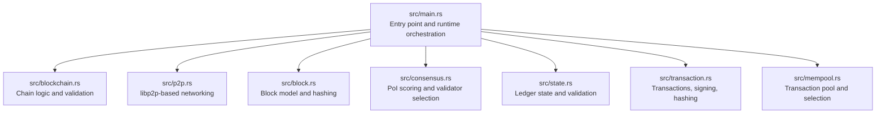
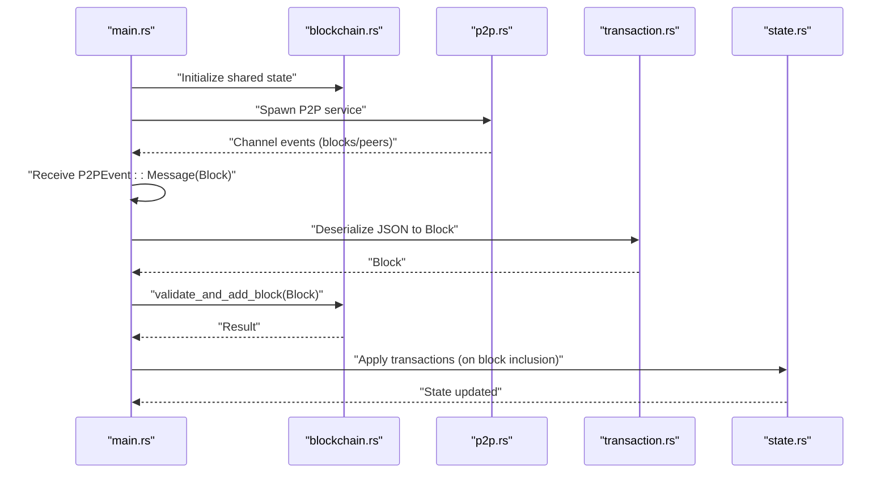
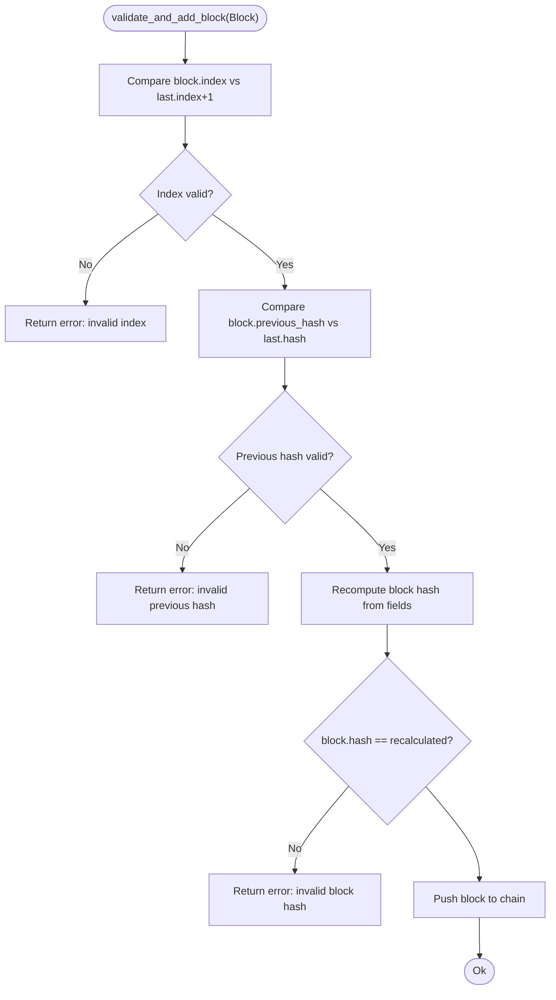
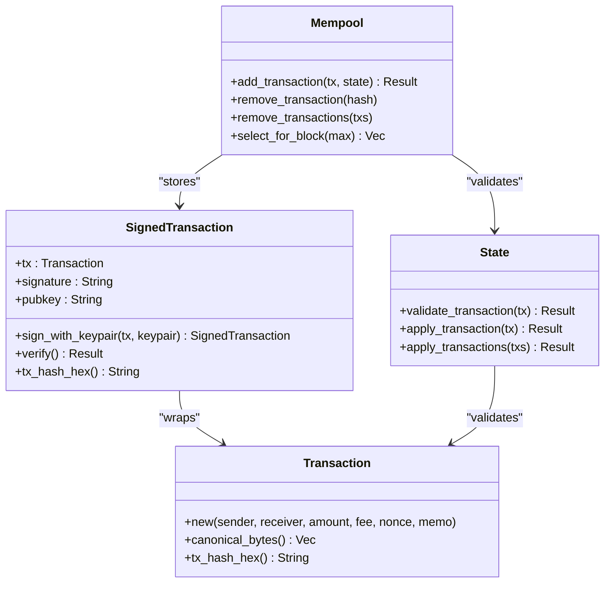
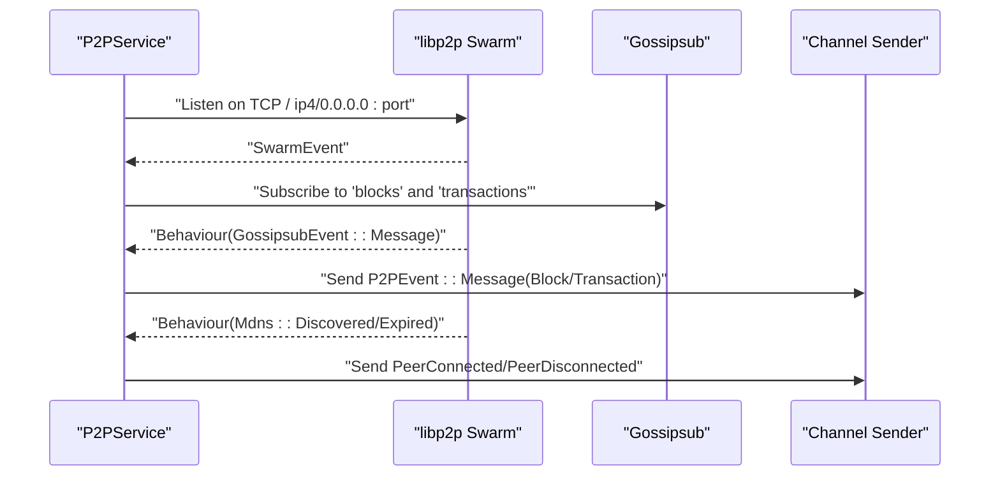
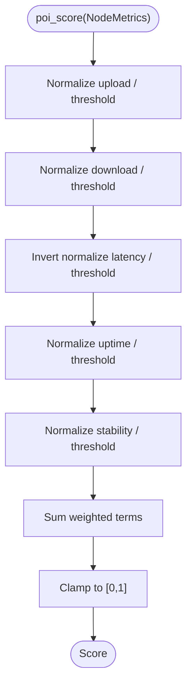
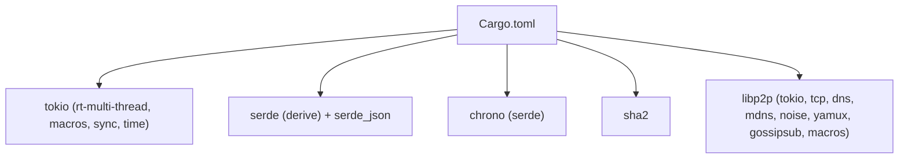

# Development and Testing

<cite>
**Referenced Files in This Document**
- [Cargo.toml](file://Cargo.toml)
- [README.md](file://README.md)
- [src/main.rs](file://src/main.rs)
- [src/block.rs](file://src/block.rs)
- [src/blockchain.rs](file://src/blockchain.rs)
- [src/consensus.rs](file://src/consensus.rs)
- [src/mempool.rs](file://src/mempool.rs)
- [src/p2p.rs](file://src/p2p.rs)
- [src/state.rs](file://src/state.rs)
- [src/transaction.rs](file://src/transaction.rs)
</cite>

## Table of Contents
1. [Introduction](#introduction)
2. [Project Structure](#project-structure)
3. [Core Components](#core-components)
4. [Architecture Overview](#architecture-overview)
5. [Detailed Component Analysis](#detailed-component-analysis)
6. [Dependency Analysis](#dependency-analysis)
7. [Performance Considerations](#performance-considerations)
8. [Troubleshooting Guide](#troubleshooting-guide)
9. [Contribution Workflow and CI Practices](#contribution-workflow-and-ci-practices)
10. [Conclusion](#conclusion)

## Introduction
This document provides a comprehensive guide for developing and testing NetChain, a Proof-of-Internet (PoI) consensus blockchain prototype implemented in Rust. It covers the development environment setup, code organization, modular architecture, testing strategies (unit and integration), and quality assurance practices. It also documents the contribution workflow, code review expectations, and continuous integration practices aligned with the current repository state.

## Project Structure
NetChain follows a simple, modular Rust layout with a single binary crate and a src/ directory containing feature-focused modules. The entry point initializes shared state, spawns a P2P service, and coordinates block creation and validation via channels.

**Diagram sources**
- [src/main.rs](file://src/main.rs#L1-L106)
- [src/blockchain.rs](file://src/blockchain.rs#L1-L89)
- [src/p2p.rs](file://src/p2p.rs#L1-L150)
- [src/block.rs](file://src/block.rs#L1-L47)
- [src/consensus.rs](file://src/consensus.rs#L1-L334)
- [src/state.rs](file://src/state.rs#L1-L183)
- [src/transaction.rs](file://src/transaction.rs#L1-L209)
- [src/mempool.rs](file://src/mempool.rs#L1-L159)

**Section sources**
- [README.md](file://README.md#L143-L158)
- [src/main.rs](file://src/main.rs#L1-L106)

## Core Components
- Block and Blockchain: Immutable block model with SHA-256 hashing and sequential chain validation.
- Transactions: Deterministic canonical serialization, Ed25519 signing, and transaction hashing.
- State: In-memory ledger with account balances, nonces, and transaction validation/apply logic.
- Mempool: In-memory transaction pool enforcing uniqueness, nonce ordering, and simple fee-based selection.
- P2P Networking: libp2p-based gossipsub topics for blocks and transactions, with MDNS peer discovery.
- Consensus (PoI): Configurable scoring of upload/download speed, latency, uptime, and packet stability; deterministic validator selection.

**Section sources**
- [src/block.rs](file://src/block.rs#L1-L47)
- [src/blockchain.rs](file://src/blockchain.rs#L1-L89)
- [src/transaction.rs](file://src/transaction.rs#L1-L209)
- [src/state.rs](file://src/state.rs#L1-L183)
- [src/mempool.rs](file://src/mempool.rs#L1-L159)
- [src/p2p.rs](file://src/p2p.rs#L1-L150)
- [src/consensus.rs](file://src/consensus.rs#L1-L334)

## Architecture Overview
The runtime composes a shared blockchain state behind an async mutex, a P2P service publishing and subscribing to gossip topics, and a main event loop consuming P2P events to validate and append blocks.

**Diagram sources**
- [src/main.rs](file://src/main.rs#L16-L105)
- [src/blockchain.rs](file://src/blockchain.rs#L40-L64)
- [src/p2p.rs](file://src/p2p.rs#L113-L141)
- [src/transaction.rs](file://src/transaction.rs#L73-L81)
- [src/state.rs](file://src/state.rs#L98-L119)

## Detailed Component Analysis

### Block and Blockchain
- Block model encapsulates index, timestamp, data, previous hash, and computed hash.
- Blockchain maintains the chain, constructs the genesis block, appends validated blocks, and validates entire chains.
- Validation checks index continuity, previous hash linkage, and recomputed block hash.

**Diagram sources**
- [src/blockchain.rs](file://src/blockchain.rs#L40-L64)

**Section sources**
- [src/block.rs](file://src/block.rs#L14-L46)
- [src/blockchain.rs](file://src/blockchain.rs#L10-L88)

### Transactions, State, and Mempool
- Transaction defines canonical serialization and SHA-256 hashing for deterministic signing.
- SignedTransaction supports Ed25519 verification using base64-encoded signature and public key.
- State enforces cryptographic verification, nonce correctness, and sufficient balance before applying transactions.
- Mempool enforces uniqueness, per-sender nonce ordering, and simple fee-based selection.

**Diagram sources**
- [src/transaction.rs](file://src/transaction.rs#L23-L138)
- [src/state.rs](file://src/state.rs#L69-L119)
- [src/mempool.rs](file://src/mempool.rs#L42-L112)

**Section sources**
- [src/transaction.rs](file://src/transaction.rs#L1-L209)
- [src/state.rs](file://src/state.rs#L1-L183)
- [src/mempool.rs](file://src/mempool.rs#L1-L159)

### P2P Networking
- libp2p transport with Noise encrypted channels and Yamux multiplexing.
- Gossipsub topics for blocks and transactions; MDNS for peer discovery.
- Event-driven loop publishes P2PEvent messages to the main channel.

**Diagram sources**
- [src/p2p.rs](file://src/p2p.rs#L71-L148)

**Section sources**
- [src/p2p.rs](file://src/p2p.rs#L1-L150)

### Consensus (PoI)
- PoiConfig defines weights and thresholds for upload/download speed, latency, uptime, and stability.
- PoiScorer computes a normalized score per metric, aggregates a weighted score, and selects a validator deterministically using a seed or randomly for local tests.

**Diagram sources**
- [src/consensus.rs](file://src/consensus.rs#L68-L99)

**Section sources**
- [src/consensus.rs](file://src/consensus.rs#L1-L334)

## Dependency Analysis
External dependencies include async runtime, serialization, time, cryptography, and libp2p with full feature set. These enable asynchronous networking, deterministic serialization, cryptographic signing, and robust peer-to-peer communication.

**Diagram sources**
- [Cargo.toml](file://Cargo.toml#L6-L38)

**Section sources**
- [Cargo.toml](file://Cargo.toml#L1-L38)

## Performance Considerations
- Prefer compact, deterministic serialization for transactions to minimize signing and hashing overhead.
- Use async I/O and channels to decouple P2P event handling from blockchain updates.
- Keep block and transaction sizes reasonable; validate early to avoid unnecessary deserialization.
- For PoI scoring, cache normalized metrics when evaluating many nodes to reduce repeated computation.

## Troubleshooting Guide
Common issues and debugging techniques:
- Block validation failures: Verify index continuity, previous hash linkage, and recomputed hash equality.
- Transaction verification errors: Confirm canonical serialization, base64 encoding/decoding, and Ed25519 signature verification.
- P2P connectivity: Ensure the node listens on the configured port and subscribes to topics; confirm MDNS discovers peers.
- State inconsistencies: Validate nonce and balance constraints before applying transactions.

Practical commands:
- Build: cargo build
- Run: cargo run
- Test: cargo test
- Release: cargo run --release

**Section sources**
- [src/blockchain.rs](file://src/blockchain.rs#L40-L87)
- [src/transaction.rs](file://src/transaction.rs#L105-L132)
- [src/p2p.rs](file://src/p2p.rs#L113-L141)
- [README.md](file://README.md#L110-L114)

## Contribution Workflow and CI Practices
- Development workflow:
  - Create a feature branch.
  - Add unit tests for new behavior.
  - Open a pull request against main with a clear description.
- Testing:
  - Run unit tests with cargo test.
  - Add unit tests for core logic (blocks, validation, consensus scoring).
  - Integration tests for networking may require multiple processes or test harnesses.
- Code review:
  - Keep PRs focused and scoped.
  - Ensure tests accompany new logic.
  - Maintain consistent error handling and serialization semantics.
- Continuous integration:
  - Align CI with cargo test and cargo build for release builds.
  - Optionally enforce formatting (rustfmt) and clippy linting in CI.

**Section sources**
- [README.md](file://README.md#L129-L168)

## Conclusion
NetChain’s modular architecture enables incremental development across blocks, transactions, state, mempool, networking, and consensus. By following the established patterns—deterministic serialization, explicit validation, async orchestration, and comprehensive unit tests—you can extend the system safely and efficiently. Integrate robust testing strategies and adhere to the contribution workflow to maintain code quality and reliability.