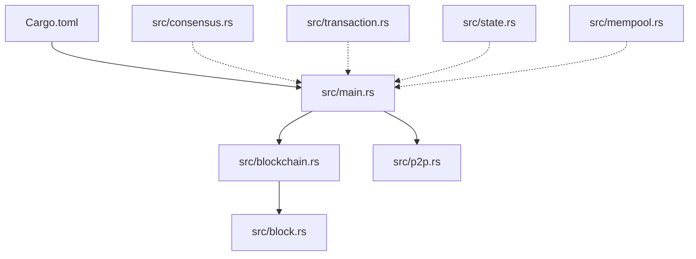
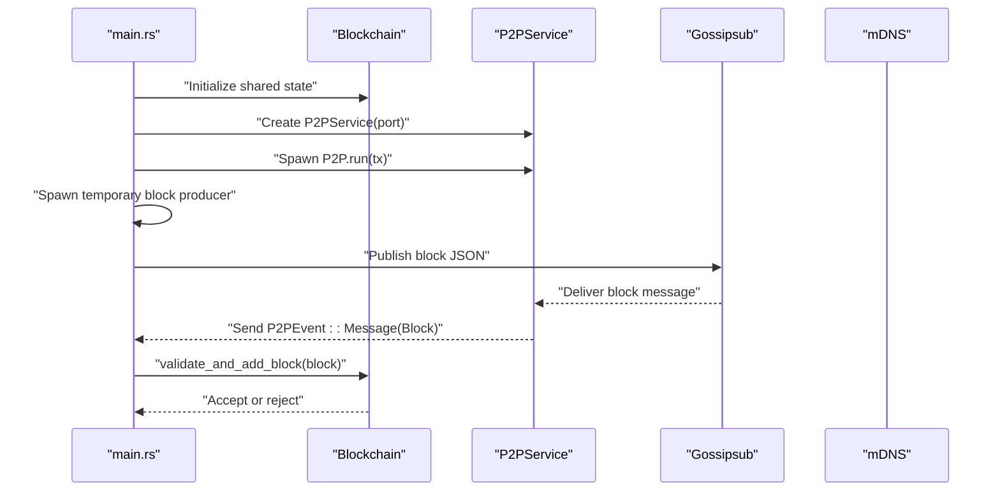
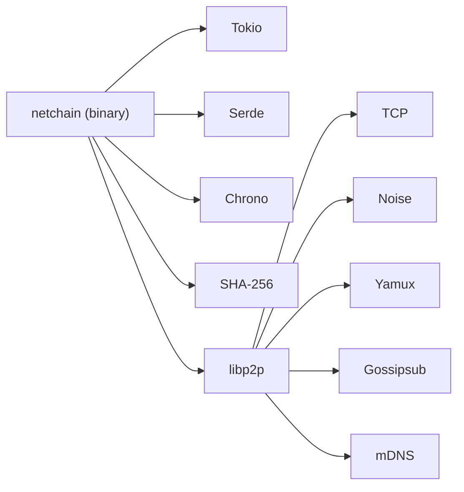

# Getting Started

<cite>
**Referenced Files in This Document**
- [README.md](file://README.md)
- [Cargo.toml](file://Cargo.toml)
- [src/main.rs](file://src/main.rs)
- [src/block.rs](file://src/block.rs)
- [src/blockchain.rs](file://src/blockchain.rs)
- [src/p2p.rs](file://src/p2p.rs)
- [src/consensus.rs](file://src/consensus.rs)
- [src/transaction.rs](file://src/transaction.rs)
- [src/state.rs](file://src/state.rs)
- [src/mempool.rs](file://src/mempool.rs)
</cite>

## Table of Contents
1. [Introduction](#introduction)
2. [Project Structure](#project-structure)
3. [Core Components](#core-components)
4. [Architecture Overview](#architecture-overview)
5. [Detailed Component Analysis](#detailed-component-analysis)
6. [Dependency Analysis](#dependency-analysis)
7. [Performance Considerations](#performance-considerations)
8. [Troubleshooting Guide](#troubleshooting-guide)
9. [Conclusion](#conclusion)
10. [Appendices](#appendices)

## Introduction
NetChain is a next-generation Layer-1 blockchain prototype implemented in Rust. It explores a Proof-of-Internet (PoI) consensus where validators are selected based on real-world internet performance characteristics such as upload/download speeds, latency, uptime, and packet stability. The project emphasizes lightweight, modular architecture with asynchronous networking powered by libp2p and Tokio.

This guide helps you install prerequisites, build and run your first local node, understand basic configuration and command-line options, and explore the development workflow including running tests and building release binaries. It is written for developers new to Rust while providing sufficient technical depth for blockchain development.

## Project Structure
The repository follows a minimal, layered structure suitable for rapid iteration and learning:

- Root-level manifests and documentation:
  - Cargo.toml defines package metadata and dependencies.
  - README.md provides quick start, run instructions, and development notes.
- Core modules under src/:
  - main.rs: Application entry point and runtime orchestration.
  - block.rs and blockchain.rs: Block structure and chain validation logic.
  - p2p.rs: libp2p-based networking with gossipsub and mDNS discovery.
  - consensus.rs: PoI scoring engine and validator selection logic.
  - transaction.rs, state.rs, mempool.rs: Transaction model, state transitions, and mempool management.

**Diagram sources**
- [Cargo.toml](file://Cargo.toml#L1-L38)
- [src/main.rs](file://src/main.rs#L1-L106)
- [src/blockchain.rs](file://src/blockchain.rs#L1-L89)
- [src/p2p.rs](file://src/p2p.rs#L1-L150)
- [src/block.rs](file://src/block.rs#L1-L47)
- [src/consensus.rs](file://src/consensus.rs#L1-L334)
- [src/transaction.rs](file://src/transaction.rs#L1-L209)
- [src/state.rs](file://src/state.rs#L1-L183)
- [src/mempool.rs](file://src/mempool.rs#L1-L159)

**Section sources**
- [README.md](file://README.md#L47-L158)
- [Cargo.toml](file://Cargo.toml#L1-L38)

## Core Components
This section introduces the primary building blocks you will interact with when running and developing NetChain.

- Entry point and runtime:
  - The application initializes a shared blockchain state, starts a P2P service on a configurable port, and runs a temporary local block producer that broadcasts a block after a short delay. It then listens for P2P events and validates incoming blocks.
- Block and chain:
  - Blocks encapsulate index, timestamp, data payload, previous hash, and computed hash. The chain enforces sequential indexing, previous-hash linkage, and cryptographic hash integrity.
- Networking:
  - libp2p provides encrypted transport, mDNS peer discovery, and gossipsub-based broadcast channels for blocks and transactions.
- Consensus:
  - PoI scoring computes a weighted score from upload/download speed, latency, uptime, and stability. Validator selection is deterministic given a seed and pool of metrics.
- Transactions, state, and mempool:
  - Transactions carry sender, receiver, amount, fee, nonce, timestamp, and optional memo. They are signed with Ed25519 and verified cryptographically. State tracks balances and nonces, enforcing validity and atomic transfers. Mempool enforces duplicate prevention, nonce ordering, and fee-based selection.

**Section sources**
- [src/main.rs](file://src/main.rs#L16-L105)
- [src/block.rs](file://src/block.rs#L5-L46)
- [src/blockchain.rs](file://src/blockchain.rs#L10-L87)
- [src/p2p.rs](file://src/p2p.rs#L63-L149)
- [src/consensus.rs](file://src/consensus.rs#L57-L182)
- [src/transaction.rs](file://src/transaction.rs#L23-L138)
- [src/state.rs](file://src/state.rs#L36-L127)
- [src/mempool.rs](file://src/mempool.rs#L26-L112)

## Architecture Overview
The runtime architecture combines synchronous initialization with asynchronous event loops. The main thread sets up shared state and spawns the P2P service. A temporary task creates and broadcasts a block after a delay. The main event loop receives P2P events, deserializes messages, and applies chain validation.

**Diagram sources**
- [src/main.rs](file://src/main.rs#L16-L105)
- [src/blockchain.rs](file://src/blockchain.rs#L40-L64)
- [src/p2p.rs](file://src/p2p.rs#L113-L148)

## Detailed Component Analysis

### Prerequisites and Environment Setup
- Rust toolchain:
  - Install via rustup and ensure the latest stable toolchain is active.
  - After installation, update the toolchain to align with the project’s edition.
- System requirements:
  - Standard desktop or laptop with sufficient CPU and memory for asynchronous tasks.
  - Open ports for P2P networking (default port is configured in the main entry point).
- Environment variables:
  - No special environment variables are required at this time.

**Section sources**
- [README.md](file://README.md#L84-L96)
- [src/main.rs](file://src/main.rs#L31-L32)

### Installation and First Run
- Build the project:
  - Use cargo build to compile the project in debug mode.
- Run the project:
  - Use cargo run to start the node with default behavior.
- Run tests:
  - Use cargo test to execute unit tests across modules.
- Release builds:
  - Use cargo run --release for optimized execution.

Notes:
- The project currently does not expose CLI flags or a config file. Command-line arguments are not parsed in the current main entry point.
- The README outlines a placeholder for adding a default configuration file and CLI documentation.

**Section sources**
- [README.md](file://README.md#L98-L116)
- [src/main.rs](file://src/main.rs#L16-L105)

### Running a Local Node
- Default behavior:
  - On startup, the node prints a development banner, initializes the genesis block, and starts listening on a default port.
  - A temporary task publishes a block after a short delay, which is then received and validated by the main loop.
- Verifying operation:
  - Look for logs indicating successful block acceptance and chain height updates.
  - Peer connection/disconnection events are logged when mDNS discovers peers.

Example verification indicators:
- Genesis block information printed during initialization.
- “Block accepted” and chain height updates after receiving a published block.
- Peer connected/disconnected messages when peers are discovered.

**Section sources**
- [src/main.rs](file://src/main.rs#L17-L25)
- [src/main.rs](file://src/main.rs#L42-L61)
- [src/main.rs](file://src/main.rs#L64-L102)
- [src/p2p.rs](file://src/p2p.rs#L125-L136)

### Basic Configuration and Command-Line Parameters
- Current state:
  - No CLI flags or configuration file are implemented in the current codebase.
  - The P2P service binds to a hardcoded port in the main entry point.
- Future extension points:
  - The README suggests adding a default configuration file and CLI documentation to enable reproducible local test scenarios.

**Section sources**
- [src/main.rs](file://src/main.rs#L31-L32)
- [README.md](file://README.md#L120-L127)

### Development Workflow
- Recommended cycle:
  - Create a feature branch, add tests for new behavior, and open a PR against main.
- Key areas to work on:
  - Consensus engine (PoI scoring and validator selection).
  - Networking (libp2p integration and transport).
  - Wallet and transaction signing.
- Testing:
  - Run unit tests with cargo test. The repository includes unit tests for consensus, transactions, state, and mempool.

**Section sources**
- [README.md](file://README.md#L129-L142)
- [src/consensus.rs](file://src/consensus.rs#L195-L333)
- [src/transaction.rs](file://src/transaction.rs#L156-L209)
- [src/state.rs](file://src/state.rs#L130-L182)
- [src/mempool.rs](file://src/mempool.rs#L116-L159)

### Practical Examples of Node Operation
- Local block creation and broadcast:
  - A temporary task waits briefly, constructs a block with a message payload, serializes it to JSON, and publishes it via gossipsub.
  - The main loop receives the message, deserializes it, and attempts to validate and append it to the chain.
- Peer discovery:
  - mDNS events trigger peer connect/disconnect notifications, enabling local network discovery.

Operational flow:
- Temporary task: construct block -> serialize -> publish.
- P2P service: receive message -> send event -> main loop: validate -> accept or reject.

**Section sources**
- [src/main.rs](file://src/main.rs#L42-L61)
- [src/p2p.rs](file://src/p2p.rs#L113-L148)
- [src/blockchain.rs](file://src/blockchain.rs#L40-L64)

## Dependency Analysis
The project relies on a curated set of crates for robustness, performance, and modern cryptography:

- Error handling: anyhow for ergonomic error propagation.
- Async runtime: Tokio with multi-threaded executor and time-related features.
- Serialization: Serde with derive macros and JSON support.
- Time: Chrono with serde support for timestamps.
- Cryptography: SHA-256 hashing for block integrity.
- Networking: libp2p with TCP transport, Noise encryption, Yamux multiplexing, gossipsub, and mDNS.

**Diagram sources**
- [Cargo.toml](file://Cargo.toml#L6-L38)

**Section sources**
- [Cargo.toml](file://Cargo.toml#L6-L38)

## Performance Considerations
- Asynchronous design:
  - Tokio enables efficient concurrency for I/O-bound tasks such as networking and block validation.
- Hashing and serialization:
  - SHA-256 and JSON-based block serialization are straightforward but can be optimized for throughput in production deployments.
- Networking:
  - libp2p’s gossipsub and mDNS provide scalable discovery and broadcast mechanisms suited for small-to-medium networks.
- Deterministic consensus:
  - PoI scoring and validator selection are deterministic when seeded consistently, aiding reproducibility in testing and development.

[No sources needed since this section provides general guidance]

## Troubleshooting Guide
Common setup and runtime issues:

- Rust toolchain not installed or outdated:
  - Ensure rustup is installed and the toolchain is updated to the latest stable version.
- Port conflicts:
  - The default P2P port is configured in the main entry point. If the port is in use, change it before running.
- No CLI flags recognized:
  - The current main entry point does not parse arguments. Pass flags only when implemented.
- No configuration file:
  - The project does not include a config file yet. Follow the README’s suggestion to add one for reproducible setups.
- Test failures:
  - Run cargo test to identify failing unit tests. Review module-specific tests for consensus, transactions, state, and mempool.

Verification steps:
- Confirm the genesis block is initialized and printed.
- Watch for block acceptance logs after the temporary block is published.
- Observe peer connect/disconnect events when peers are discovered.

**Section sources**
- [README.md](file://README.md#L84-L116)
- [src/main.rs](file://src/main.rs#L17-L25)
- [src/main.rs](file://src/main.rs#L42-L61)
- [src/main.rs](file://src/main.rs#L64-L102)
- [src/p2p.rs](file://src/p2p.rs#L125-L136)

## Conclusion
You are now equipped to install prerequisites, build and run NetChain locally, and understand the foundational components and workflows. As the project evolves, expect CLI flags, configuration files, and expanded consensus features. Continue iterating with unit tests, explore the PoI scoring engine, and extend the networking and transaction layers to meet your development goals.

[No sources needed since this section summarizes without analyzing specific files]

## Appendices

### Appendix A: Quick Start Checklist
- Install Rust via rustup and update the toolchain.
- Build the project with cargo build.
- Run the node with cargo run.
- Verify operation by observing logs for block acceptance and peer events.
- Run tests with cargo test.
- Build a release binary with cargo run --release.

**Section sources**
- [README.md](file://README.md#L84-L116)

### Appendix B: Module Reference
- Block and blockchain:
  - Block structure, hashing, and chain validation.
- P2P networking:
  - libp2p transport, mDNS discovery, and gossipsub messaging.
- Consensus:
  - PoI scoring and deterministic validator selection.
- Transactions, state, and mempool:
  - Transaction model, cryptographic verification, state transitions, and mempool management.

**Section sources**
- [src/block.rs](file://src/block.rs#L5-L46)
- [src/blockchain.rs](file://src/blockchain.rs#L10-L87)
- [src/p2p.rs](file://src/p2p.rs#L63-L149)
- [src/consensus.rs](file://src/consensus.rs#L57-L182)
- [src/transaction.rs](file://src/transaction.rs#L23-L138)
- [src/state.rs](file://src/state.rs#L36-L127)
- [src/mempool.rs](file://src/mempool.rs#L26-L112)