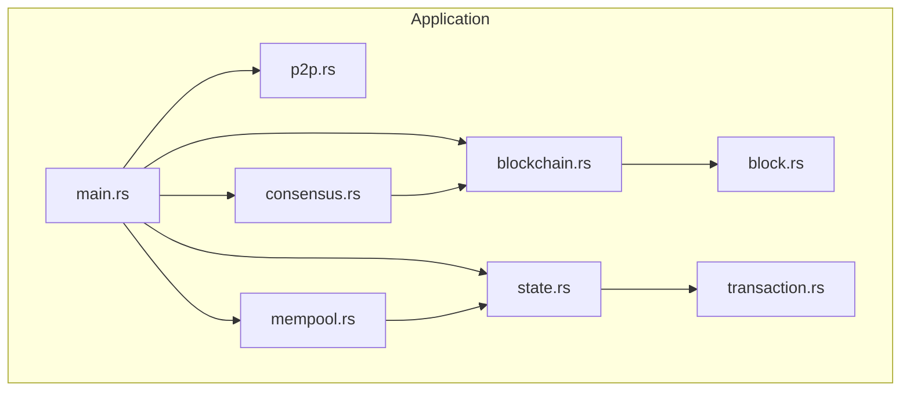
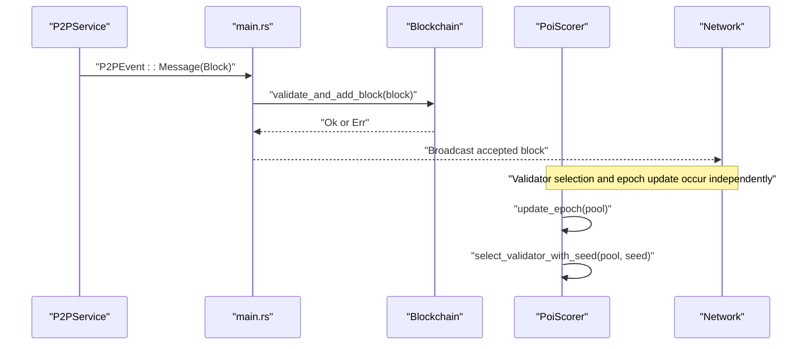
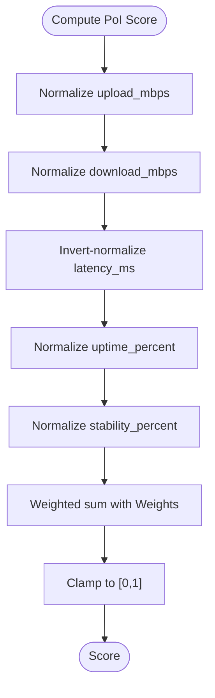
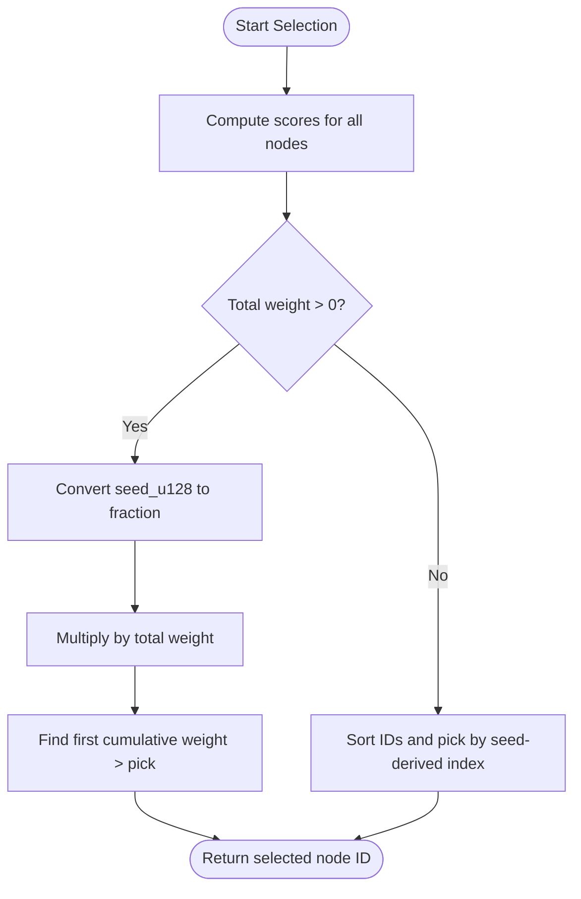
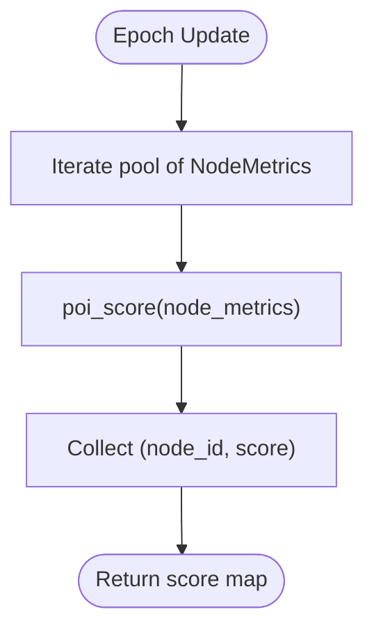
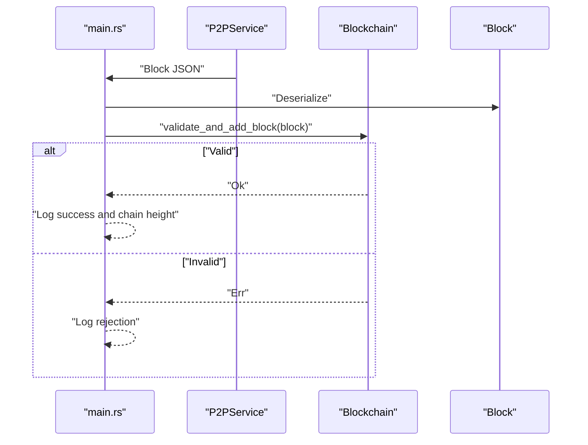
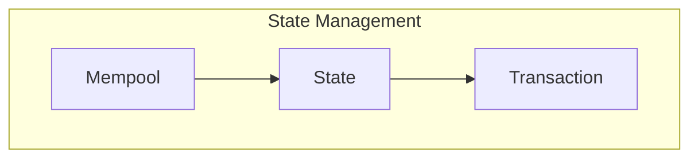
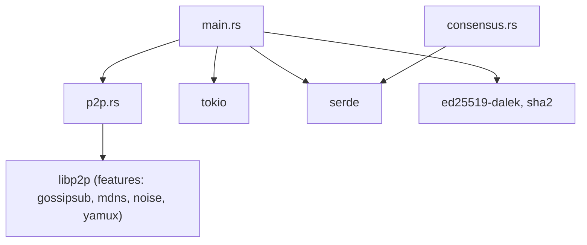

# Consensus Engine

<cite>
**Referenced Files in This Document**
- [consensus.rs](file://src/consensus.rs)
- [main.rs](file://src/main.rs)
- [blockchain.rs](file://src/blockchain.rs)
- [block.rs](file://src/block.rs)
- [p2p.rs](file://src/p2p.rs)
- [state.rs](file://src/state.rs)
- [mempool.rs](file://src/mempool.rs)
- [transaction.rs](file://src/transaction.rs)
- [Cargo.toml](file://Cargo.toml)
- [README.md](file://README.md)
</cite>

## Table of Contents
1. [Introduction](#introduction)
2. [Project Structure](#project-structure)
3. [Core Components](#core-components)
4. [Architecture Overview](#architecture-overview)
5. [Detailed Component Analysis](#detailed-component-analysis)
6. [Dependency Analysis](#dependency-analysis)
7. [Performance Considerations](#performance-considerations)
8. [Troubleshooting Guide](#troubleshooting-guide)
9. [Conclusion](#conclusion)
10. [Appendices](#appendices)

## Introduction
This document explains NetChain’s Proof-of-Internet (PoI) consensus engine with a focus on the node scoring and validator selection mechanism. The PoI algorithm ranks nodes based on internet performance metrics—upload/download speed, latency, uptime, and packet stability—and uses these scores to probabilistically or deterministically select validators for block production. The implementation centers around the NodeMetrics structure, weighted scoring, validator selection, and epoch update mechanisms. The document provides conceptual overviews for newcomers and technical details for implementers, including integration points with blockchain validation, state synchronization, and fault tolerance strategies.

## Project Structure
The repository organizes core blockchain and consensus logic into modular Rust modules. The PoI consensus engine resides in the consensus module, while the rest of the stack handles block creation, validation, state transitions, transactions, and P2P networking.

**Diagram sources**
- [main.rs](file://src/main.rs#L1-L123)
- [consensus.rs](file://src/consensus.rs#L1-L334)
- [blockchain.rs](file://src/blockchain.rs#L1-L89)
- [state.rs](file://src/state.rs#L1-L183)
- [mempool.rs](file://src/mempool.rs#L1-L159)
- [transaction.rs](file://src/transaction.rs#L1-L211)
- [p2p.rs](file://src/p2p.rs#L1-L150)
- [block.rs](file://src/block.rs#L1-L47)

**Section sources**
- [README.md](file://README.md#L47-L158)
- [Cargo.toml](file://Cargo.toml#L1-L47)

## Core Components
- NodeMetrics: Encapsulates a node’s internet performance attributes used for PoI scoring.
- PoiConfig: Defines weights and thresholds for normalization and scoring.
- PoiScorer: Implements PoI scoring, validator selection, and epoch updates.
- Validator Selection: Deterministic selection using a shared seed and fallback behavior.
- Epoch Update: Periodic re-scoring of nodes to reflect recent performance.

Key responsibilities:
- Performance scoring: Normalization and weighted aggregation of metrics.
- Validator selection: Weighted random selection with deterministic fallback.
- Epoch update: Batch recomputation of scores across the validator pool.

**Section sources**
- [consensus.rs](file://src/consensus.rs#L6-L182)

## Architecture Overview
The PoI consensus engine integrates with the blockchain and networking layers. The main event loop receives blocks from peers via P2P, validates them, and appends them to the chain. The PoI engine maintains a pool of validators represented by NodeMetrics and periodically recomputes scores. Validator selection is used to determine who produces the next block, aligning incentives with internet performance.

**Diagram sources**
- [main.rs](file://src/main.rs#L80-L119)
- [blockchain.rs](file://src/blockchain.rs#L40-L64)
- [consensus.rs](file://src/consensus.rs#L176-L181)
- [consensus.rs](file://src/consensus.rs#L101-L143)
- [p2p.rs](file://src/p2p.rs#L113-L148)

## Detailed Component Analysis

### NodeMetrics and PoI Scoring
NodeMetrics captures the five internet performance metrics used by PoI:
- Upload/download speeds (Mbps)
- Latency (ms)
- Uptime (%)
- Packet stability (%)

Scoring pipeline:
- Normalize each metric against configured thresholds.
- For latency, invert normalization so lower latency yields higher contribution.
- Weighted sum of normalized metrics yields a score in [0, 1].
- Clamped to [0, 1] to ensure valid bounds.

**Diagram sources**
- [consensus.rs](file://src/consensus.rs#L68-L99)

**Section sources**
- [consensus.rs](file://src/consensus.rs#L31-L55)
- [consensus.rs](file://src/consensus.rs#L68-L99)

### Validator Selection Mechanisms
Two selection modes are supported:
- Deterministic selection: Uses a shared seed_u128 to ensure identical selection across nodes.
- Fallback behavior: If total weight is zero, selection falls back to lexicographic order using the seed.

Selection process:
- Compute PoI score for each node.
- Scale scores to weights and accumulate to a cumulative distribution.
- Convert seed to a fraction in [0,1) and pick the first cumulative bucket containing the value.
- If all scores are zero, sort node IDs and select by index derived from the seed.

**Diagram sources**
- [consensus.rs](file://src/consensus.rs#L101-L143)

**Section sources**
- [consensus.rs](file://src/consensus.rs#L101-L143)

### Epoch Update Mechanism
Epoch update recomputes PoI scores for all nodes in the validator pool. It is intended to run periodically (e.g., every N blocks) to reflect recent performance changes. The method returns a map of node IDs to their updated scores.

**Diagram sources**
- [consensus.rs](file://src/consensus.rs#L176-L181)

**Section sources**
- [consensus.rs](file://src/consensus.rs#L176-L181)

### Integration with Blockchain Validation
- Block reception: The main loop deserializes blocks received over P2P and validates them using Blockchain.validate_and_add_block.
- Block acceptance: On success, the chain height increases; on failure, errors are logged.
- Consensus participation: The PoI engine determines validators independently of the main loop. Blocks produced locally or received from peers are validated by the blockchain module.

**Diagram sources**
- [main.rs](file://src/main.rs#L80-L119)
- [blockchain.rs](file://src/blockchain.rs#L40-L64)
- [block.rs](file://src/block.rs#L14-L46)

**Section sources**
- [main.rs](file://src/main.rs#L80-L119)
- [blockchain.rs](file://src/blockchain.rs#L40-L64)

### State Synchronization and Fault Tolerance
- State transitions: The state module validates and applies transactions atomically, ensuring consistency across blocks.
- Mempool: Maintains pending transactions, enforces nonce ordering, and filters duplicates, supporting reliable block production.
- Fault tolerance: The PoI engine includes a deterministic fallback when all scores are zero, preventing liveness issues under extreme conditions.

**Diagram sources**
- [state.rs](file://src/state.rs#L98-L127)
- [mempool.rs](file://src/mempool.rs#L41-L112)
- [transaction.rs](file://src/transaction.rs#L23-L81)

**Section sources**
- [state.rs](file://src/state.rs#L98-L127)
- [mempool.rs](file://src/mempool.rs#L41-L112)

## Dependency Analysis
External dependencies relevant to consensus and networking include:
- libp2p: Provides gossipsub and mDNS for P2P discovery and messaging.
- Tokio: Asynchronous runtime for event loops and concurrency.
- Serde: Serialization/deserialization for blocks and messages.
- Cryptographic libraries: Ed25519 signing and SHA-256 hashing.

**Diagram sources**
- [Cargo.toml](file://Cargo.toml#L37-L47)
- [consensus.rs](file://src/consensus.rs#L1-L5)
- [p2p.rs](file://src/p2p.rs#L3-L23)
- [main.rs](file://src/main.rs#L11-L21)

**Section sources**
- [Cargo.toml](file://Cargo.toml#L1-L47)

## Performance Considerations
- Scoring complexity: Computing scores for a pool of size n is O(n). Epoch updates are linear in the number of validators.
- Normalization cost: Each metric normalization is constant-time; invert normalization adds negligible overhead.
- Selection complexity: Cumulative weight construction and selection are O(n). Sorting fallback is O(n log n).
- Recommendations:
  - Limit validator pool size to reduce selection overhead.
  - Cache normalized values when metrics change infrequently.
  - Use bounded memory structures for pools and cumulative distributions.

[No sources needed since this section provides general guidance]

## Troubleshooting Guide
Common issues and mitigations:
- No validators in pool: Selection panics when the pool is empty; ensure the validator pool is populated before selection.
- Zero total weight: If all scores normalize to zero, selection falls back to lexicographic order using the seed. Verify thresholds and metrics to avoid this condition.
- Network partitioning: P2P gossipsub may delay or drop messages. Monitor peer connections and adjust subscription topics.
- Malicious nodes: Validate blocks and transactions rigorously; rely on cryptographic signatures and state checks.
- Performance degradation: Periodic epoch updates help recover from degraded nodes. Consider increasing update frequency or adjusting weights/thresholds.

**Section sources**
- [consensus.rs](file://src/consensus.rs#L109-L111)
- [consensus.rs](file://src/consensus.rs#L124-L130)
- [p2p.rs](file://src/p2p.rs#L113-L148)
- [blockchain.rs](file://src/blockchain.rs#L40-L64)
- [state.rs](file://src/state.rs#L98-L127)

## Conclusion
NetChain’s PoI consensus engine introduces a novel approach to validator selection grounded in real-world internet performance. The NodeMetrics structure and PoiScorer provide a robust foundation for performance scoring, while deterministic validator selection ensures consensus agreement across nodes. Integration with the blockchain and state modules enables secure, stateful block validation, and the epoch update mechanism keeps the validator pool responsive to performance changes. By tuning weights and thresholds and monitoring network health, operators can achieve a fair, efficient, and resilient consensus system.

[No sources needed since this section summarizes without analyzing specific files]

## Appendices

### Practical Examples

- Scoring calculations:
  - Use NodeMetrics to represent a node’s upload/download speed, latency, uptime, and stability.
  - Configure PoiConfig weights and thresholds to reflect desired emphasis on each metric.
  - Call PoiScorer.poi_score to compute a normalized score in [0, 1].

- Validator rotation:
  - Periodically call PoiScorer.update_epoch to re-score the validator pool.
  - Use PoiScorer.select_validator_with_seed to deterministically select the next proposer based on a shared seed.

- Performance monitoring:
  - Track NodeMetrics over time to detect degradation or improvements.
  - Adjust thresholds dynamically to maintain meaningful discrimination among nodes.

- Consensus participation:
  - Integrate PoI selection with block production and validation.
  - Ensure blocks are validated by Blockchain.validate_and_add_block before considering them finalized.

[No sources needed since this section provides general guidance]