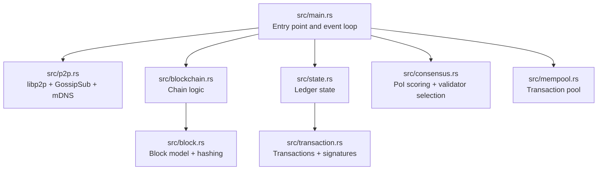
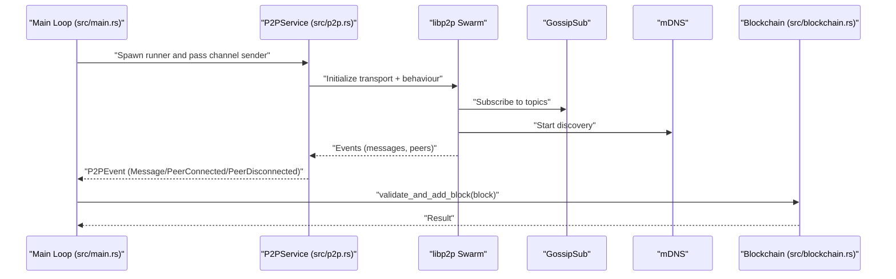
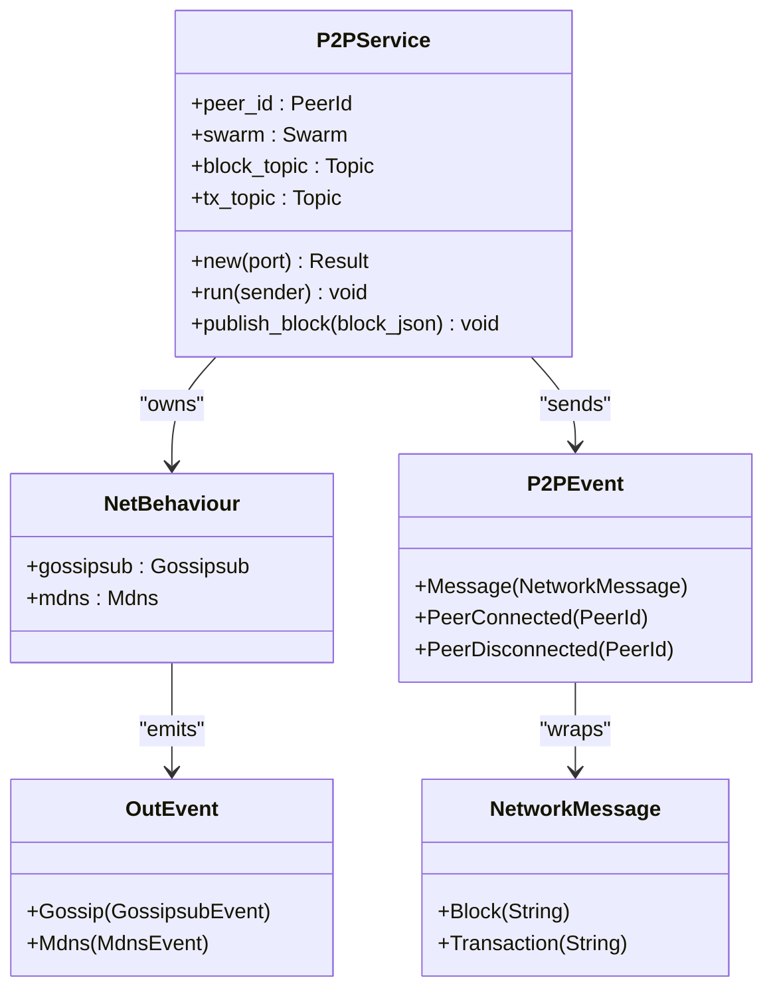
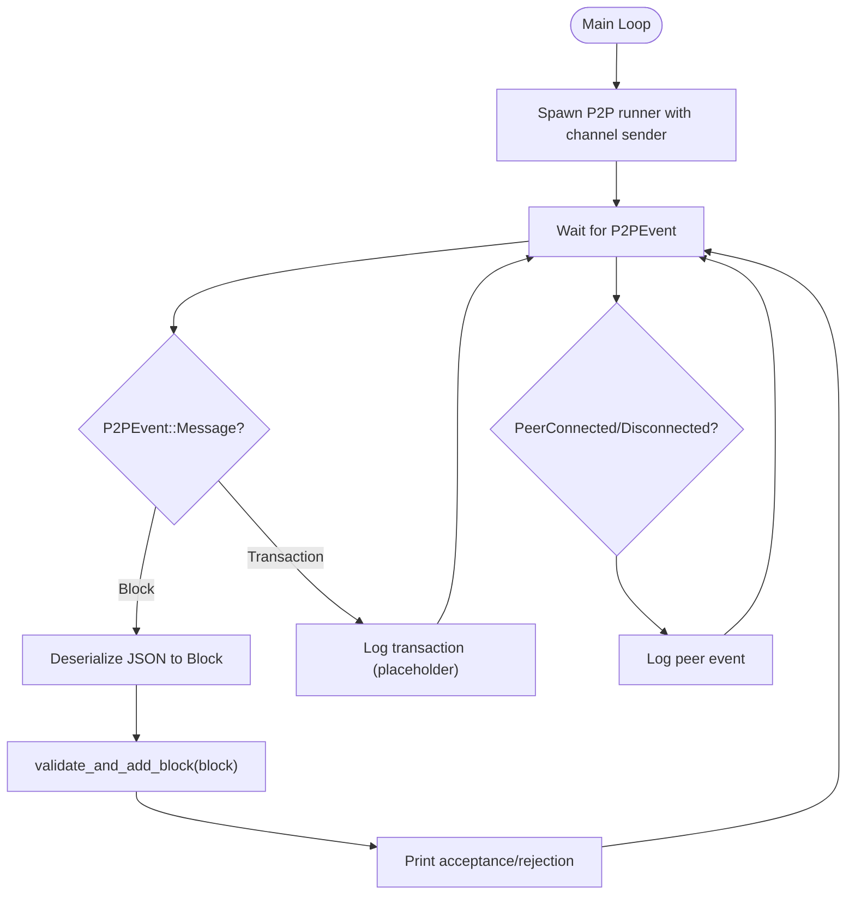
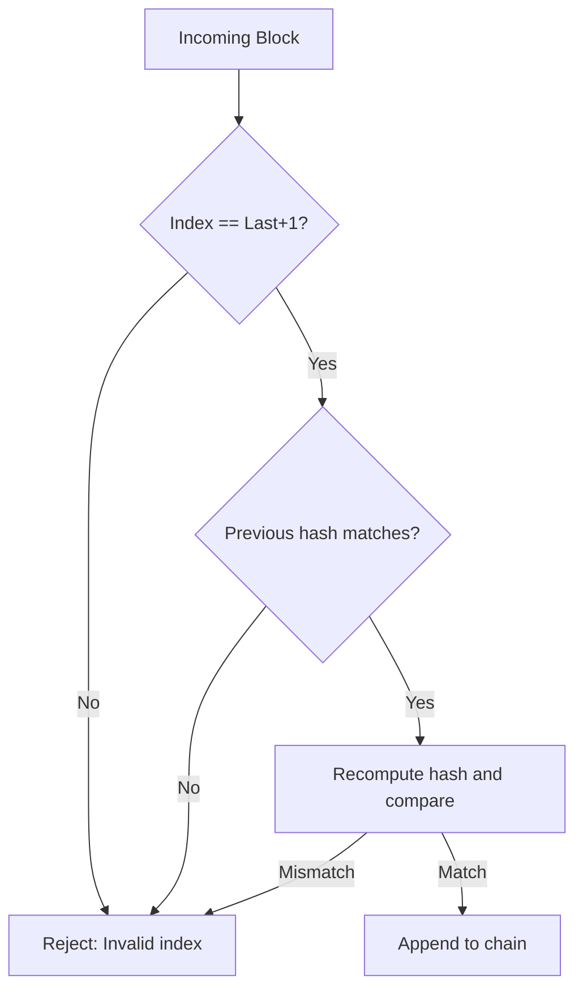
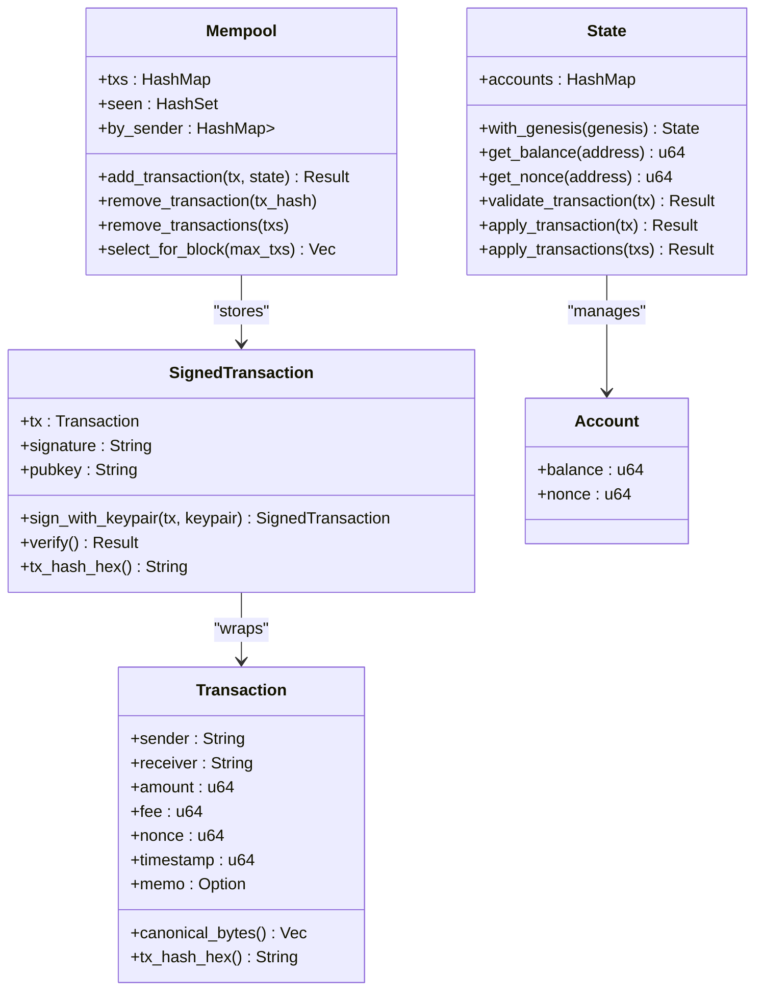
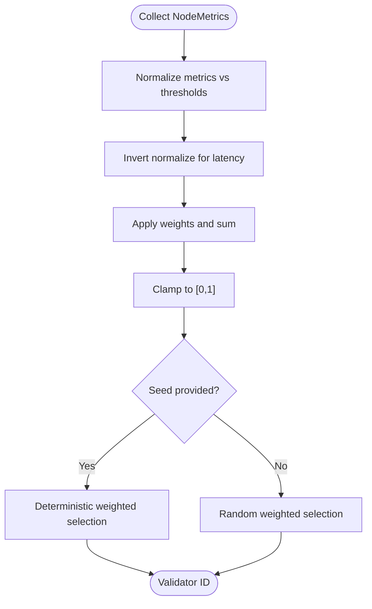
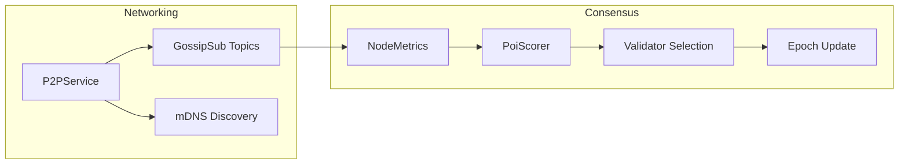
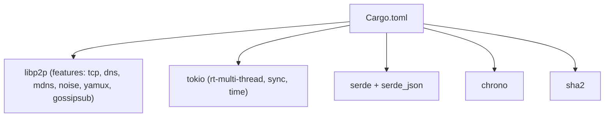

# Networking and Consensus

<cite>
**Referenced Files in This Document**
- [main.rs](file://src/main.rs)
- [p2p.rs](file://src/p2p.rs)
- [consensus.rs](file://src/consensus.rs)
- [blockchain.rs](file://src/blockchain.rs)
- [block.rs](file://src/block.rs)
- [state.rs](file://src/state.rs)
- [transaction.rs](file://src/transaction.rs)
- [mempool.rs](file://src/mempool.rs)
- [Cargo.toml](file://Cargo.toml)
- [README.md](file://README.md)
</cite>

## Table of Contents
1. [Introduction](#introduction)
2. [Project Structure](#project-structure)
3. [Core Components](#core-components)
4. [Architecture Overview](#architecture-overview)
5. [Detailed Component Analysis](#detailed-component-analysis)
6. [Dependency Analysis](#dependency-analysis)
7. [Performance Considerations](#performance-considerations)
8. [Troubleshooting Guide](#troubleshooting-guide)
9. [Conclusion](#conclusion)
10. [Appendices](#appendices)

## Introduction
This document explains NetChain’s networking and consensus systems with a focus on the distributed communication infrastructure and Proof-of-Internet (PoI) consensus. It covers:
- libp2p integration with GossipSub and mDNS peer discovery
- Event-driven architecture for network communication
- PoI scoring algorithm that ranks nodes by upload/download speed, latency, uptime, and packet stability
- Practical examples of network participation, consensus scoring, and validator rotation
- Integration between networking and consensus layers, message formats, and performance optimization strategies

The goal is to be accessible to beginners learning distributed systems while providing technical depth for experienced developers working with consensus algorithms.

## Project Structure
NetChain is a modular Rust project organized around core layers:
- Entry point and orchestration
- Blockchain and block validation
- Transactions and state
- P2P networking (libp2p)
- Consensus (PoI scoring and validator selection)
- Mempool for transaction pooling

**Diagram sources**
- [main.rs](file://src/main.rs#L16-L106)
- [p2p.rs](file://src/p2p.rs#L1-L150)
- [blockchain.rs](file://src/blockchain.rs#L1-L89)
- [block.rs](file://src/block.rs#L1-L47)
- [state.rs](file://src/state.rs#L1-L183)
- [transaction.rs](file://src/transaction.rs#L1-L209)
- [consensus.rs](file://src/consensus.rs#L1-L334)
- [mempool.rs](file://src/mempool.rs#L1-L159)

**Section sources**
- [main.rs](file://src/main.rs#L1-L106)
- [Cargo.toml](file://Cargo.toml#L1-L38)

## Core Components
- P2PService: libp2p-based networking with GossipSub topics for blocks and transactions, and mDNS for peer discovery. It emits P2PEvent messages to the main event loop.
- Blockchain: Manages the chain state, validates incoming blocks, and adds newly created blocks.
- PoI Scoring Engine: Computes NodeMetrics-based scores and selects validators deterministically using a shared seed.
- Transaction and State: Defines transaction structures, canonical serialization, Ed25519 signatures, and ledger state transitions.
- Mempool: Maintains pending transactions, enforces nonce ordering, and selects transactions for block production.

**Section sources**
- [p2p.rs](file://src/p2p.rs#L25-L150)
- [blockchain.rs](file://src/blockchain.rs#L1-L89)
- [consensus.rs](file://src/consensus.rs#L31-L182)
- [transaction.rs](file://src/transaction.rs#L23-L138)
- [state.rs](file://src/state.rs#L16-L128)
- [mempool.rs](file://src/mempool.rs#L14-L113)

## Architecture Overview
The system uses an event-driven architecture:
- P2PService listens on libp2p transports, subscribes to GossipSub topics, discovers peers via mDNS, and forwards events to the main loop.
- The main loop receives P2PEvent messages, deserializes blocks, validates them against the blockchain, and prints outcomes.
- PoI scoring and validator selection operate independently of the P2P layer, but the PoI engine’s NodeMetrics align with the networking metrics collected by the P2P layer.

**Diagram sources**
- [main.rs](file://src/main.rs#L30-L102)
- [p2p.rs](file://src/p2p.rs#L70-L149)
- [blockchain.rs](file://src/blockchain.rs#L40-L64)

## Detailed Component Analysis

### P2P Networking with libp2p, GossipSub, and mDNS
- Transport and Security: TCP transport with Noise handshake and Yamux multiplexing.
- Behaviors:
  - GossipSub: Publish-subscribe with two topics: blocks and transactions.
  - mDNS: Local peer discovery.
- Event Emission:
  - On GossipSub message arrival, the service extracts UTF-8 data and sends a P2PEvent::Message(NetworkMessage::Block(...)).
  - On mDNS discovered/expired events, it emits P2PEvent::PeerConnected/Disconnected with PeerId.
- Publishing:
  - Blocks are published to the blocks topic as bytes.

**Diagram sources**
- [p2p.rs](file://src/p2p.rs#L38-L149)

**Section sources**
- [p2p.rs](file://src/p2p.rs#L70-L149)

### Event-Driven Communication Flow
- The main loop spawns P2PService and passes an mpsc channel sender to it.
- P2PService continuously selects next events from the Swarm and forwards them to the main loop.
- The main loop handles:
  - P2PEvent::Message(NetworkMessage::Block(...)): Deserializes JSON into a Block, validates, and appends to the chain.
  - P2PEvent::Message(NetworkMessage::Transaction(...)): Logs receipt (placeholder).
  - P2PEvent::PeerConnected/Disconnected: Logs peer lifecycle.

**Diagram sources**
- [main.rs](file://src/main.rs#L64-L102)
- [blockchain.rs](file://src/blockchain.rs#L40-L64)

**Section sources**
- [main.rs](file://src/main.rs#L30-L102)
- [blockchain.rs](file://src/blockchain.rs#L40-L64)

### Blockchain and Block Validation
- Genesis block creation and chain initialization.
- Block addition by local miner/validator.
- Incoming block validation:
  - Index continuity
  - Previous hash linkage
  - Hash recomputation and equality
- Chain validity check across all blocks.

**Diagram sources**
- [blockchain.rs](file://src/blockchain.rs#L40-L64)
- [block.rs](file://src/block.rs#L27-L45)

**Section sources**
- [blockchain.rs](file://src/blockchain.rs#L10-L88)
- [block.rs](file://src/block.rs#L14-L46)

### Transactions, State, and Mempool
- Transaction structure with canonical serialization for deterministic signing.
- Ed25519 signing and verification.
- Ledger state with balance, nonce, and validation rules.
- Mempool enforces:
  - Duplicate prevention
  - State-based validation
  - Monotonic nonce ordering per sender
  - Fee-based selection for block inclusion

**Diagram sources**
- [transaction.rs](file://src/transaction.rs#L23-L138)
- [state.rs](file://src/state.rs#L16-L128)
- [mempool.rs](file://src/mempool.rs#L14-L113)

**Section sources**
- [transaction.rs](file://src/transaction.rs#L23-L138)
- [state.rs](file://src/state.rs#L36-L128)
- [mempool.rs](file://src/mempool.rs#L26-L113)

### PoI Scoring, Validator Selection, and Epoch Update
- NodeMetrics captures upload/download throughput, latency, uptime, and packet stability.
- PoiScorer computes a weighted score using normalization and inverted normalization for latency.
- Validator selection:
  - Deterministic selection using a shared seed_u128 derived consistently across nodes.
  - Fallback to lexicographic ordering when total weight is zero.
- Epoch update re-scores all nodes periodically (e.g., every N blocks).

**Diagram sources**
- [consensus.rs](file://src/consensus.rs#L68-L182)

**Section sources**
- [consensus.rs](file://src/consensus.rs#L31-L182)

### Integration Between Networking and Consensus
- Networking layer: GossipSub topics for blocks and transactions; mDNS for peer discovery.
- Consensus layer: PoI scoring and validator selection based on NodeMetrics.
- Integration points:
  - Network participation: Nodes join the network, subscribe to topics, and exchange blocks/transactions.
  - Metrics collection: NodeMetrics can be derived from observed network performance (e.g., measured bandwidth, latency, uptime, and packet loss).
  - Epoch update: Periodic re-scoring of NodeMetrics to rotate validators.

**Diagram sources**
- [p2p.rs](file://src/p2p.rs#L81-L90)
- [consensus.rs](file://src/consensus.rs#L31-L182)

**Section sources**
- [p2p.rs](file://src/p2p.rs#L81-L90)
- [consensus.rs](file://src/consensus.rs#L31-L182)

## Dependency Analysis
External dependencies include libp2p with GossipSub and mDNS, Tokio for async runtime, Serde for serialization, and cryptographic libraries for hashing and signatures.

**Diagram sources**
- [Cargo.toml](file://Cargo.toml#L28-L38)

**Section sources**
- [Cargo.toml](file://Cargo.toml#L1-L38)

## Performance Considerations
- Transport and Security:
  - Use Noise for authenticated encryption and Yamux for multiplexing to reduce overhead.
  - Prefer TCP with DNS for broader reach; ensure ports are open/firewalled appropriately.
- GossipSub:
  - Tune subscription topics and message sizes; avoid flooding with large payloads.
  - Use UTF-8 safe message handling and ensure publishers validate payloads.
- mDNS:
  - Limit discovery scope to local networks; monitor discovery churn.
- Scoring:
  - Normalize metrics carefully; choose thresholds aligned with realistic network conditions.
  - Use inverted normalization for latency to penalize higher values.
- Epoch Update:
  - Schedule epoch updates at block intervals suitable for network dynamics; avoid overly frequent updates.
- Mempool:
  - Maintain fee-based prioritization and enforce nonce ordering to prevent reordering attacks.
  - Limit pool size and prune stale transactions.

[No sources needed since this section provides general guidance]

## Troubleshooting Guide
- No peers discovered:
  - Ensure mDNS is enabled and network allows multicast.
  - Verify listen address and port binding.
- Messages not received:
  - Confirm subscription to correct topics.
  - Check UTF-8 decoding and message format.
- Block validation failures:
  - Verify index continuity, previous hash linkage, and recomputed hash equality.
- Transaction errors:
  - Check signature verification, nonce correctness, and sufficient balance.
- Validator selection anomalies:
  - Confirm consistent seed derivation across nodes.
  - Validate that thresholds and weights are reasonable.

**Section sources**
- [p2p.rs](file://src/p2p.rs#L113-L149)
- [blockchain.rs](file://src/blockchain.rs#L40-L64)
- [state.rs](file://src/state.rs#L69-L95)
- [consensus.rs](file://src/consensus.rs#L101-L143)

## Conclusion
NetChain integrates libp2p with GossipSub and mDNS to form a robust, event-driven networking layer, while the PoI consensus engine ranks nodes by internet performance metrics to drive validator selection. The modular architecture cleanly separates concerns across networking, consensus, state, and transactions, enabling extensibility and performance optimization. By aligning network participation with PoI scoring and scheduling epoch updates, the system can evolve toward a decentralized, performance-oriented consensus mechanism.

[No sources needed since this section summarizes without analyzing specific files]

## Appendices

### Practical Examples

- Network Participation
  - Start a node and observe peer connections via mDNS.
  - Publish a block to the blocks topic; other nodes subscribed to the topic will receive it and forward it to the main loop for validation.

- Consensus Scoring Calculation
  - Given NodeMetrics with upload/download throughput, latency, uptime, and stability percent, compute normalized values and apply weights to obtain a PoI score in [0,1].

- Validator Rotation
  - Derive a shared seed_u128 from the previous block hash and epoch, then deterministically select the next validator from the scored pool.

**Section sources**
- [p2p.rs](file://src/p2p.rs#L113-L149)
- [consensus.rs](file://src/consensus.rs#L68-L182)
- [main.rs](file://src/main.rs#L42-L61)