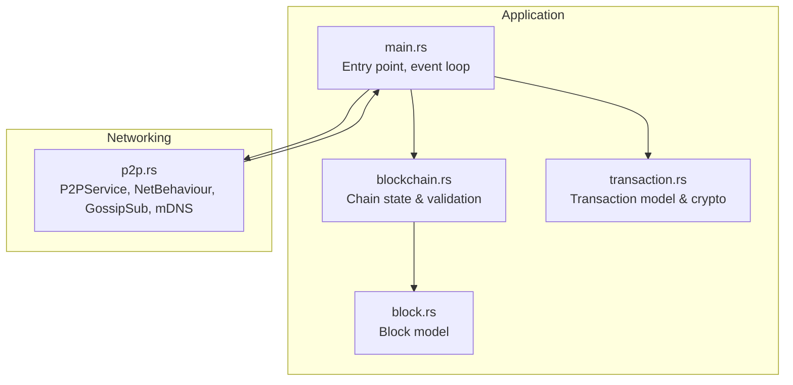
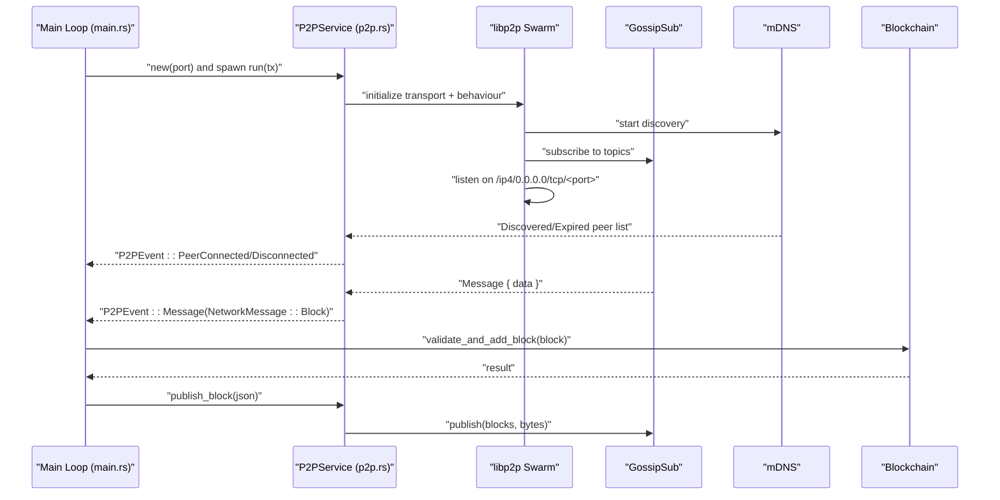
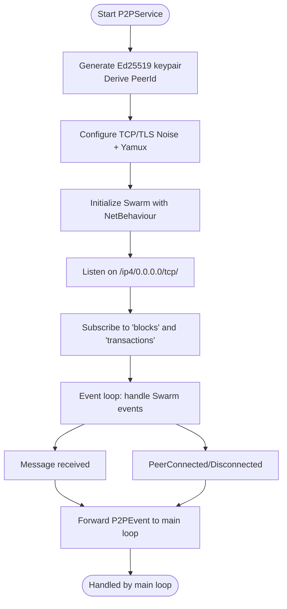
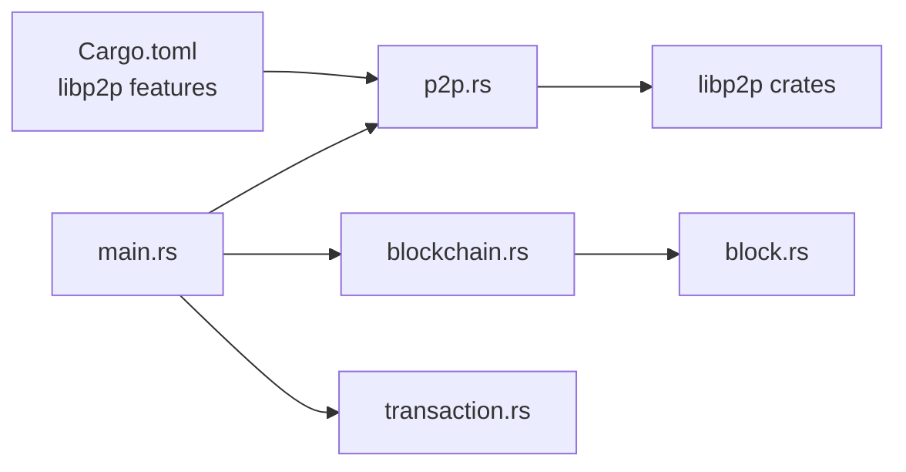

# P2P Networking

<cite>
**Referenced Files in This Document**
- [src/p2p.rs](file://src/p2p.rs)
- [src/main.rs](file://src/main.rs)
- [src/block.rs](file://src/block.rs)
- [src/blockchain.rs](file://src/blockchain.rs)
- [src/transaction.rs](file://src/transaction.rs)
- [Cargo.toml](file://Cargo.toml)
- [README.md](file://README.md)
</cite>

## Table of Contents
1. [Introduction](#introduction)
2. [Project Structure](#project-structure)
3. [Core Components](#core-components)
4. [Architecture Overview](#architecture-overview)
5. [Detailed Component Analysis](#detailed-component-analysis)
6. [Dependency Analysis](#dependency-analysis)
7. [Performance Considerations](#performance-considerations)
8. [Troubleshooting Guide](#troubleshooting-guide)
9. [Conclusion](#conclusion)
10. [Appendices](#appendices)

## Introduction
This document explains NetChain’s P2P networking system built on libp2p. It focuses on:
- GossipSub-based message broadcasting for blocks and transactions
- mDNS-based peer discovery for local networks
- An event-driven architecture using NetBehaviour, P2PEvent, NetworkMessage, and OutEvent
- Transport layer setup with TCP/TLS encryption (Noise) and multiplexing (Yamux)
- Peer identity management with Ed25519 keys
- Integration between the P2P service and the main application loop
- Practical examples for connecting peers, publishing/subscribing messages, handling events, and optimizing performance

The goal is to help beginners understand distributed systems concepts and enable experienced developers to integrate and extend the libp2p behaviors effectively.

## Project Structure
NetChain organizes networking logic in a dedicated module that integrates with the main application loop. The P2P module defines the libp2p behaviors, transport, topics, and event conversion, while the main module orchestrates startup, channel-based event passing, and blockchain updates.

**Diagram sources**
- [src/main.rs](file://src/main.rs#L1-L106)
- [src/p2p.rs](file://src/p2p.rs#L1-L150)
- [src/blockchain.rs](file://src/blockchain.rs#L1-L89)
- [src/block.rs](file://src/block.rs#L1-L47)
- [src/transaction.rs](file://src/transaction.rs#L1-L211)

**Section sources**
- [src/main.rs](file://src/main.rs#L1-L106)
- [src/p2p.rs](file://src/p2p.rs#L1-L150)
- [Cargo.toml](file://Cargo.toml#L1-L47)

## Core Components
- P2PService: encapsulates libp2p swarm, peer identity, transport, and topics. Provides lifecycle methods to initialize, run, and publish messages.
- NetBehaviour: a composite libp2p behavior combining GossipSub and mDNS.
- OutEvent: a unified event wrapper for Gossipsub and mDNS outputs.
- P2PEvent: the application-facing event type emitted to the main loop.
- NetworkMessage: the application-level message envelope for blocks and transactions.

Key responsibilities:
- Transport setup with TCP/TLS Noise and Yamux multiplexing
- Peer identity via Ed25519 keypair
- Topic subscriptions for “blocks” and “transactions”
- Event bridging from Swarm events to P2PEvent for the main loop

**Section sources**
- [src/p2p.rs](file://src/p2p.rs#L25-L150)
- [src/main.rs](file://src/main.rs#L14-L102)

## Architecture Overview
The P2P subsystem runs independently in a Tokio task, listening on a configured port and emitting events over a channel to the main loop. The main loop handles blockchain updates and prints peer events.

**Diagram sources**
- [src/p2p.rs](file://src/p2p.rs#L70-L149)
- [src/main.rs](file://src/main.rs#L30-L102)

## Detailed Component Analysis

### Transport Layer Setup (TCP/TLS Noise + Yamux)
- Identity: Ed25519 keypair generates the local PeerId.
- Transport: TCP upgrade with Noise handshake and Yamux multiplexing.
- Listener: Swarm listens on /ip4/0.0.0.0/tcp/<port>.
- Security: Noise provides authenticated encryption; Ed25519 identities are used by GossipSub for message signing.

Implementation highlights:
- Keypair generation and PeerId extraction
- Transport composition with upgrade and multiplexing
- Swarm creation with executor configuration
- Listening on the configured port

Operational notes:
- The transport stack ensures encrypted, multiplexed connections.
- Port binding is required for inbound connections and discovery.

**Section sources**
- [src/p2p.rs](file://src/p2p.rs#L70-L104)

### NetBehaviour Composition (GossipSub + mDNS)
- NetBehaviour aggregates GossipSub and mDNS behaviors.
- OutEvent bridges GossipsubEvent and MdnsEvent into a single enum for downstream handling.
- This design keeps the event loop simple and decoupled from libp2p internals.

Behavioral details:
- GossipSub is configured with signed authenticity using the local keypair.
- mDNS is initialized with the current PeerId to discover peers on the local network.

**Section sources**
- [src/p2p.rs](file://src/p2p.rs#L38-L61)

### Topic-Based Message Routing (Blocks and Transactions)
- Topics: “blocks” and “transactions” are subscribed upon initialization.
- Publishing: blocks are published to the “blocks” topic; transactions are represented in NetworkMessage but not yet published in the current implementation.
- Subscriptions: peers receive messages for topics they subscribed to.

Serialization:
- Messages are sent as bytes; the current implementation treats block payloads as UTF-8 strings. For production, consider explicit JSON or binary encodings.

**Section sources**
- [src/p2p.rs](file://src/p2p.rs#L81-L90)
- [src/p2p.rs](file://src/p2p.rs#L142-L148)

### Event-Driven Architecture (P2PEvent, OutEvent, NetBehaviour)
- OutEvent wraps Gossipsub and mDNS events for unified handling.
- P2PEvent is the application-facing event type:
  - Message(NetworkMessage): carries block or transaction payloads
  - PeerConnected(PeerId)/PeerDisconnected(PeerId): discovered/expired peers
- The run loop converts Swarm events to P2PEvent and forwards them via a channel to the main loop.

Flow of events:
- GossipSub message arrives → convert to NetworkMessage::Block → emit P2PEvent::Message
- mDNS discovered/expired lists → emit P2PEvent::PeerConnected/Disconnected

**Section sources**
- [src/p2p.rs](file://src/p2p.rs#L31-L61)
- [src/p2p.rs](file://src/p2p.rs#L113-L140)

### Integration Between P2P Service and Main Application Loop
- Channel: mpsc channel with capacity 100 connects P2PService to the main loop.
- Lifecycle:
  - P2PService::new initializes transport, behavior, and topics
  - Spawn P2PService::run to continuously process Swarm events
  - Main loop receives P2PEvent and reacts:
    - Blocks: parse JSON, validate, and append to blockchain
    - Transactions: currently logged but not processed
    - Peer events: print connection/disconnection

Example flow:
- After a delay, main loop creates a block, serializes to JSON, and calls P2PService::publish_block
- Other nodes receive the message and update their chains

**Section sources**
- [src/main.rs](file://src/main.rs#L27-L102)
- [src/p2p.rs](file://src/p2p.rs#L142-L148)

### Practical Examples

#### Peer Connection Establishment
- Local discovery via mDNS: peers appear in Discovered lists and trigger PeerConnected events.
- Remote peers connect via TCP/TLS Noise; they must be reachable on the configured port.

Validation steps:
- Confirm listener is bound on the expected port
- Verify mDNS discovery emits PeerConnected events
- Ensure OutEvent::Mdns is handled in the run loop

**Section sources**
- [src/p2p.rs](file://src/p2p.rs#L125-L136)
- [src/main.rs](file://src/main.rs#L94-L100)

#### Message Publishing and Subscription
- Publishing:
  - Serialize block to JSON
  - Call publish_block with the JSON bytes
- Subscription:
  - Subscribe to “blocks” and “transactions” during initialization
  - Receive messages in the run loop and forward as P2PEvent::Message

Notes:
- Current implementation publishes blocks and expects blocks; transactions are modeled but not published.

**Section sources**
- [src/main.rs](file://src/main.rs#L55-L58)
- [src/p2p.rs](file://src/p2p.rs#L86-L90)
- [src/p2p.rs](file://src/p2p.rs#L142-L148)

#### Network Event Handling
- Convert SwarmEvent::Behaviour to OutEvent
- Map OutEvent to P2PEvent and send to the main loop
- Main loop routes events to blockchain or logs

**Section sources**
- [src/p2p.rs](file://src/p2p.rs#L113-L140)
- [src/main.rs](file://src/main.rs#L64-L102)

#### Performance Optimization Strategies
- Backpressure: the channel capacity is set; monitor for dropped events under load and adjust capacity or batch processing.
- Message size: consider compressing payloads or switching to compact binary encodings for blocks and transactions.
- Topic fan-out: limit the number of topics or use separate swarms for different message types if traffic grows.
- Transport tuning: configure TCP keepalive and buffer sizes according to deployment environment.
- Event batching: coalesce frequent peer events to reduce main loop overhead.

[No sources needed since this section provides general guidance]

### Conceptual Overview
This section provides a beginner-friendly explanation of the P2P networking concepts implemented here.

- GossipSub: a probabilistic broadcast protocol where nodes subscribe to topics and forward messages to neighbors. It is efficient and resilient to churn.
- mDNS: a zeroconf discovery mechanism that advertises peers on the local network, enabling easy bootstrap without external seed nodes.
- Event-driven loop: the P2P service runs asynchronously, converting low-level libp2p events into application-level events for the main loop.
- Transport security: TCP/TLS Noise ensures confidentiality and authenticity; Ed25519 identities tie messages to publishers.

[No sources needed since this diagram shows conceptual workflow, not actual code structure]

## Dependency Analysis
The P2P module depends on libp2p features for TCP, DNS, mDNS, Noise, Yamux, and GossipSub. The main module depends on P2PService and uses channels to coordinate with the blockchain.

**Diagram sources**
- [Cargo.toml](file://Cargo.toml#L37-L47)
- [src/p2p.rs](file://src/p2p.rs#L5-L23)
- [src/main.rs](file://src/main.rs#L14-L14)

**Section sources**
- [Cargo.toml](file://Cargo.toml#L37-L47)
- [src/p2p.rs](file://src/p2p.rs#L5-L23)
- [src/main.rs](file://src/main.rs#L14-L14)

## Performance Considerations
- Channel sizing: tune the mpsc channel capacity to balance throughput and memory usage.
- Message serialization: prefer compact encodings (e.g., bincode) for blocks and transactions to reduce bandwidth and CPU overhead.
- Topic strategy: minimize the number of topics and ensure only necessary peers subscribe to reduce propagation fan-out.
- Transport tuning: adjust TCP keepalive, buffer sizes, and TLS handshake parameters for your environment.
- Backpressure handling: monitor dropped events and implement retry or batching strategies in the main loop.

[No sources needed since this section provides general guidance]

## Troubleshooting Guide
Common issues and remedies:
- No peers discovered:
  - Ensure mDNS is enabled and the local network allows multicast.
  - Verify the listener is bound on the expected port.
- Messages not received:
  - Confirm both nodes subscribed to the same topics.
  - Check that messages are published to the correct topic.
- Peer events not emitted:
  - Verify OutEvent mapping and SwarmEvent handling in the run loop.
- Serialization errors:
  - Ensure consistent serialization format for blocks and transactions.
  - Validate JSON parsing in the main loop.

**Section sources**
- [src/p2p.rs](file://src/p2p.rs#L113-L140)
- [src/main.rs](file://src/main.rs#L64-L102)

## Conclusion
NetChain’s P2P networking integrates libp2p behaviors to deliver secure, event-driven communication. The modular design separates transport, identity, discovery, and messaging into cohesive components. The current implementation demonstrates GossipSub broadcasting and mDNS discovery, with room to expand transaction publishing and advanced transport tuning. By following the patterns shown here, developers can extend the system with robust, production-grade networking capabilities.

[No sources needed since this section summarizes without analyzing specific files]

## Appendices

### API Definitions and Types
- P2PService
  - Methods: new(port), run(sender), publish_block(json)
  - Fields: peer_id, swarm, block_topic, tx_topic
- NetBehaviour
  - Fields: gossipsub, mdns
- OutEvent
  - Variants: Gossip(GossipsubEvent), Mdns(MdnsEvent)
- P2PEvent
  - Variants: Message(NetworkMessage), PeerConnected(PeerId), PeerDisconnected(PeerId)
- NetworkMessage
  - Variants: Block(String), Transaction(String)

**Section sources**
- [src/p2p.rs](file://src/p2p.rs#L31-L149)

### Message Serialization Formats
- Blocks: JSON-encoded strings are published and parsed as Block structs.
- Transactions: modeled in the transaction module; serialization follows canonical bincode rules for signing and hashing.

**Section sources**
- [src/main.rs](file://src/main.rs#L55-L58)
- [src/block.rs](file://src/block.rs#L14-L46)
- [src/transaction.rs](file://src/transaction.rs#L63-L81)

### Practical Usage Scenarios
- Local testing:
  - Run multiple nodes on the same machine; they should discover each other via mDNS and exchange blocks.
- Remote testing:
  - Expose the port and ensure NAT traversal or firewall rules allow inbound connections.
- Extending to transactions:
  - Add publish_transaction to P2PService and handle P2PEvent::Message(NetworkMessage::Transaction(...)) in the main loop.

[No sources needed since this section provides general guidance]