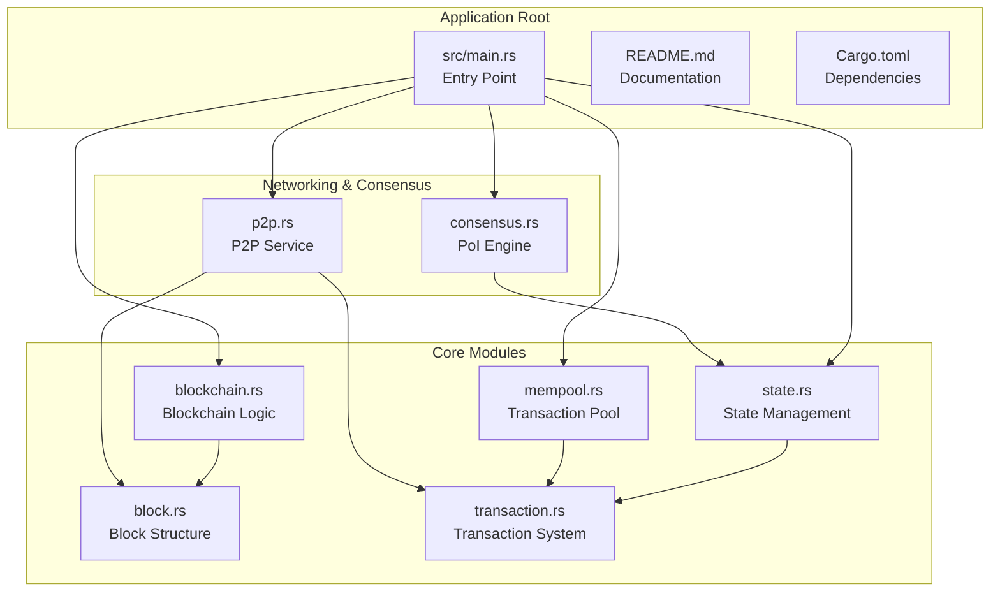
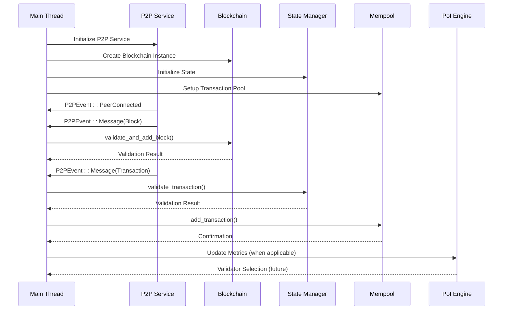
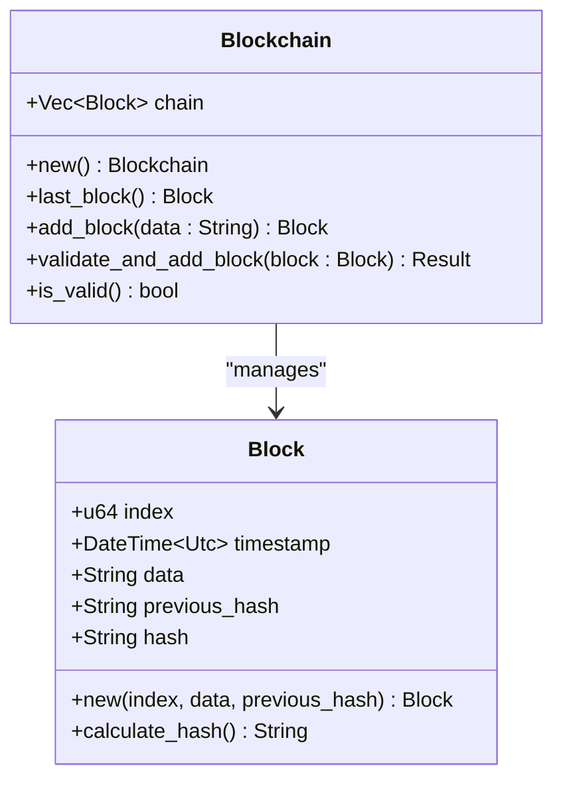
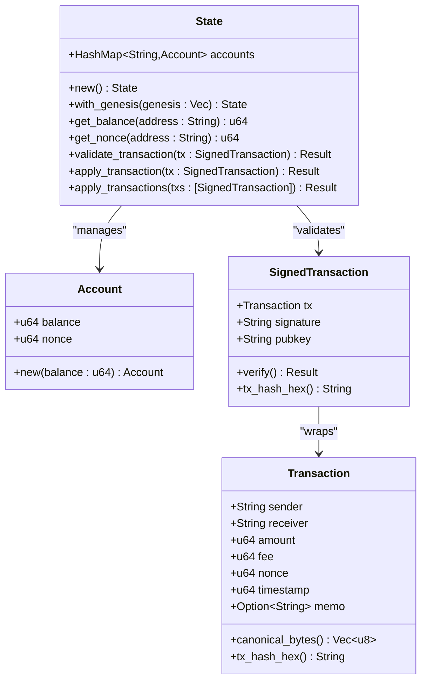
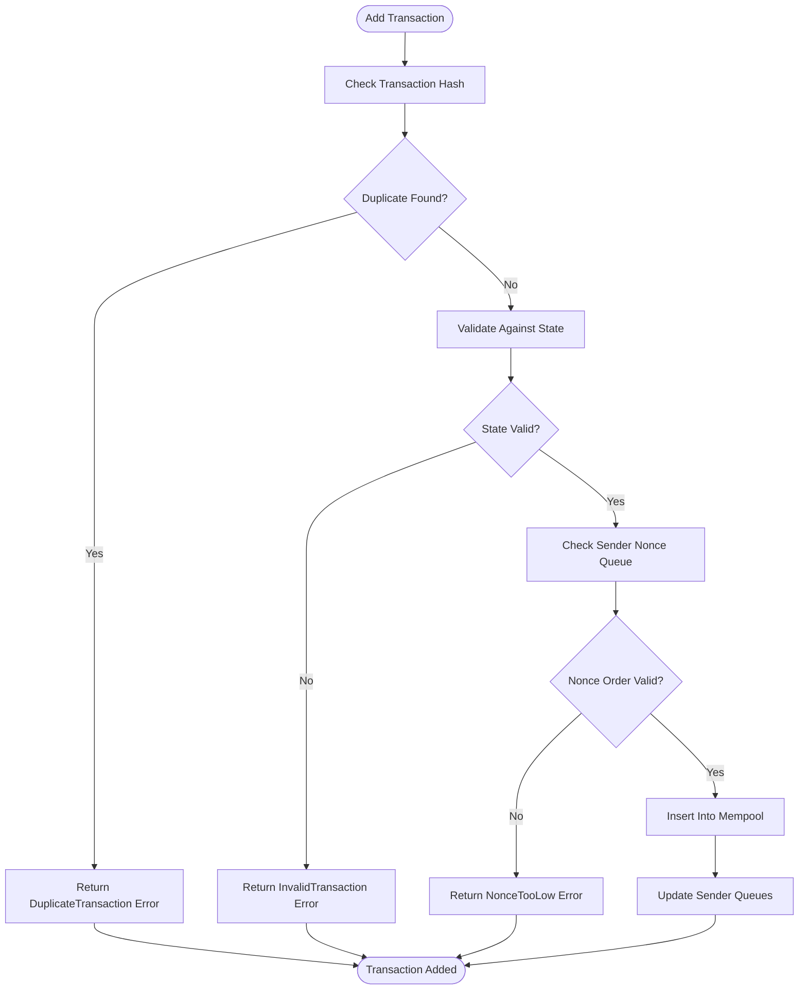
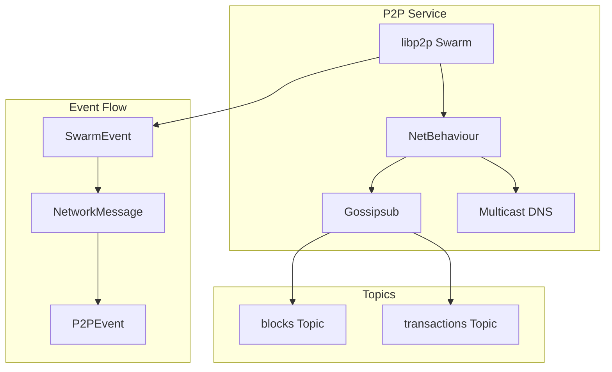
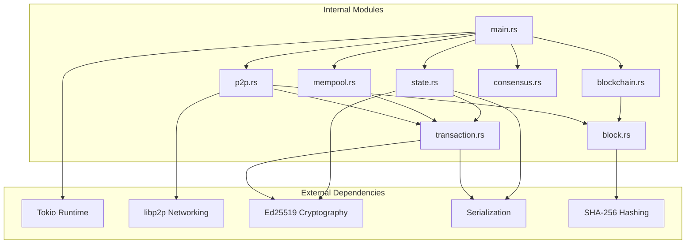

# Architecture Overview

<cite>
**Referenced Files in This Document**
- [src/main.rs](file://src/main.rs)
- [src/blockchain.rs](file://src/blockchain.rs)
- [src/block.rs](file://src/block.rs)
- [src/state.rs](file://src/state.rs)
- [src/mempool.rs](file://src/mempool.rs)
- [src/transaction.rs](file://src/transaction.rs)
- [src/p2p.rs](file://src/p2p.rs)
- [src/consensus.rs](file://src/consensus.rs)
- [Cargo.toml](file://Cargo.toml)
- [README.md](file://README.md)
</cite>

## Table of Contents
1. [Introduction](#introduction)
2. [Project Structure](#project-structure)
3. [Core Components](#core-components)
4. [Architecture Overview](#architecture-overview)
5. [Detailed Component Analysis](#detailed-component-analysis)
6. [Dependency Analysis](#dependency-analysis)
7. [Performance Considerations](#performance-considerations)
8. [Troubleshooting Guide](#troubleshooting-guide)
9. [Conclusion](#conclusion)

## Introduction

NetChain is a next-generation Layer-1 blockchain prototype that implements a novel Proof-of-Internet (PoI) consensus mechanism. Unlike traditional Proof-of-Work or Proof-of-Stake systems, NetChain selects validators based on their real-world internet performance characteristics including upload/download speeds, latency, uptime, and packet stability.

The system follows a lightweight, modular architecture built in Rust with a focus on performance, memory safety, and modern cryptographic primitives. The implementation demonstrates a clean separation of concerns across blockchain management, state handling, memory pool operations, and P2P networking layers.

## Project Structure

The NetChain project follows a clean, modular structure organized around core blockchain components:



**Diagram sources**
- [src/main.rs](file://src/main.rs#L1-L145)
- [src/blockchain.rs](file://src/blockchain.rs#L1-L89)
- [src/state.rs](file://src/state.rs#L1-L183)
- [src/mempool.rs](file://src/mempool.rs#L1-L159)
- [src/p2p.rs](file://src/p2p.rs#L1-L150)
- [src/consensus.rs](file://src/consensus.rs#L1-L334)

**Section sources**
- [src/main.rs](file://src/main.rs#L1-L145)
- [Cargo.toml](file://Cargo.toml#L1-L47)

## Core Components

NetChain implements a comprehensive blockchain architecture with clearly defined component boundaries:

### Blockchain Core
The blockchain module provides fundamental ledger functionality including block creation, validation, and chain integrity maintenance. It manages the immutable chain of blocks and ensures cryptographic consistency through hash verification.

### State Management
The state system maintains account balances, nonces, and handles transaction validation and application. It provides atomic state transitions and enforces business rules for transaction processing.

### Memory Pool
The mempool component manages unconfirmed transactions with duplicate detection, nonce ordering, and fee-based prioritization. It serves as the staging area for transactions awaiting block inclusion.

### P2P Networking
Built on libp2p, the networking layer provides decentralized peer discovery, gossip-based message propagation, and secure encrypted communications using Noise protocol and Yamux multiplexing.

### Consensus Engine
The PoI consensus module implements a sophisticated scoring system that evaluates network performance metrics to determine validator selection probabilities, promoting nodes with superior internet connectivity.

**Section sources**
- [src/blockchain.rs](file://src/blockchain.rs#L1-L89)
- [src/state.rs](file://src/state.rs#L1-L183)
- [src/mempool.rs](file://src/mempool.rs#L1-L159)
- [src/p2p.rs](file://src/p2p.rs#L1-L150)
- [src/consensus.rs](file://src/consensus.rs#L1-L334)

## Architecture Overview

NetChain employs an event-driven architecture pattern that enables asynchronous communication between components through message passing channels. The system operates on a central event loop that coordinates blockchain operations, state updates, and network synchronization.



**Diagram sources**
- [src/main.rs](file://src/main.rs#L23-L145)
- [src/p2p.rs](file://src/p2p.rs#L113-L141)
- [src/blockchain.rs](file://src/blockchain.rs#L40-L64)
- [src/state.rs](file://src/state.rs#L69-L95)
- [src/mempool.rs](file://src/mempool.rs#L42-L77)

The architecture follows a producer-consumer pattern where the P2P service acts as the primary event producer, generating messages that drive the blockchain's state transitions. The main thread serves as the central coordinator, orchestrating operations across all subsystems through a structured event handling mechanism.

**Section sources**
- [src/main.rs](file://src/main.rs#L44-L141)
- [src/p2p.rs](file://src/p2p.rs#L113-L141)

## Detailed Component Analysis

### Blockchain Management System

The blockchain component provides the foundational ledger functionality with robust validation mechanisms:



**Diagram sources**
- [src/blockchain.rs](file://src/blockchain.rs#L5-L37)
- [src/block.rs](file://src/block.rs#L5-L25)

The blockchain implements a simple but effective validation pipeline that checks block indices, cryptographic chaining through hash verification, and maintains chain integrity through comprehensive validation routines.

**Section sources**
- [src/blockchain.rs](file://src/blockchain.rs#L10-L64)
- [src/block.rs](file://src/block.rs#L14-L46)

### State Management Architecture

The state system implements a ledger-based approach to account management with atomic transaction processing:



**Diagram sources**
- [src/state.rs](file://src/state.rs#L16-L128)
- [src/transaction.rs](file://src/transaction.rs#L23-L144)

The state management system enforces strict validation rules including cryptographic signature verification, balance calculations, nonce sequencing, and transaction atomicity through comprehensive error handling.

**Section sources**
- [src/state.rs](file://src/state.rs#L36-L128)
- [src/transaction.rs](file://src/transaction.rs#L23-L144)

### Memory Pool Operations

The mempool component implements sophisticated transaction queuing with duplicate prevention and nonce ordering:



**Diagram sources**
- [src/mempool.rs](file://src/mempool.rs#L42-L77)

The mempool ensures transaction integrity through multiple validation layers and maintains optimal ordering for block production through fee-based prioritization.

**Section sources**
- [src/mempool.rs](file://src/mempool.rs#L26-L113)

### P2P Networking Infrastructure

The networking layer leverages libp2p for decentralized peer-to-peer communication with comprehensive message routing:



**Diagram sources**
- [src/p2p.rs](file://src/p2p.rs#L38-L111)

The P2P system provides secure, encrypted communication channels with automatic peer discovery and efficient message propagation through gossip protocols.

**Section sources**
- [src/p2p.rs](file://src/p2p.rs#L63-L149)

### PoI Consensus Engine

The PoI consensus module implements a sophisticated scoring system for validator selection based on network performance metrics:

```mermaid
flowchart TD
Metrics[NodeMetrics] --> Normalize[Normalize Metrics]
Normalize --> WeightCalc[Weighted Sum Calculation]
WeightCalc --> Score[Final PoI Score 0.0-1.0]
Score --> ValidatorSelection[Validator Selection]
subgraph "Normalization Functions"
Normal[Normal: val/max]
Invert[Invert: 1-(val/max)]
end
Metrics --> Normal
Metrics --> Invert
Normal --> WeightCalc
Invert --> WeightCalc
subgraph "Selection Methods"
Seed[Seed-based Selection]
RNG[RNG-based Selection]
end
WeightCalc --> Seed
WeightCalc --> RNG
```

**Diagram sources**
- [src/consensus.rs](file://src/consensus.rs#L63-L182)

The consensus engine provides both deterministic and probabilistic validator selection mechanisms, ensuring fair and transparent governance based on network contribution rather than capital ownership.

**Section sources**
- [src/consensus.rs](file://src/consensus.rs#L57-L182)

## Dependency Analysis

NetChain's dependency graph reflects a clean, layered architecture with minimal coupling between components:



**Diagram sources**
- [Cargo.toml](file://Cargo.toml#L6-L47)
- [src/main.rs](file://src/main.rs#L11-L21)

The dependency analysis reveals a well-structured system where external dependencies are primarily used for specific functionalities: Tokio for async operations, libp2p for networking, Ed25519 for cryptography, and various serialization libraries for data interchange.

**Section sources**
- [Cargo.toml](file://Cargo.toml#L6-L47)

## Performance Considerations

NetChain's architecture incorporates several performance optimization strategies:

### Asynchronous Processing
The system leverages Tokio's async runtime to handle concurrent operations efficiently, enabling non-blocking I/O operations and parallel processing of network events and blockchain operations.

### Memory Efficiency
Components use optimized data structures including HashMap for transaction indexing, VecDeque for nonce-ordered queues, and compact binary serialization for efficient storage and transmission.

### Network Optimization
The libp2p integration provides efficient peer discovery, message routing, and connection management with built-in encryption and compression capabilities.

### Cryptographic Efficiency
Ed25519 signatures offer excellent performance characteristics with small key sizes and fast verification times, suitable for high-throughput blockchain operations.

## Troubleshooting Guide

Common issues and their resolution strategies:

### Network Connectivity Problems
- **Symptom**: Peers not connecting or messages not propagating
- **Solution**: Verify port availability, firewall settings, and libp2p transport configuration

### Transaction Validation Failures
- **Symptom**: Transactions rejected with validation errors
- **Solution**: Check signature verification, nonce sequencing, and account balance sufficient funds

### Blockchain Synchronization Issues
- **Symptom**: Chain validation failures or fork conflicts
- **Solution**: Verify block hash calculations, index continuity, and previous hash matching

### Memory Pool Errors
- **Symptom**: Duplicate transaction rejections or nonce ordering problems
- **Solution**: Review transaction hash uniqueness and sender queue management

**Section sources**
- [src/state.rs](file://src/state.rs#L6-L14)
- [src/mempool.rs](file://src/mempool.rs#L5-L11)
- [src/blockchain.rs](file://src/blockchain.rs#L40-L64)

## Conclusion

NetChain represents a forward-thinking approach to blockchain architecture that prioritizes performance, modularity, and practical utility. The system's event-driven design, combined with Rust's memory safety guarantees and libp2p's robust networking capabilities, creates a foundation for scalable, efficient blockchain operations.

The PoI consensus mechanism introduces a novel approach to validator selection that aligns economic incentives with network contribution, potentially reducing energy consumption while maintaining security and decentralization. The modular architecture ensures that each component can be independently developed, tested, and optimized while maintaining clear interfaces and well-defined responsibilities.

This architectural approach positions NetChain as a promising candidate for next-generation blockchain infrastructure, demonstrating how modern technologies and innovative consensus mechanisms can work together to create more sustainable and efficient distributed systems.