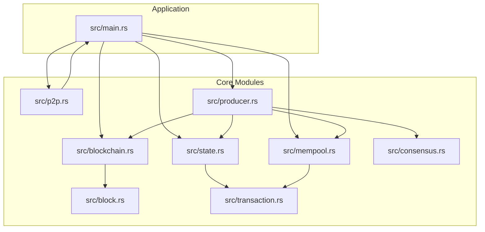
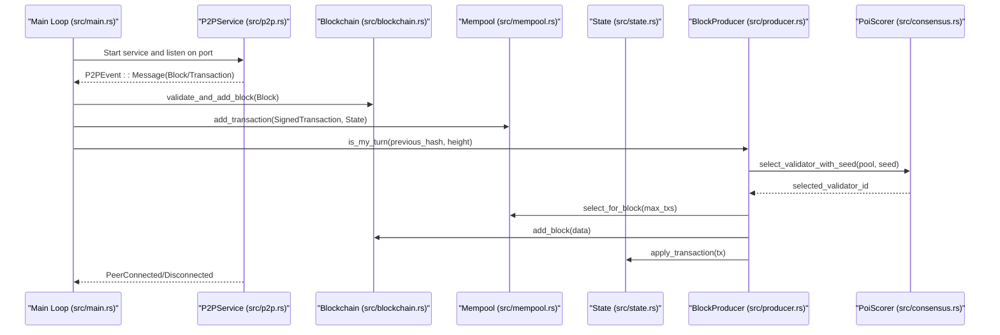
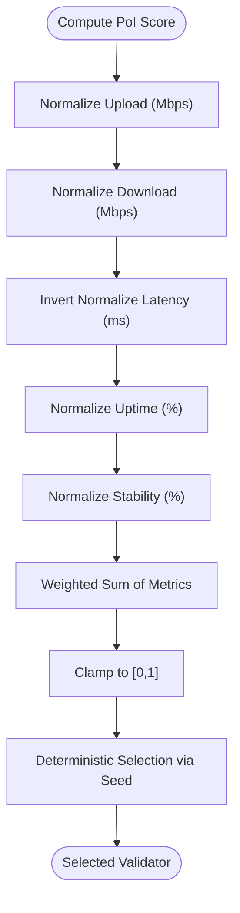
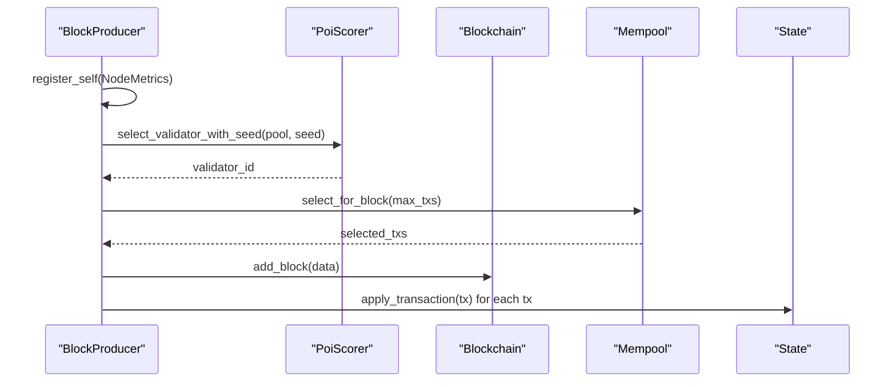
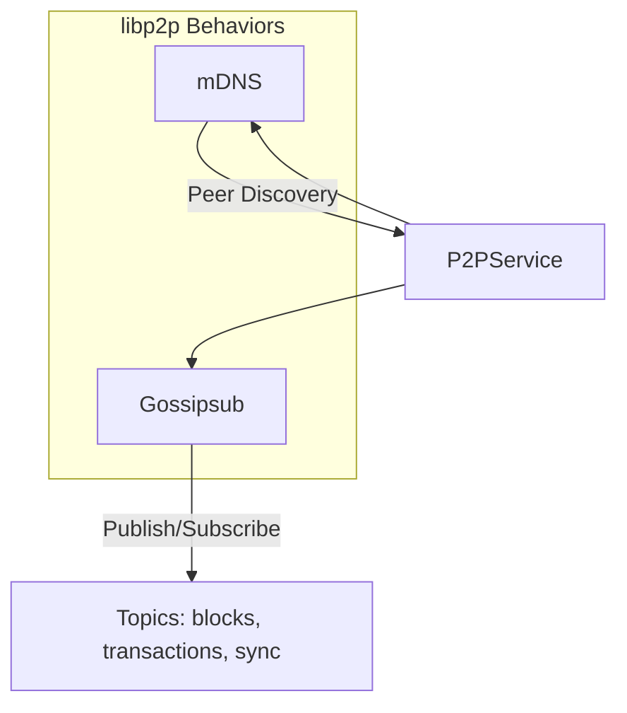
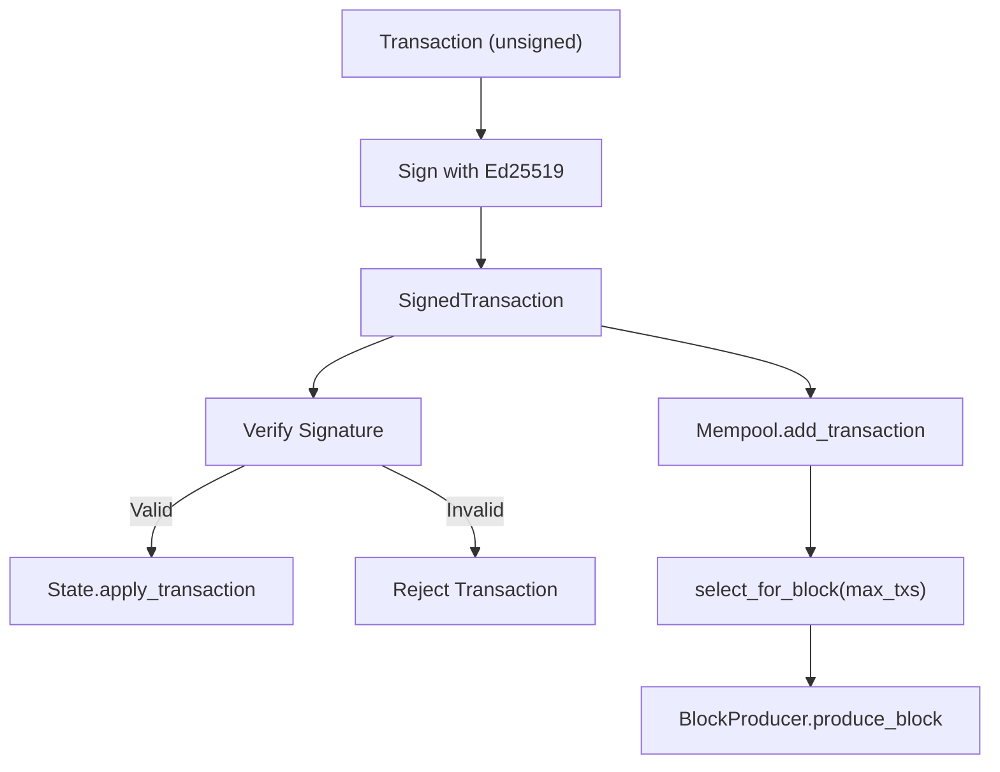
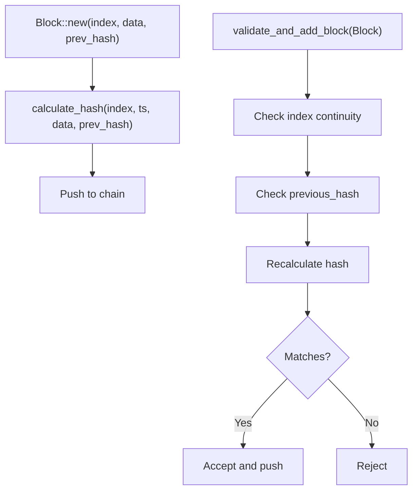
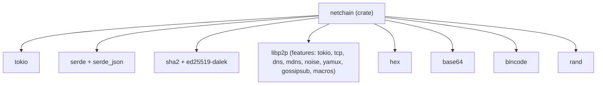

# Comparison and Market Positioning

<cite>
**Referenced Files in This Document**
- [README.md](file://README.md)
- [Cargo.toml](file://Cargo.toml)
- [src/main.rs](file://src/main.rs)
- [src/consensus.rs](file://src/consensus.rs)
- [src/producer.rs](file://src/producer.rs)
- [src/p2p.rs](file://src/p2p.rs)
- [src/blockchain.rs](file://src/blockchain.rs)
- [src/block.rs](file://src/block.rs)
- [src/transaction.rs](file://src/transaction.rs)
- [src/state.rs](file://src/state.rs)
- [src/mempool.rs](file://src/mempool.rs)
</cite>

## Table of Contents
1. [Introduction](#introduction)
2. [Project Structure](#project-structure)
3. [Core Components](#core-components)
4. [Architecture Overview](#architecture-overview)
5. [Detailed Component Analysis](#detailed-component-analysis)
6. [Dependency Analysis](#dependency-analysis)
7. [Performance Considerations](#performance-considerations)
8. [Troubleshooting Guide](#troubleshooting-guide)
9. [Conclusion](#conclusion)
10. [Appendices](#appendices)

## Introduction
NetChain is an experimental Layer-1 blockchain prototype that explores a novel consensus mechanism—Proof of Internet (PoI)—to replace energy-intensive Proof-of-Work (PoW) and capital-weighted Proof-of-Stake (PoS). PoI selects validators based on real-world internet performance indicators such as upload/download throughput, latency, uptime, and packet stability. This approach emphasizes energy efficiency, global inclusivity, and economic fairness by rewarding participants who contribute network quality rather than hardware or capital.

Positioning:
- Energy efficiency: PoI avoids the massive electricity consumption of PoW and the capital requirements of PoS.
- Accessibility: Anyone with a capable internet connection can participate as a validator.
- Economic fairness: Rewards are proportional to network performance, reducing wealth concentration.
- Educational value: As a developer-focused prototype, NetChain serves as a practical learning platform for blockchain consensus mechanisms.

Target audience:
- Developers building on or extending the prototype
- Researchers exploring alternative consensus designs
- Early adopters interested in sustainable and inclusive blockchain systems

Competitive advantages:
- Unique consensus model grounded in internet performance
- Lightweight, modular architecture implemented in Rust for performance and safety
- Clear separation of concerns across layers (block, chain, transactions, state, mempool, P2P, consensus)
- Deterministic validator selection via seed-derived randomness for reproducibility

## Project Structure
The repository follows a layered, modular design with a focus on incremental development. The main modules include:
- Block and blockchain primitives
- Transactions, state, and mempool
- P2P networking using libp2p
- PoI consensus engine for validator selection
- Entry point orchestrating components

**Diagram sources**
- [src/main.rs](file://src/main.rs#L1-L147)
- [src/block.rs](file://src/block.rs#L1-L47)
- [src/blockchain.rs](file://src/blockchain.rs#L1-L117)
- [src/transaction.rs](file://src/transaction.rs#L1-L211)
- [src/state.rs](file://src/state.rs#L1-L183)
- [src/mempool.rs](file://src/mempool.rs#L1-L159)
- [src/p2p.rs](file://src/p2p.rs#L1-L214)
- [src/consensus.rs](file://src/consensus.rs#L1-L334)
- [src/producer.rs](file://src/producer.rs#L1-L239)

**Section sources**
- [README.md](file://README.md#L47-L158)
- [src/main.rs](file://src/main.rs#L1-L147)

## Core Components
- PoI consensus engine: Computes validator importance scores from internet metrics and selects validators deterministically using a seed derived from the previous block hash and block height.
- Block producer: Manages block creation, validator selection, and integrates with mempool and state.
- P2P networking: Provides gossip-based messaging for blocks, transactions, and chain synchronization using libp2p.
- Transaction and state management: Handles transaction signing, verification, validation, and ledger updates.
- Mempool: Maintains pending transactions, enforces deduplication and nonce ordering, and selects transactions for block inclusion.
- Blockchain and block primitives: Define block structure, hashing, and chain validation logic.

These components collectively enable a lightweight, extensible prototype suitable for experimentation and education.

**Section sources**
- [src/consensus.rs](file://src/consensus.rs#L1-L334)
- [src/producer.rs](file://src/producer.rs#L1-L239)
- [src/p2p.rs](file://src/p2p.rs#L1-L214)
- [src/transaction.rs](file://src/transaction.rs#L1-L211)
- [src/state.rs](file://src/state.rs#L1-L183)
- [src/mempool.rs](file://src/mempool.rs#L1-L159)
- [src/blockchain.rs](file://src/blockchain.rs#L1-L117)
- [src/block.rs](file://src/block.rs#L1-L47)

## Architecture Overview
The system architecture centers on a main event loop that coordinates P2P messaging, block validation, and transaction lifecycle. The PoI engine feeds the block producer, which decides when to produce blocks and how to select transactions. The state and mempool modules ensure correctness and fairness in transaction processing.

**Diagram sources**
- [src/main.rs](file://src/main.rs#L1-L147)
- [src/p2p.rs](file://src/p2p.rs#L1-L214)
- [src/blockchain.rs](file://src/blockchain.rs#L1-L117)
- [src/mempool.rs](file://src/mempool.rs#L1-L159)
- [src/state.rs](file://src/state.rs#L1-L183)
- [src/producer.rs](file://src/producer.rs#L1-L239)
- [src/consensus.rs](file://src/consensus.rs#L1-L334)

## Detailed Component Analysis

### PoI Consensus Engine
PoI computes a validator importance score from five metrics: upload throughput, download throughput, latency, uptime, and packet stability. Scores are normalized and combined using configurable weights and thresholds. Validator selection is deterministic using a seed derived from the previous block hash and block height, ensuring reproducibility across nodes.

**Diagram sources**
- [src/consensus.rs](file://src/consensus.rs#L63-L182)

Key properties:
- Deterministic validator selection using a seed derived from the previous block hash and block height
- Normalization and inversion logic tailored to metric characteristics (e.g., lower latency yields higher score)
- Fallback behavior when all scores are zero, ensuring progress

**Section sources**
- [src/consensus.rs](file://src/consensus.rs#L1-L334)
- [src/producer.rs](file://src/producer.rs#L95-L127)

### Block Producer and Validator Selection
The block producer integrates PoI scoring with block production. It registers validator metrics, computes a deterministic seed from the previous block, selects the next validator, and produces blocks containing validated transactions.

**Diagram sources**
- [src/producer.rs](file://src/producer.rs#L108-L176)
- [src/consensus.rs](file://src/consensus.rs#L101-L143)
- [src/mempool.rs](file://src/mempool.rs#L99-L112)
- [src/blockchain.rs](file://src/blockchain.rs#L28-L38)
- [src/state.rs](file://src/state.rs#L98-L119)

**Section sources**
- [src/producer.rs](file://src/producer.rs#L1-L239)

### P2P Networking and Messaging
The P2P layer uses libp2p with gossipsub for decentralized messaging. Topics include blocks, transactions, and chain sync requests/responses. The service publishes and subscribes to topics, relaying messages to the main event loop.

**Diagram sources**
- [src/p2p.rs](file://src/p2p.rs#L44-L121)
- [src/p2p.rs](file://src/p2p.rs#L123-L167)

**Section sources**
- [src/p2p.rs](file://src/p2p.rs#L1-L214)

### Transactions, State, and Mempool
Transactions are signed using Ed25519 and verified cryptographically. The state maintains account balances and nonces, enforcing validity before applying transactions. The mempool enforces deduplication, nonce ordering per sender, and fee-based prioritization.

**Diagram sources**
- [src/transaction.rs](file://src/transaction.rs#L83-L144)
- [src/state.rs](file://src/state.rs#L69-L119)
- [src/mempool.rs](file://src/mempool.rs#L42-L112)
- [src/producer.rs](file://src/producer.rs#L136-L176)

**Section sources**
- [src/transaction.rs](file://src/transaction.rs#L1-L211)
- [src/state.rs](file://src/state.rs#L1-L183)
- [src/mempool.rs](file://src/mempool.rs#L1-L159)

### Blockchain and Blocks
Blocks encapsulate index, timestamp, data, previous hash, and computed hash. The blockchain validates incoming blocks against the previous block’s hash and recalculates the block hash to ensure integrity.

**Diagram sources**
- [src/block.rs](file://src/block.rs#L14-L46)
- [src/blockchain.rs](file://src/blockchain.rs#L40-L65)

**Section sources**
- [src/block.rs](file://src/block.rs#L1-L47)
- [src/blockchain.rs](file://src/blockchain.rs#L1-L117)

## Dependency Analysis
The project leverages a curated set of dependencies to support asynchronous networking, serialization, cryptography, and P2P communication. Notable dependencies include:
- tokio for async runtime and concurrency
- serde and serde_json for serialization
- sha2 and ed25519-dalek for cryptographic primitives
- libp2p for peer-to-peer networking with gossipsub and mDNS

**Diagram sources**
- [Cargo.toml](file://Cargo.toml#L6-L47)

**Section sources**
- [Cargo.toml](file://Cargo.toml#L1-L47)

## Performance Considerations
- PoI consensus reduces energy usage compared to PoW and eliminates capital requirements typical of PoS, aligning with sustainability goals.
- Rust implementation ensures memory safety and high performance, beneficial for network-heavy operations.
- libp2p’s gossipsub enables scalable, decentralized message propagation.
- Deterministic validator selection minimizes variability in block production timing, aiding predictability.

[No sources needed since this section provides general guidance]

## Troubleshooting Guide
Common operational checks:
- Ensure the P2P service binds to the configured port and discovers peers via mDNS.
- Validate that blocks received over gossipsub pass index, previous hash, and hash recalculations.
- Confirm transactions are properly signed and verified before being added to the mempool.
- Verify state transitions succeed and nonces are enforced correctly.

Operational tips:
- Use the temporary local block broadcasting for quick testing in development mode.
- Monitor P2P events for peer connections and disconnections.
- Adjust PoI weights and thresholds to calibrate validator selection sensitivity.

**Section sources**
- [src/main.rs](file://src/main.rs#L50-L80)
- [src/p2p.rs](file://src/p2p.rs#L123-L167)
- [src/blockchain.rs](file://src/blockchain.rs#L40-L65)
- [src/transaction.rs](file://src/transaction.rs#L105-L138)
- [src/state.rs](file://src/state.rs#L69-L95)

## Conclusion
NetChain reimagines blockchain consensus by rewarding network performance rather than energy or capital. Its PoI mechanism offers a pathway toward more sustainable, inclusive, and fair consensus. As a developer-focused prototype, it bridges academic exploration with practical implementation, enabling hands-on learning about consensus mechanics, networking, and state management. The modular architecture and Rust foundation position it as a solid foundation for experimentation, iteration, and education.

[No sources needed since this section summarizes without analyzing specific files]

## Appendices

### Comparative Summary: PoI vs PoW vs PoS
- Energy efficiency: PoI avoids mining energy costs; PoW is highly energy-intensive; PoS is less so but still requires capital commitment.
- Accessibility: PoI lowers barriers by focusing on internet performance; PoW requires expensive hardware; PoS requires significant capital.
- Economic fairness: PoI distributes rewards based on network contribution; PoW rewards miners with high upfront costs; PoS rewards capital holders.

[No sources needed since this section provides general guidance]