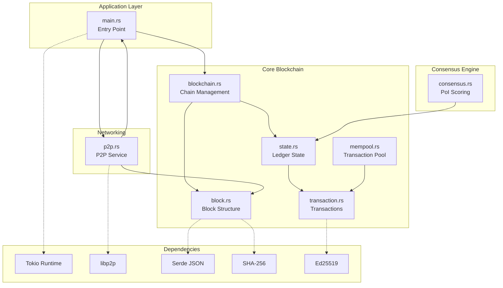
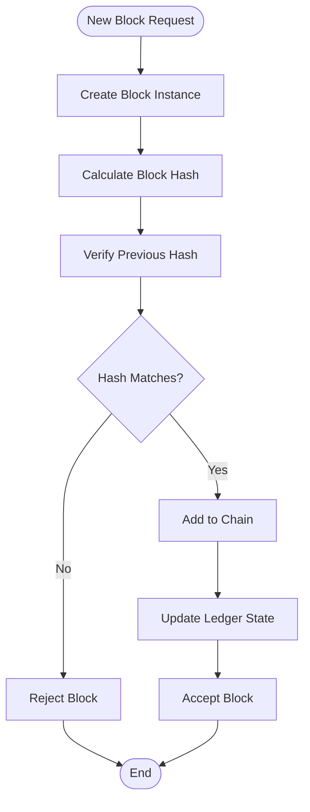
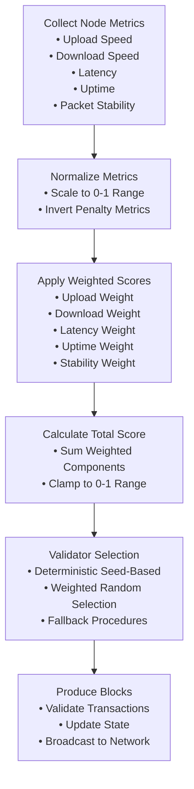
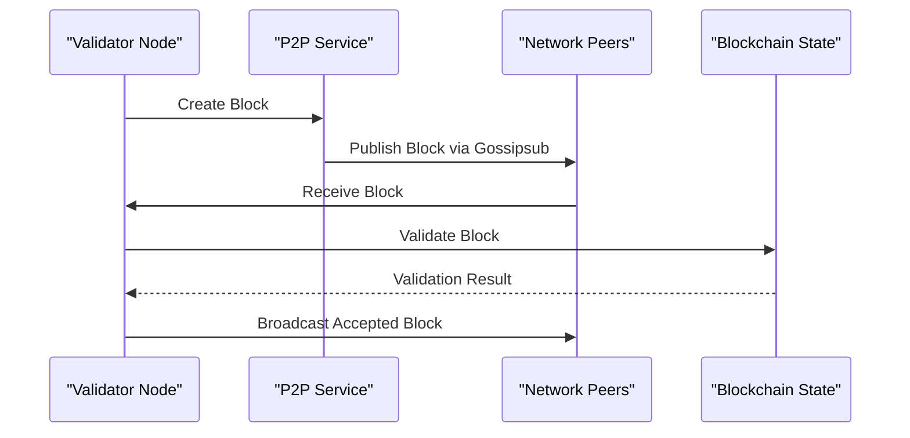
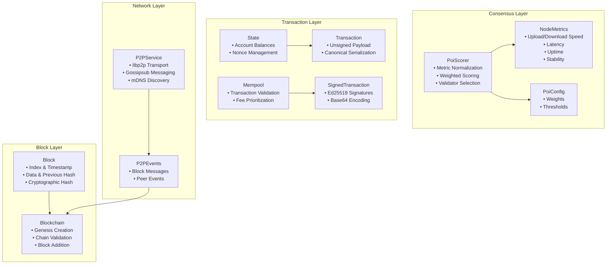
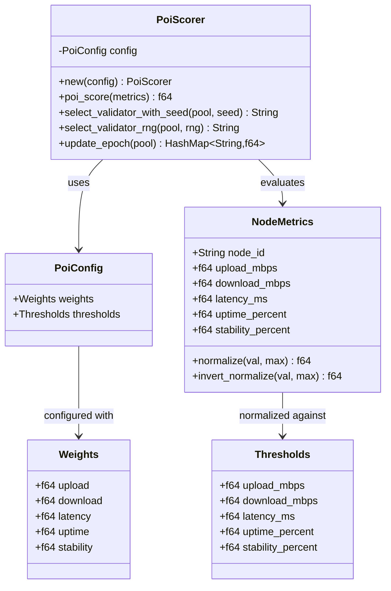
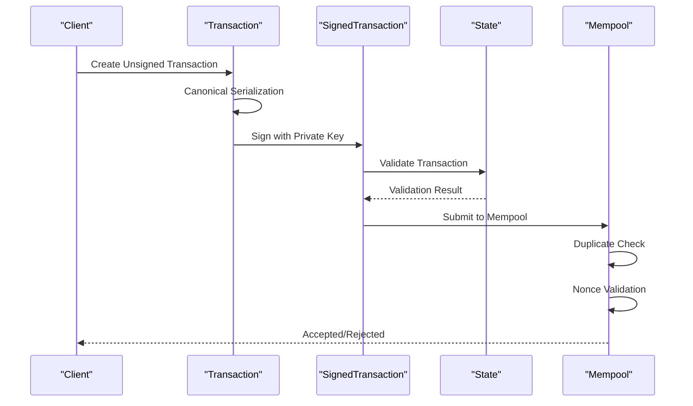
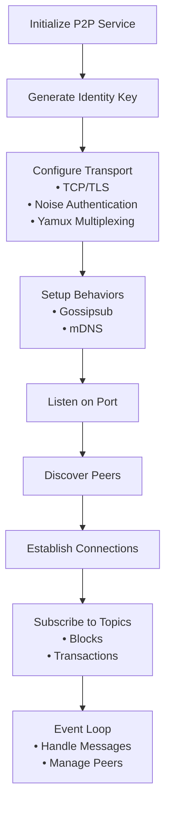
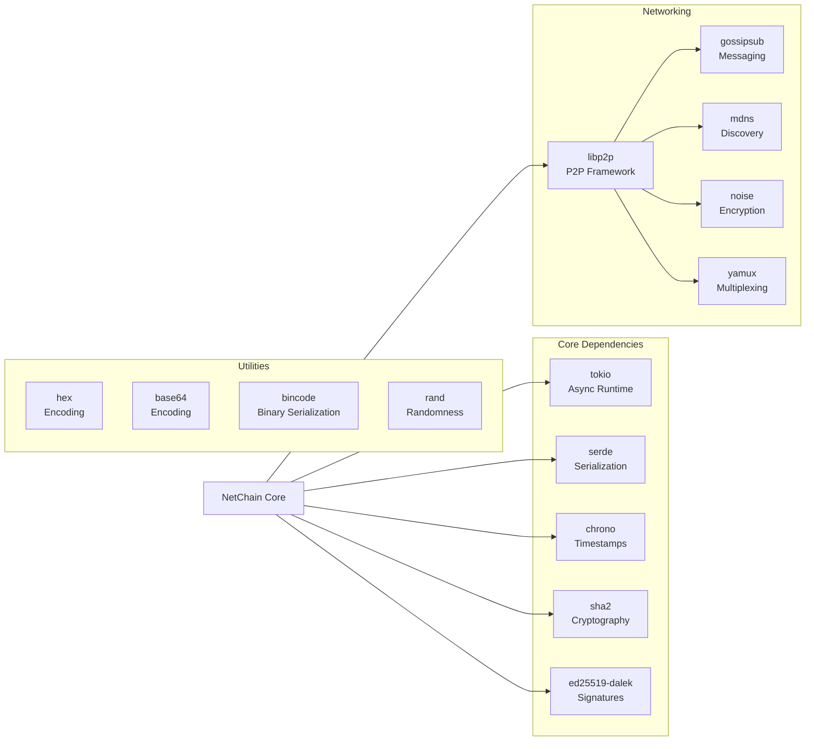

# Introduction and Core Concepts

<cite>
**Referenced Files in This Document**
- [README.md](file://README.md)
- [Cargo.toml](file://Cargo.toml)
- [src/main.rs](file://src/main.rs)
- [src/block.rs](file://src/block.rs)
- [src/blockchain.rs](file://src/blockchain.rs)
- [src/consensus.rs](file://src/consensus.rs)
- [src/p2p.rs](file://src/p2p.rs)
- [src/state.rs](file://src/state.rs)
- [src/transaction.rs](file://src/transaction.rs)
- [src/mempool.rs](file://src/mempool.rs)
</cite>

## Table of Contents
1. [Introduction](#introduction)
2. [Project Structure](#project-structure)
3. [Core Components](#core-components)
4. [Architecture Overview](#architecture-overview)
5. [Detailed Component Analysis](#detailed-component-analysis)
6. [Dependency Analysis](#dependency-analysis)
7. [Performance Considerations](#performance-considerations)
8. [Troubleshooting Guide](#troubleshooting-guide)
9. [Conclusion](#conclusion)

## Introduction
NetChain is a next-generation Layer-1 blockchain prototype that introduces a revolutionary Proof-of-Internet (PoI) consensus mechanism. Unlike traditional Proof-of-Work (PoW) or Proof-of-Stake (PoS), PoI selects validators based on real-world internet performance metrics: upload speed, download speed, latency, uptime, and packet stability. This performance-based approach aligns incentives with network quality and throughput, enabling anyone with a strong internet connection to participate and earn rewards.

The project emphasizes practical, real-world performance over energy consumption or capital requirements. Validators are ranked by their network performance, with faster and more stable nodes gaining higher chances of validating blocks and earning rewards. This creates a more inclusive and efficient consensus model that leverages the global internet infrastructure itself as the security substrate.

## Project Structure
NetChain follows a modular, layered architecture designed for clarity and extensibility. The codebase is organized around core blockchain components, with clear separation of concerns between block management, consensus logic, networking, and state handling.

**Diagram sources**
- [src/main.rs](file://src/main.rs#L16-L105)
- [src/blockchain.rs](file://src/blockchain.rs#L1-L88)
- [src/consensus.rs](file://src/consensus.rs#L1-L182)
- [src/p2p.rs](file://src/p2p.rs#L1-L149)

**Section sources**
- [README.md](file://README.md#L47-L56)
- [Cargo.toml](file://Cargo.toml#L1-L47)

## Core Components
This section establishes the foundational concepts that underpin NetChain's architecture and PoI consensus mechanism.

### Blockchain Fundamentals
At its core, NetChain implements a classic blockchain structure with blocks linked by cryptographic hashes. Each block contains an index, timestamp, data payload, previous block hash, and its own computed hash. The blockchain maintains a linear sequence of blocks secured by cryptographic commitments, ensuring immutability and chronological ordering.

**Diagram sources**
- [src/block.rs](file://src/block.rs#L14-L46)
- [src/blockchain.rs](file://src/blockchain.rs#L40-L64)

### Consensus Mechanism Overview
NetChain's PoI consensus fundamentally differs from traditional approaches by replacing computational difficulty or stake requirements with internet performance metrics. The system evaluates potential validators based on measurable network characteristics rather than abstract economic factors.

**Diagram sources**
- [src/consensus.rs](file://src/consensus.rs#L68-L99)
- [src/consensus.rs](file://src/consensus.rs#L104-L143)

### Networking Foundation
The P2P layer provides the communication backbone for block propagation and peer discovery. Built on libp2p, the system supports gossipsub-based messaging, mDNS peer discovery, and secure encrypted connections. This enables efficient block broadcasting and transaction propagation across the network.

**Diagram sources**
- [src/p2p.rs](file://src/p2p.rs#L113-L141)
- [src/main.rs](file://src/main.rs#L42-L61)

**Section sources**
- [src/block.rs](file://src/block.rs#L5-L46)
- [src/blockchain.rs](file://src/blockchain.rs#L10-L88)
- [src/consensus.rs](file://src/consensus.rs#L57-L182)
- [src/p2p.rs](file://src/p2p.rs#L38-L149)

## Architecture Overview
NetChain implements a layered architecture that separates concerns between block management, consensus evaluation, transaction processing, and network communication. The design emphasizes modularity, allowing each component to evolve independently while maintaining clear interfaces.

**Diagram sources**
- [src/consensus.rs](file://src/consensus.rs#L57-L182)
- [src/transaction.rs](file://src/transaction.rs#L23-L144)
- [src/state.rs](file://src/state.rs#L29-L128)
- [src/block.rs](file://src/block.rs#L5-L46)
- [src/blockchain.rs](file://src/blockchain.rs#L5-L88)
- [src/p2p.rs](file://src/p2p.rs#L63-L149)

## Detailed Component Analysis

### PoI Scoring Engine
The PoI scoring engine forms the heart of NetChain's consensus mechanism. It transforms raw internet performance metrics into quantifiable validator scores through a sophisticated normalization and weighting process.

**Diagram sources**
- [src/consensus.rs](file://src/consensus.rs#L6-L182)

The scoring algorithm applies weighted normalization to each metric category, with special handling for latency (inverted normalization to penalize higher values). The resulting scores are combined to produce a final validator ranking that determines block production eligibility.

**Section sources**
- [src/consensus.rs](file://src/consensus.rs#L57-L182)

### Transaction and State Management
NetChain implements a comprehensive transaction system with cryptographic signing, deterministic serialization, and state validation. The system ensures transaction integrity through Ed25519 signatures and maintains ledger consistency through account-based state management.

**Diagram sources**
- [src/transaction.rs](file://src/transaction.rs#L43-L144)
- [src/state.rs](file://src/state.rs#L69-L95)
- [src/mempool.rs](file://src/mempool.rs#L42-L77)

The transaction lifecycle includes creation with canonical serialization, cryptographic signing, state validation, and mempool acceptance. The system enforces nonce ordering per sender and prevents duplicate submissions.

**Section sources**
- [src/transaction.rs](file://src/transaction.rs#L23-L144)
- [src/state.rs](file://src/state.rs#L29-L128)
- [src/mempool.rs](file://src/mempool.rs#L13-L113)

### Network Communication
The P2P service provides robust peer-to-peer communication using libp2p, enabling efficient block propagation and transaction broadcasting. The system supports encrypted connections, peer discovery, and structured messaging through gossipsub.

**Diagram sources**
- [src/p2p.rs](file://src/p2p.rs#L71-L111)
- [src/p2p.rs](file://src/p2p.rs#L113-L141)

**Section sources**
- [src/p2p.rs](file://src/p2p.rs#L38-L149)

## Dependency Analysis
NetChain's dependency graph reflects a modern Rust ecosystem focused on performance, security, and reliability. The project leverages mature libraries for asynchronous operations, cryptographic operations, and peer-to-peer networking.

**Diagram sources**
- [Cargo.toml](file://Cargo.toml#L6-L47)

**Section sources**
- [Cargo.toml](file://Cargo.toml#L6-L47)

## Performance Considerations
NetChain's PoI consensus offers significant advantages over traditional consensus mechanisms in terms of performance and resource efficiency. The system eliminates the computational waste associated with PoW while avoiding the capital requirements of PoS, instead leveraging existing internet infrastructure.

### Performance Characteristics
- **Energy Efficiency**: No computational mining required; validation based on network performance
- **Scalability**: Network-based validation scales with internet capacity rather than computational power
- **Inclusivity**: Lower barriers to entry for validators compared to hardware requirements or staking
- **Real-world Alignment**: Incentives directly tied to network quality and throughput

### Optimization Opportunities
- **Metric Collection**: Efficient sampling of network performance metrics
- **Weight Tuning**: Dynamic adjustment of metric weights based on network conditions
- **Selection Algorithms**: Optimized validator selection procedures for large node pools
- **Network Topology**: Strategic peer selection to minimize latency and maximize throughput

## Troubleshooting Guide
Common issues and solutions for NetChain development and operation:

### Consensus Issues
- **Validator Selection Problems**: Verify metric thresholds and weights configuration
- **Score Calculation Errors**: Check normalization logic and threshold boundaries
- **Deterministic Selection Failures**: Ensure consistent seed derivation across nodes

### Network Connectivity
- **Peer Discovery Failures**: Verify mDNS configuration and firewall settings
- **Message Delivery Issues**: Check gossipsub topic subscriptions and message routing
- **Connection Handshake Problems**: Validate libp2p transport configuration and encryption setup

### Transaction Processing
- **Signature Verification Failures**: Confirm canonical serialization and encoding consistency
- **State Validation Errors**: Check account balances, nonce values, and transaction amounts
- **Mempool Rejection**: Review duplicate detection and nonce ordering logic

**Section sources**
- [src/consensus.rs](file://src/consensus.rs#L104-L143)
- [src/p2p.rs](file://src/p2p.rs#L113-L141)
- [src/transaction.rs](file://src/transaction.rs#L105-L138)

## Conclusion
NetChain represents a paradigm shift in blockchain consensus design, moving from energy-intensive computation or capital-weighted participation to performance-based validation grounded in real-world internet metrics. The PoI consensus mechanism creates a more inclusive, efficient, and scalable blockchain infrastructure that leverages existing network resources.

The modular architecture provides a solid foundation for future development, with clear separation between consensus logic, transaction processing, and network communication. As the project evolves toward mainnet deployment, the PoI framework offers promising potential for creating blockchain networks that truly reflect and utilize global internet performance capabilities.

This introduction establishes both the conceptual foundation for newcomers and the technical groundwork for advanced developers, demonstrating how NetChain's innovative approach to consensus can reshape the blockchain landscape through practical, performance-driven validation mechanisms.