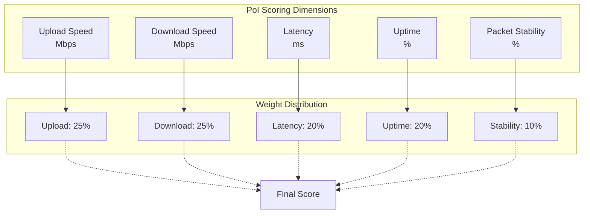
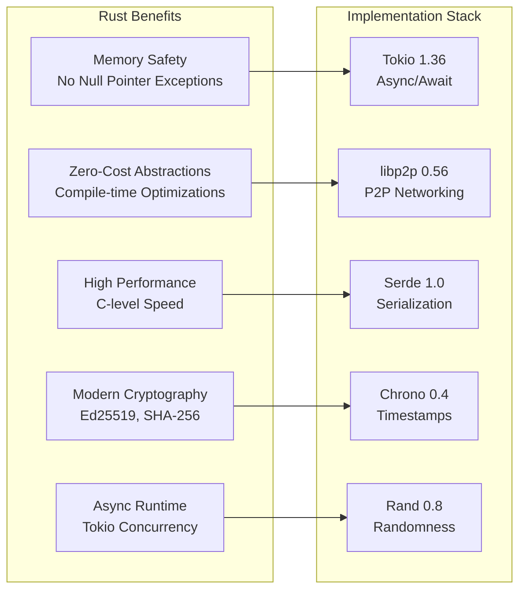
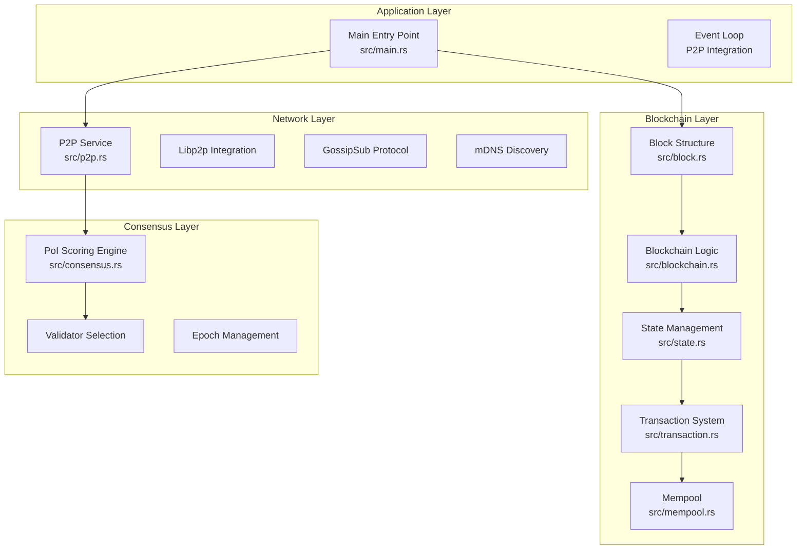
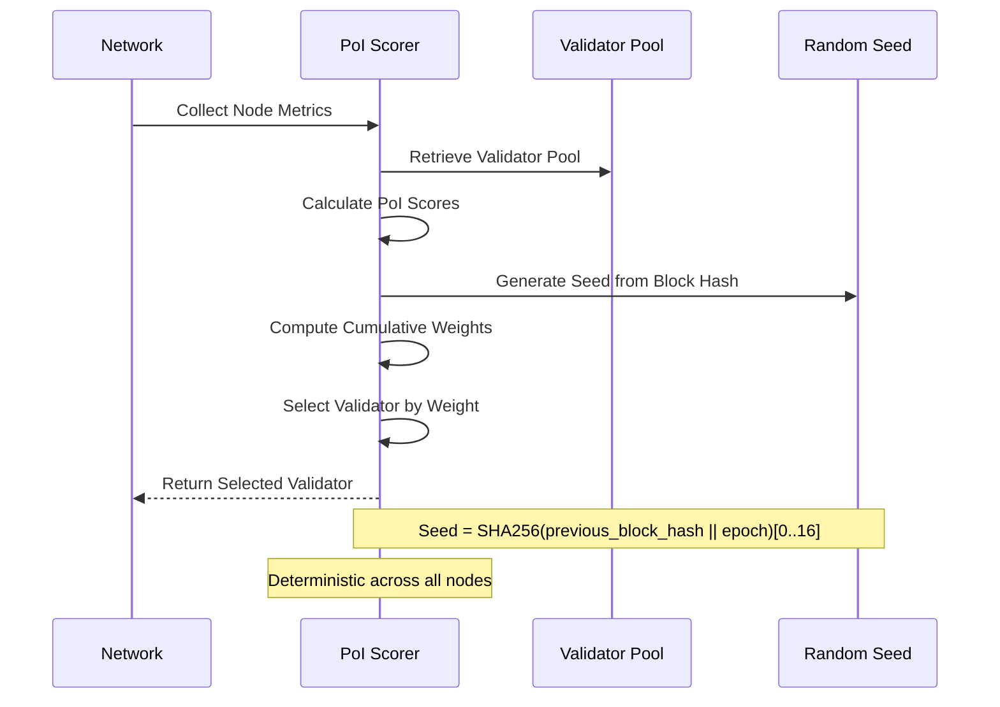
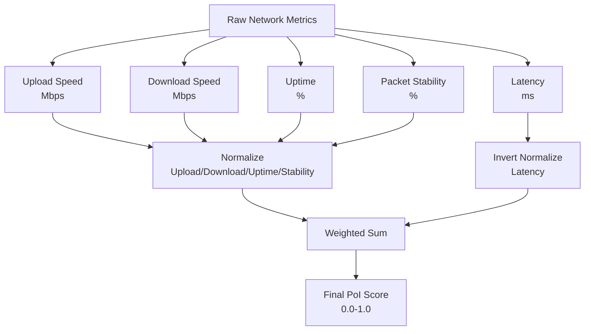
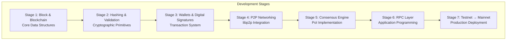
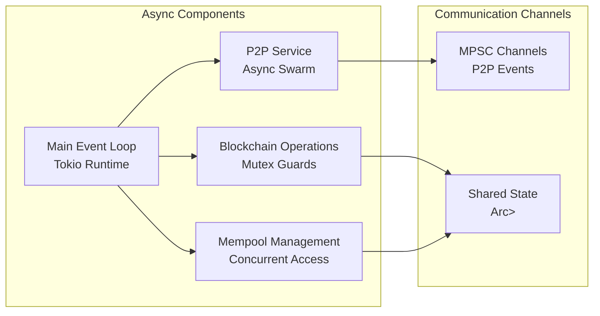

# Key Features and Capabilities

<cite>
**Referenced Files in This Document**
- [README.md](file://README.md)
- [src/main.rs](file://src/main.rs)
- [src/consensus.rs](file://src/consensus.rs)
- [src/blockchain.rs](file://src/blockchain.rs)
- [src/p2p.rs](file://src/p2p.rs)
- [src/state.rs](file://src/state.rs)
- [src/transaction.rs](file://src/transaction.rs)
- [src/mempool.rs](file://src/mempool.rs)
- [src/block.rs](file://src/block.rs)
- [Cargo.toml](file://Cargo.toml)
</cite>

## Table of Contents
1. [Introduction](#introduction)
2. [Proof-of-Internet (PoI) Consensus Algorithm](#proof-of-internet-poi-consensus-algorithm)
3. [Lightweight Rust Implementation](#lightweight-rust-implementation)
4. [Modular Architecture Design](#modular-architecture-design)
5. [Validator Selection Process](#validator-selection-process)
6. [Network Performance Metrics](#network-performance-metrics)
7. [Educational Focus and Development Approach](#educational-focus-and-development-approach)
8. [Technical Implementation Details](#technical-implementation-details)
9. [Performance Characteristics](#performance-characteristics)
10. [Conclusion](#conclusion)

## Introduction

NetChain represents a revolutionary approach to blockchain consensus mechanisms, introducing Proof-of-Internet (PoI) as an innovative alternative to traditional Proof-of-Work (PoW) and Proof-of-Stake (PoS) systems. This experimental Layer-1 blockchain prototype demonstrates how network performance metrics can be effectively utilized to secure distributed consensus while maintaining fairness and energy efficiency.

The project serves as both a technical demonstration and an educational platform, showcasing modern blockchain development practices through a clean, modular architecture implemented in Rust. As a proof-of-concept, NetChain explores the theoretical foundations of internet-based consensus while providing developers with practical insights into blockchain construction.

**Section sources**
- [README.md](file://README.md#L1-L177)

## Proof-of-Internet (PoI) Consensus Algorithm

### Five-Dimensional Scoring System

The PoI consensus algorithm operates on a sophisticated five-dimensional scoring system that evaluates network performance across critical metrics:



**Diagram sources**
- [src/consensus.rs](file://src/consensus.rs#L13-L29)
- [src/consensus.rs](file://src/consensus.rs#L68-L99)

Each dimension contributes proportionally to the final validator selection probability, with upload and download speeds carrying equal weight, latency receiving moderate emphasis, and uptime and packet stability providing complementary factors for network reliability assessment.

### Mathematical Foundation

The PoI scoring algorithm employs a weighted linear combination approach:

**Score Calculation Formula:**
```
PoI_Score = Σ(Weight_i × Normalized_Metric_i)
```

Where each normalized metric follows specific scaling rules:
- **Upload/Download/Uptime/Stability**: Direct normalization (higher values = better)
- **Latency**: Inverted normalization (lower values = better)

**Normalization Functions:**
```
Direct Normalization: Metric/MAX_Value (clamped to [0,1])
Inverted Normalization: 1 - (Metric/MAX_Value) (clamped to [0,1])
```

This mathematical framework ensures that nodes with superior network performance consistently achieve higher validation probabilities while maintaining deterministic selection criteria across the network.

**Section sources**
- [src/consensus.rs](file://src/consensus.rs#L68-L99)

## Lightweight Rust Implementation

### Performance Advantages

NetChain leverages Rust's unique characteristics to deliver exceptional performance and reliability:



**Diagram sources**
- [Cargo.toml](file://Cargo.toml#L10-L47)

### Memory Safety Guarantees

The Rust implementation eliminates entire categories of runtime errors through compile-time safety checks:
- **Null Pointer Prevention**: Guaranteed through Option types and borrowing rules
- **Buffer Overflow Protection**: Enforced by the type system
- **Concurrent Access Safety**: Managed through ownership and lifetime systems
- **Resource Leak Prevention**: Automatic cleanup through RAII principles

### Zero-Cost Abstractions

Rust's abstraction model ensures that high-level constructs have no runtime overhead:
- **Generic Types**: Compile-time monomorphization eliminates virtual dispatch costs
- **Iterator Chains**: Optimized through compiler transformations
- **Pattern Matching**: Translated to efficient jump tables
- **Ownership System**: Provides safety without garbage collection pauses

**Section sources**
- [Cargo.toml](file://Cargo.toml#L1-L47)

## Modular Architecture Design

### Layered Component Organization

NetChain implements a clean, layered architecture that separates concerns across distinct functional domains:



**Diagram sources**
- [src/main.rs](file://src/main.rs#L1-L145)
- [src/block.rs](file://src/block.rs#L1-L47)
- [src/blockchain.rs](file://src/blockchain.rs#L1-L89)
- [src/p2p.rs](file://src/p2p.rs#L1-L150)
- [src/consensus.rs](file://src/consensus.rs#L1-L334)

### Clear Separation of Responsibilities

Each module maintains well-defined boundaries:
- **Blockchain Layer**: Handles block creation, validation, and state transitions
- **Wallet System**: Manages cryptographic keys, transaction signing, and account state
- **P2P Networking**: Provides decentralized communication infrastructure
- **Consensus Engine**: Implements PoI scoring and validator selection algorithms

This architectural approach enables independent development, testing, and maintenance of each component while preserving system coherence.

**Section sources**
- [src/main.rs](file://src/main.rs#L1-L145)
- [src/blockchain.rs](file://src/blockchain.rs#L1-L89)
- [src/p2p.rs](file://src/p2p.rs#L1-L150)
- [src/consensus.rs](file://src/consensus.rs#L1-L334)

## Validator Selection Process

### Deterministic Weighted Selection

The PoI consensus implements a sophisticated validator selection mechanism that combines mathematical precision with network-wide determinism:



**Diagram sources**
- [src/consensus.rs](file://src/consensus.rs#L104-L143)

### Selection Algorithm Mechanics

The validator selection process follows these critical steps:

1. **Score Calculation**: Each validator's network metrics are converted to PoI scores using the weighted formula
2. **Weight Scaling**: Scores are scaled to integer-like precision while maintaining floating-point accuracy
3. **Cumulative Weight Computation**: Running totals establish selection boundaries
4. **Seed-Based Selection**: A cryptographic seed derived from the previous block hash ensures deterministic selection
5. **Fallback Mechanism**: In case of zero weights, lexicographic ordering provides deterministic fallback

### Mathematical Relationships

The selection probability for any validator follows a direct proportional relationship with their PoI score:

**Selection Probability:**
```
P(Validator_i) = Weight_i / Σ(All Validators' Weights)
```

This mathematical foundation ensures that network performance directly correlates with validation opportunities, creating an incentive-aligned system where superior connectivity translates to higher rewards.

**Section sources**
- [src/consensus.rs](file://src/consensus.rs#L104-L143)
- [src/consensus.rs](file://src/consensus.rs#L176-L181)

## Network Performance Metrics

### Metric Collection and Normalization

The PoI system measures five critical network performance indicators, each normalized against predefined thresholds:



**Diagram sources**
- [src/consensus.rs](file://src/consensus.rs#L42-L55)
- [src/consensus.rs](file://src/consensus.rs#L68-L99)

### Threshold Configuration

The system employs configurable thresholds for metric normalization:

| Metric Type | Normalization Method | Typical Threshold |
|-------------|---------------------|-------------------|
| Upload Speed | Direct normalization | 100 Mbps |
| Download Speed | Direct normalization | 1000 Mbps |
| Latency | Inverted normalization | 200 ms |
| Uptime | Direct normalization | 100% |
| Packet Stability | Direct normalization | 100% |

These thresholds enable the system to handle diverse network conditions while maintaining meaningful discrimination between network performers.

**Section sources**
- [src/consensus.rs](file://src/consensus.rs#L13-L29)

## Educational Focus and Development Approach

### Prototype-First Development

NetChain positions itself as an educational prototype that demonstrates blockchain fundamentals through hands-on implementation:



**Diagram sources**
- [README.md](file://README.md#L35-L43)

### Learning Objectives

The educational framework emphasizes several key learning outcomes:
- **Consensus Algorithm Implementation**: Practical understanding of PoI mechanics
- **Rust Programming Patterns**: Modern systems programming techniques
- **Distributed Systems Principles**: Network protocols and synchronization
- **Cryptography Integration**: Secure transaction processing
- **Modular Architecture Design**: Clean separation of concerns

### Developer-Friendly Features

The codebase incorporates numerous educational enhancements:
- **Comprehensive Documentation**: Inline comments explaining complex concepts
- **Unit Tests**: Extensive test coverage demonstrating proper usage
- **Clear Module Boundaries**: Logical separation of concerns
- **Type Safety**: Compile-time error detection prevents common mistakes
- **Performance Benchmarks**: Reference implementations for optimization

**Section sources**
- [README.md](file://README.md#L74-L83)
- [README.md](file://README.md#L129-L142)

## Technical Implementation Details

### Asynchronous Architecture

NetChain utilizes Tokio's asynchronous runtime to achieve high concurrency with minimal resource overhead:



**Diagram sources**
- [src/main.rs](file://src/main.rs#L23-L145)
- [src/p2p.rs](file://src/p2p.rs#L113-L141)

### Cryptographic Foundation

The implementation integrates modern cryptographic primitives for security and authenticity:

| Component | Algorithm | Purpose |
|-----------|-----------|---------|
| Key Generation | Ed25519 | Digital signatures |
| Hash Functions | SHA-256 | Block hashing |
| Encryption | Noise protocol | Transport security |
| Encoding | Base64, Hex | Data serialization |

### Data Serialization Strategy

NetChain employs multiple serialization approaches for different use cases:
- **JSON**: Human-readable block and transaction data
- **Bincode**: Efficient binary serialization for signing
- **Base64**: Safe transport of cryptographic material
- **Hex**: Address representation and hash display

**Section sources**
- [src/main.rs](file://src/main.rs#L11-L21)
- [src/transaction.rs](file://src/transaction.rs#L15-L21)
- [Cargo.toml](file://Cargo.toml#L18-L32)

## Performance Characteristics

### Throughput and Scalability

The Rust implementation delivers exceptional performance characteristics:
- **Block Creation**: Sub-second validation and addition
- **Transaction Processing**: Millisecond-level validation times
- **Network Communication**: High-throughput gossip messaging
- **Memory Usage**: Predictable allocation patterns with minimal GC pressure

### Resource Efficiency

NetChain optimizes resource utilization through:
- **Zero-Cost Abstractions**: High-level constructs with C-performance
- **Memory Pooling**: Reduced allocation overhead for hot paths
- **Efficient Hashing**: SHA-256 acceleration through optimized libraries
- **Asynchronous I/O**: Non-blocking network operations

### Network Resilience

The libp2p integration provides robust network capabilities:
- **Multi-Protocol Support**: TCP, UDP, and QUIC transport
- **Automatic NAT Traversal**: Hole punching for NAT environments
- **Content-Based Routing**: Efficient message distribution
- **Fault Tolerance**: Graceful handling of peer failures

**Section sources**
- [Cargo.toml](file://Cargo.toml#L37-L47)
- [src/p2p.rs](file://src/p2p.rs#L75-L103)

## Conclusion

NetChain represents a compelling demonstration of how innovative consensus mechanisms can transform blockchain security paradigms. The Proof-of-Internet approach offers a fresh perspective on distributed consensus, leveraging real-world network performance as a measure of trustworthiness.

Through its Rust implementation, NetChain showcases modern systems programming practices while delivering practical performance benefits. The modular architecture provides an excellent foundation for educational exploration and future development.

The project's positioning as a Layer-1 blockchain prototype, combined with its educational focus, creates a unique opportunity for developers to understand blockchain fundamentals while contributing to cutting-edge research in consensus algorithms. NetChain stands as both a technical achievement and an educational resource, demonstrating that blockchain innovation can be both theoretically sound and practically accessible.

The five-dimensional PoI scoring system, combined with deterministic validator selection, establishes a framework that aligns economic incentives with network performance. This approach has the potential to create more efficient and equitable blockchain ecosystems while reducing the environmental impact associated with traditional consensus mechanisms.

As a prototype, NetChain continues to evolve, with future iterations likely to incorporate advanced features such as dynamic threshold adjustment, reputation systems, and enhanced security measures. The educational foundation established through this codebase will serve as a cornerstone for blockchain development education and innovation.