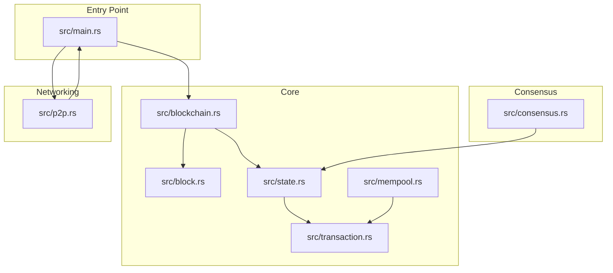
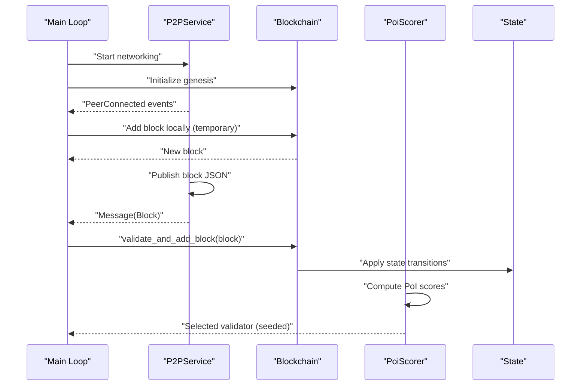
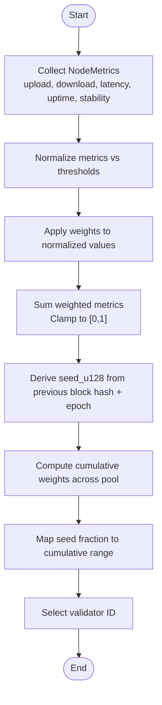
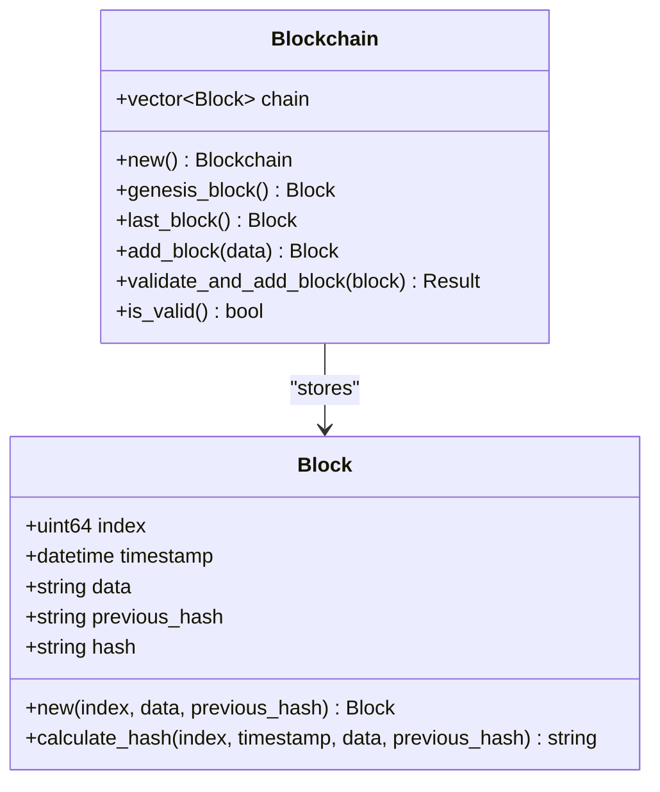
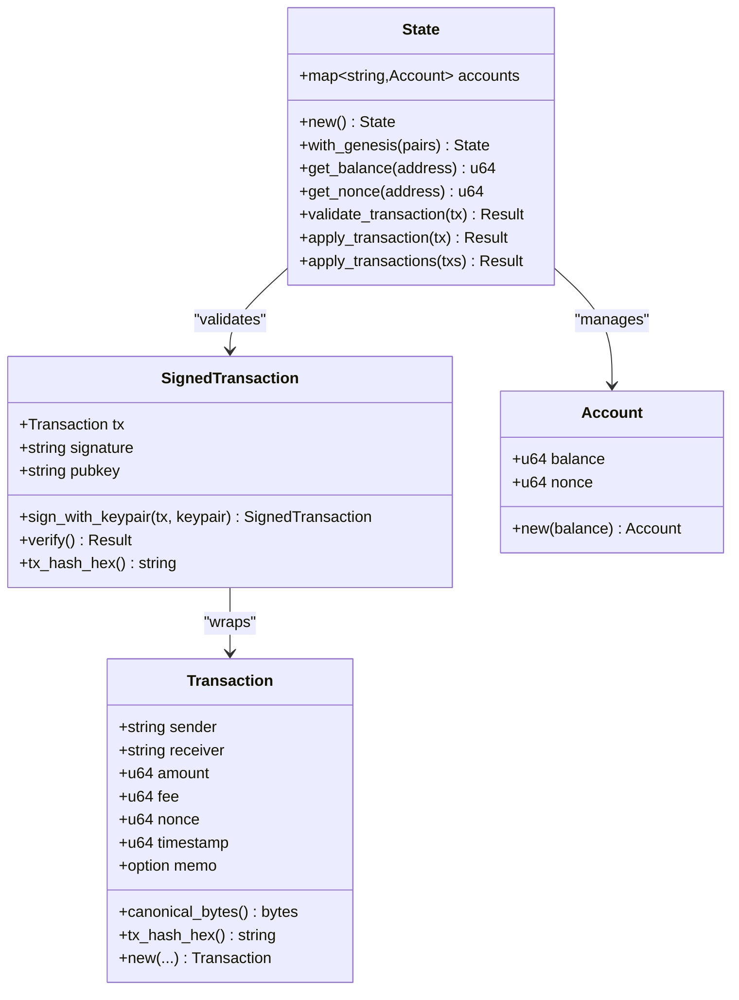
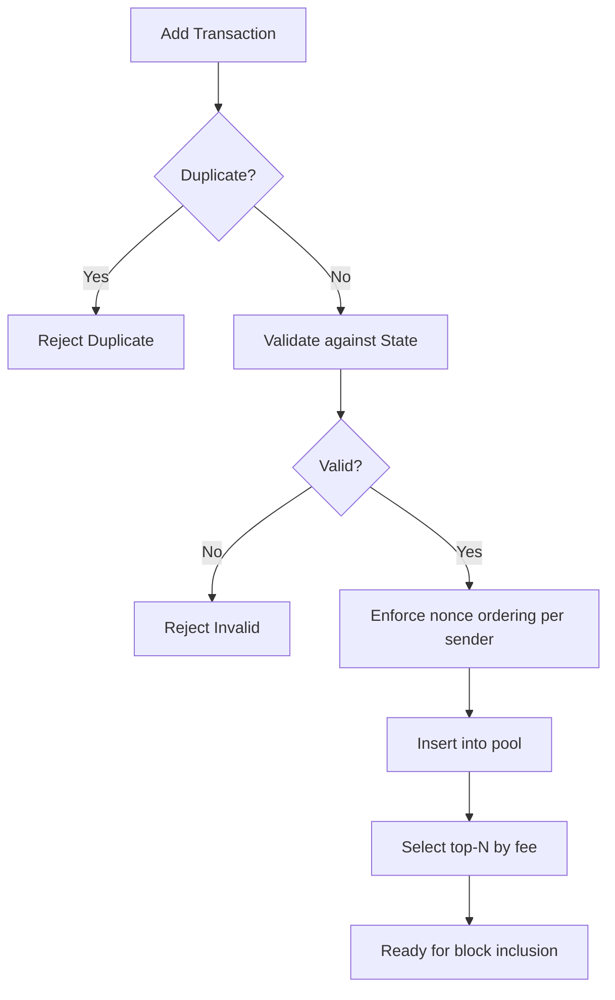
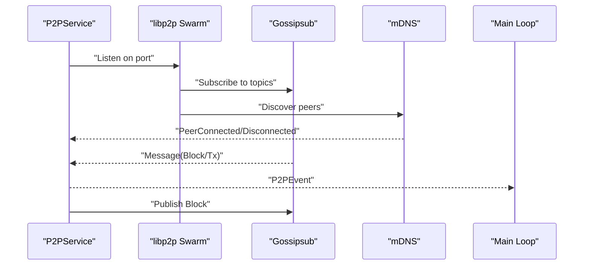
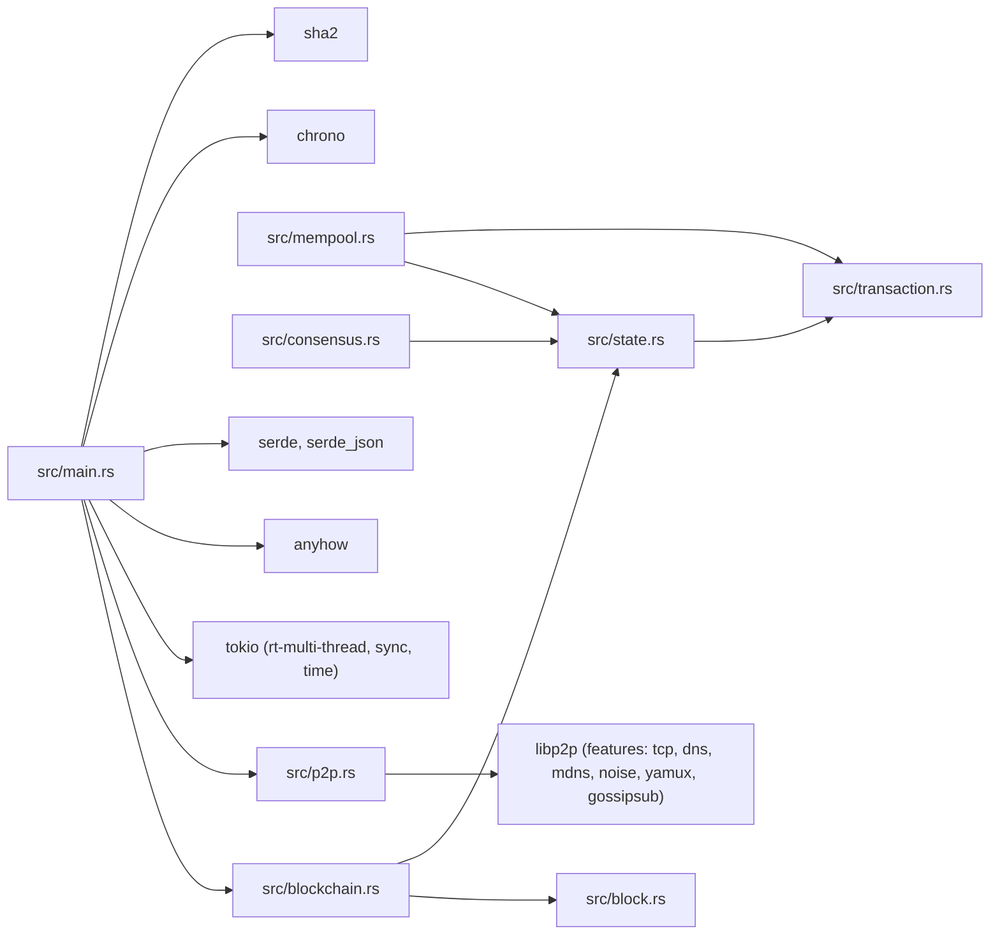

# Project Overview

<cite>
**Referenced Files in This Document**
- [README.md](file://README.md)
- [Cargo.toml](file://Cargo.toml)
- [src/main.rs](file://src/main.rs)
- [src/block.rs](file://src/block.rs)
- [src/blockchain.rs](file://src/blockchain.rs)
- [src/consensus.rs](file://src/consensus.rs)
- [src/p2p.rs](file://src/p2p.rs)
- [src/state.rs](file://src/state.rs)
- [src/transaction.rs](file://src/transaction.rs)
- [src/mempool.rs](file://src/mempool.rs)
</cite>

## Table of Contents
1. [Introduction](#introduction)
2. [Project Structure](#project-structure)
3. [Core Components](#core-components)
4. [Architecture Overview](#architecture-overview)
5. [Detailed Component Analysis](#detailed-component-analysis)
6. [Dependency Analysis](#dependency-analysis)
7. [Performance Considerations](#performance-considerations)
8. [Troubleshooting Guide](#troubleshooting-guide)
9. [Conclusion](#conclusion)

## Introduction
NetChain is a next-generation Layer-1 blockchain prototype exploring a novel Proof-of-Internet (PoI) consensus mechanism. Instead of energy-intensive Proof-of-Work (PoW) or capital-weighted Proof-of-Stake (PoS), NetChain selects validators based on real-world internet performance: upload speed, download speed, latency, uptime, and packet stability. This approach aims to make participation fairer, more energy-efficient, and aligned with the global internet infrastructure.

The project emphasizes education and experimentation, offering a lightweight Rust implementation with a modular architecture. It is currently a developer-focused prototype that demonstrates core blockchain logic, a PoI scoring engine, and networking primitives.

## Project Structure
The repository follows a layered, feature-oriented structure with clear separation of concerns:
- Entry point initializes the blockchain state, P2P networking, and event loop.
- Block and blockchain modules define the chain structure and validation logic.
- Consensus module implements PoI scoring and validator selection.
- P2P module integrates libp2p for gossipsub messaging and mDNS peer discovery.
- State and transaction modules handle account state, transaction validation, and digital signatures.
- Mempool module manages pending transactions before block inclusion.

**Diagram sources**
- [src/main.rs](file://src/main.rs#L16-L105)
- [src/block.rs](file://src/block.rs#L14-L46)
- [src/blockchain.rs](file://src/blockchain.rs#L10-L88)
- [src/state.rs](file://src/state.rs#L36-L128)
- [src/transaction.rs](file://src/transaction.rs#L23-L81)
- [src/mempool.rs](file://src/mempool.rs#L26-L113)
- [src/consensus.rs](file://src/consensus.rs#L57-L182)
- [src/p2p.rs](file://src/p2p.rs#L70-L149)

**Section sources**
- [README.md](file://README.md#L47-L58)
- [Cargo.toml](file://Cargo.toml#L1-L38)
- [src/main.rs](file://src/main.rs#L16-L105)

## Core Components
- PoI Consensus Engine: Implements weighted scoring across upload/download speed, latency, uptime, and packet stability. Provides deterministic validator selection using a shared seed and fallback mechanisms.
- Block and Blockchain: Defines block structure, hashing, and chain validation logic, including genesis initialization and integrity checks.
- State and Transactions: Manages account balances and nonces, validates transactions cryptographically, and applies state transitions atomically.
- Mempool: Maintains pending transactions, enforces uniqueness and nonce ordering, and selects transactions for block inclusion.
- P2P Networking: Integrates libp2p with gossipsub for block and transaction propagation, and mDNS for peer discovery.

**Section sources**
- [README.md](file://README.md#L9-L44)
- [src/consensus.rs](file://src/consensus.rs#L57-L182)
- [src/block.rs](file://src/block.rs#L14-L46)
- [src/blockchain.rs](file://src/blockchain.rs#L10-L88)
- [src/state.rs](file://src/state.rs#L36-L128)
- [src/transaction.rs](file://src/transaction.rs#L23-L138)
- [src/mempool.rs](file://src/mempool.rs#L26-L113)
- [src/p2p.rs](file://src/p2p.rs#L70-L149)

## Architecture Overview
NetChain’s architecture centers on a modular design with asynchronous event-driven networking and deterministic consensus:
- Entry point initializes shared blockchain state and spawns P2P networking.
- P2P service publishes and consumes blocks and transactions via gossipsub topics.
- Main event loop validates incoming blocks and updates chain state.
- PoI scoring informs validator selection for block proposal and consensus participation.
- State and mempool modules coordinate transaction lifecycle from validation to block inclusion.

**Diagram sources**
- [src/main.rs](file://src/main.rs#L16-L105)
- [src/p2p.rs](file://src/p2p.rs#L113-L149)
- [src/blockchain.rs](file://src/blockchain.rs#L40-L64)
- [src/state.rs](file://src/state.rs#L98-L119)
- [src/consensus.rs](file://src/consensus.rs#L63-L182)

## Detailed Component Analysis

### PoI Consensus Engine
The PoI engine computes validator importance from internet performance metrics and selects validators deterministically using a shared seed. It normalizes metrics and applies configurable weights, with inverted normalization for latency to penalize slower connections.

**Diagram sources**
- [src/consensus.rs](file://src/consensus.rs#L63-L182)

Key capabilities:
- Normalization and inversion for latency to reflect performance penalties.
- Deterministic selection via seed to ensure consensus agreement across nodes.
- Fallback to lexicographic ordering when all scores are zero.

Practical example: A validator with high upload/download speeds, low latency, excellent uptime, and stable packet rates receives a higher PoI score and thus a higher probability of being selected as the next proposer.

Validator selection process:
- Compute PoI scores for all validators.
- Derive a seed from the previous block hash and epoch.
- Map the seed to a cumulative distribution to pick a validator deterministically.

**Section sources**
- [src/consensus.rs](file://src/consensus.rs#L63-L182)

### Block and Blockchain
Blocks encapsulate index, timestamp, data, previous hash, and computed hash. The blockchain maintains a chain of blocks, enforces sequential indexing, and validates integrity by recomputing hashes.

**Diagram sources**
- [src/block.rs](file://src/block.rs#L14-L46)
- [src/blockchain.rs](file://src/blockchain.rs#L10-L88)

Validation logic ensures:
- Index increments correctly.
- Previous hash matches the latest block.
- Hash integrity verified by recomputation.

**Section sources**
- [src/block.rs](file://src/block.rs#L14-L46)
- [src/blockchain.rs](file://src/blockchain.rs#L40-L64)

### State and Transactions
Transactions carry sender, receiver, amount, fee, nonce, timestamp, and optional memo. They are signed with Ed25519 and verified cryptographically. State tracks balances and nonces, enforcing sufficient funds, valid nonce progression, and immutable signature verification.

**Diagram sources**
- [src/transaction.rs](file://src/transaction.rs#L23-L138)
- [src/state.rs](file://src/state.rs#L36-L128)

Validation and application:
- Cryptographic verification of signatures.
- Nonce checks to prevent replay.
- Balance checks for amount plus fee.
- Atomic application of transactions to update state.

**Section sources**
- [src/transaction.rs](file://src/transaction.rs#L23-L138)
- [src/state.rs](file://src/state.rs#L98-L119)

### Mempool
The mempool maintains pending transactions, prevents duplicates, enforces monotonic nonce ordering per sender, and selects transactions for block inclusion based on fee priority.

**Diagram sources**
- [src/mempool.rs](file://src/mempool.rs#L42-L112)

**Section sources**
- [src/mempool.rs](file://src/mempool.rs#L26-L113)

### P2P Networking
The P2P service integrates libp2p with TCP transport, Noise encryption, Yamux multiplexing, gossipsub for message propagation, and mDNS for peer discovery. It emits events for blocks, transactions, and peer connectivity.

**Diagram sources**
- [src/p2p.rs](file://src/p2p.rs#L70-L149)
- [src/main.rs](file://src/main.rs#L30-L102)

**Section sources**
- [src/p2p.rs](file://src/p2p.rs#L70-L149)
- [src/main.rs](file://src/main.rs#L30-L102)

## Dependency Analysis
NetChain relies on a curated set of crates for performance, safety, and networking:
- Async runtime and concurrency primitives for event loops and channels.
- Serialization libraries for block and transaction payloads.
- Cryptographic primitives for hashing and Ed25519 signatures.
- libp2p for robust peer-to-peer communication with gossipsub and mDNS.

**Diagram sources**
- [Cargo.toml](file://Cargo.toml#L6-L38)
- [src/main.rs](file://src/main.rs#L1-L15)
- [src/p2p.rs](file://src/p2p.rs#L3-L23)

**Section sources**
- [Cargo.toml](file://Cargo.toml#L6-L38)

## Performance Considerations
- PoI scoring uses floating-point arithmetic and normalization; ensure thresholds are tuned to realistic network conditions to avoid numerical instability.
- Deterministic validator selection requires identical seed derivation across nodes; use a stable hash of the previous block header and epoch to guarantee consensus.
- P2P gossipsub throughput depends on network topology and message sizes; keep block payloads minimal to reduce bandwidth pressure.
- State transitions and transaction validation should remain lightweight to support frequent updates without blocking the event loop.

[No sources needed since this section provides general guidance]

## Troubleshooting Guide
Common issues and remedies:
- Block validation failures: Verify index continuity and previous hash alignment; recompute block hash to detect tampering.
- Transaction rejection: Check signature validity, nonce progression, and sufficient balance for amount plus fee.
- P2P connectivity: Confirm listening address and port, and ensure mDNS discovery is enabled for local networks.
- PoI selection anomalies: Validate metric thresholds and weights; confirm seed derivation is consistent across nodes.

**Section sources**
- [src/blockchain.rs](file://src/blockchain.rs#L40-L64)
- [src/state.rs](file://src/state.rs#L98-L119)
- [src/p2p.rs](file://src/p2p.rs#L113-L149)
- [src/consensus.rs](file://src/consensus.rs#L101-L143)

## Conclusion
NetChain presents a compelling alternative to traditional consensus mechanisms by aligning validator selection with real-world internet performance. Its modular architecture, lightweight Rust implementation, and PoI scoring engine offer a foundation for experimentation and education. As the project evolves toward wallets, RPC, and testnet/mainnet deployment, the PoI framework positions NetChain to explore fairness, sustainability, and accessibility in blockchain consensus.

[No sources needed since this section summarizes without analyzing specific files]